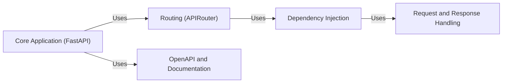

## Details

Simplified architecture of core components and their interactions within a FastAPI application.

### Core Application (FastAPI)
The central entry point for the FastAPI application. It initializes the application, configures middleware, exception handlers, and integrates routers.

**Related Classes/Methods**: _None_

### Routing (APIRouter)
Manages the mapping of incoming HTTP requests to specific endpoint functions. Defines API routes, including paths, HTTP methods, and associated handlers.

**Related Classes/Methods**: _None_

### Dependency Injection [[Expand]](./Dependency_Injection.md)
Resolves and injects dependencies into endpoint functions. This includes path parameters, query parameters, headers, cookies, and request bodies.

**Related Classes/Methods**: _None_

### Request and Response Handling [[Expand]](./Request_and_Response_Handling.md)
Parses incoming requests, validates data, serializes responses, and sets HTTP status codes and headers.

**Related Classes/Methods**: _None_

### OpenAPI and Documentation [[Expand]](./OpenAPI_and_Documentation.md)
Generates the OpenAPI schema for the API and serves interactive API documentation (Swagger UI, ReDoc).

**Related Classes/Methods**: _None_

### [FAQ](https://github.com/CodeBoarding/GeneratedOnBoardings/tree/main?tab=readme-ov-file#faq)