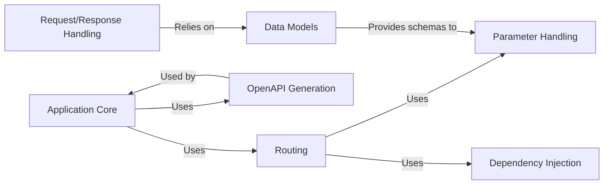

## Details

One paragraph explaining the functionality which is represented by this graph. What the main flow is and what is its purpose.

### Application Core
The central component responsible for initializing and configuring the FastAPI application. It manages the application lifecycle, including startup and shutdown events, and integrates other components.

**Related Classes/Methods**:

- <a href="https://github.com/fastapi/fastapi/blob/master/temp/fastapi/applications.py" target="_blank" rel="noopener noreferrer">`fastapi.applications` (0:0)</a>

### Routing [[Expand]](./Routing.md)
Maps incoming HTTP requests to the appropriate handler functions (path operations). It manages route definitions, including methods (GET, POST, etc.), paths, and dependencies.

**Related Classes/Methods**:

- <a href="https://github.com/fastapi/fastapi/blob/master/temp/fastapi/routing.py" target="_blank" rel="noopener noreferrer">`fastapi.routing` (0:0)</a>

### Dependency Injection [[Expand]](./Dependency_Injection.md)
Manages dependencies for path operation functions, providing a way to inject required resources into handlers.

**Related Classes/Methods**:

- <a href="https://github.com/fastapi/fastapi/blob/master/temp/fastapi/dependencies/utils.py" target="_blank" rel="noopener noreferrer">`fastapi.dependencies.utils` (0:0)</a>
- <a href="https://github.com/fastapi/fastapi/blob/master/temp/fastapi/dependencies/models.py" target="_blank" rel="noopener noreferrer">`fastapi.dependencies.models` (0:0)</a>

### Parameter Handling [[Expand]](./Parameter_Handling.md)
Extracts, validates, and converts parameters from various sources (path, query, headers, cookies, body).

**Related Classes/Methods**:

- <a href="https://github.com/fastapi/fastapi/blob/master/temp/fastapi/params.py" target="_blank" rel="noopener noreferrer">`fastapi.params` (0:0)</a>
- <a href="https://github.com/fastapi/fastapi/blob/master/temp/fastapi/param_functions.py" target="_blank" rel="noopener noreferrer">`fastapi.param_functions` (0:0)</a>

### Request/Response Handling [[Expand]](./Request_Response_Handling.md)
Encapsulates the processing of incoming HTTP requests and the creation of outgoing HTTP responses.

**Related Classes/Methods**:

- <a href="https://github.com/fastapi/fastapi/blob/master/temp/fastapi/requests.py" target="_blank" rel="noopener noreferrer">`fastapi.requests` (0:0)</a>
- <a href="https://github.com/fastapi/fastapi/blob/master/temp/fastapi/responses.py" target="_blank" rel="noopener noreferrer">`fastapi.responses` (0:0)</a>

### Data Models [[Expand]](./Data_Models.md)
Defines the structure and validation rules for request and response data using Pydantic.

**Related Classes/Methods**:

- `pydantic` (0:0)

### OpenAPI Generation [[Expand]](./OpenAPI_Generation.md)
Generates the OpenAPI schema for the API, providing documentation and interactive API exploration tools.

**Related Classes/Methods**:

- <a href="https://github.com/fastapi/fastapi/blob/master/temp/fastapi/openapi/utils.py" target="_blank" rel="noopener noreferrer">`fastapi.openapi.utils` (0:0)</a>
- <a href="https://github.com/fastapi/fastapi/blob/master/temp/fastapi/openapi/docs.py" target="_blank" rel="noopener noreferrer">`fastapi.openapi.docs` (0:0)</a>

### [FAQ](https://github.com/CodeBoarding/GeneratedOnBoardings/tree/main?tab=readme-ov-file#faq)