```mermaid
graph LR
    External_Client["External Client"]
    FastAPI_Application_Core["FastAPI Application Core"]
    Middleware_Layer["Middleware Layer"]
    Request_Processing_Routing["Request Processing & Routing"]
    Application_Logic_User_Endpoints_["Application Logic (User Endpoints)"]
    Response_Exception_Handling["Response & Exception Handling"]
    OpenAPI_Documentation["OpenAPI Documentation"]
    External_Client -- "Sends HTTP Request" --> FastAPI_Application_Core
    FastAPI_Application_Core -- "Dispatches Request" --> Middleware_Layer
    Middleware_Layer -- "Processes & Forwards Request" --> Request_Processing_Routing
    Request_Processing_Routing -- "Invokes Endpoint" --> Application_Logic_User_Endpoints_
    Application_Logic_User_Endpoints_ -- "Returns Data" --> Response_Exception_Handling
    Application_Logic_User_Endpoints_ -- "Raises Exception" --> Response_Exception_Handling
    Response_Exception_Handling -- "Sends HTTP Response" --> Middleware_Layer
    Middleware_Layer -- "Delivers Response" --> External_Client
    FastAPI_Application_Core -- "Provides API Metadata" --> OpenAPI_Documentation
    OpenAPI_Documentation -- "Serves Documentation" --> External_Client
    click FastAPI_Application_Core href "https://github.com/CodeBoarding/GeneratedOnBoardings/blob/main/fastapi/FastAPI_Application_Core.md" "Details"
    click Middleware_Layer href "https://github.com/CodeBoarding/GeneratedOnBoardings/blob/main/fastapi/Middleware_Layer.md" "Details"
    click Request_Processing_Routing href "https://github.com/CodeBoarding/GeneratedOnBoardings/blob/main/fastapi/Request_Processing_Routing.md" "Details"
    click Application_Logic_User_Endpoints_ href "https://github.com/CodeBoarding/GeneratedOnBoardings/blob/main/fastapi/Application_Logic_User_Endpoints_.md" "Details"
    click Response_Exception_Handling href "https://github.com/CodeBoarding/GeneratedOnBoardings/blob/main/fastapi/Response_Exception_Handling.md" "Details"
    click OpenAPI_Documentation href "https://github.com/CodeBoarding/GeneratedOnBoardings/blob/main/fastapi/OpenAPI_Documentation.md" "Details"
```

## Details

The FastAPI application operates as a robust API server, designed to efficiently handle incoming HTTP requests from diverse External Clients. At its heart, the FastAPI Application Core acts as the central orchestrator, responsible for initializing the ASGI application and managing the overall request-response lifecycle. All incoming requests first pass through a configurable Middleware Layer, which applies cross-cutting concerns such as security, logging, and data compression. Following middleware processing, the Request Processing & Routing component takes over, accurately directing requests to the appropriate Application Logic (User Endpoints) based on defined API paths and methods. These user-defined endpoints encapsulate the core business logic, processing data and interacting with any backend services (not explicitly shown but implied). Upon completion, the results or any encountered errors are channeled to the Response & Exception Handling component, which ensures proper data serialization into HTTP responses or consistent error reporting. Finally, the processed responses traverse back through the Middleware Layer before being delivered to the External Client. Additionally, the OpenAPI Documentation component, integrated with the FastAPI Core, automatically generates and serves interactive API documentation, facilitating easy consumption and understanding of the API by developers and other systems.

### External Client
Represents any external system or user agent interacting with the FastAPI application, such as a web browser, mobile application, or another microservice. This component exists outside the project's codebase.

**Related Classes/Methods**: _None_

### FastAPI Application Core [[Expand]](./FastAPI_Application_Core.md)
The central orchestrator, initializing the ASGI application, registering routes, and managing the overall request-response lifecycle. It acts as the entry point for all incoming requests.

**Related Classes/Methods**:

- <a href="https://github.com/fastapi/fastapi/blob/master/fastapi/applications.py#L48-L4588" target="_blank" rel="noopener noreferrer">`fastapi.applications.FastAPI`:48-4588</a>

### Middleware Layer [[Expand]](./Middleware_Layer.md)
Intercepts and processes incoming requests and outgoing responses for cross-cutting concerns like CORS, GZIP, authentication, or logging before they reach the main routing logic or after the response is generated.

**Related Classes/Methods**:

- <a href="https://github.com/fastapi/fastapi/blob/master/fastapi/middleware/base.py" target="_blank" rel="noopener noreferrer">`fastapi.middleware.base.Middleware`</a>

### Request Processing & Routing [[Expand]](./Request_Processing_Routing.md)
Responsible for matching incoming HTTP requests to the correct endpoint based on defined routes, parsing path, query, and body parameters, and resolving dependencies (including security dependencies).

**Related Classes/Methods**:

- <a href="https://github.com/fastapi/fastapi/blob/master/fastapi/routing.py#L596-L4440" target="_blank" rel="noopener noreferrer">`fastapi.routing.APIRouter`:596-4440</a>
- <a href="https://github.com/fastapi/fastapi/blob/master/fastapi/params.py#L764-L774" target="_blank" rel="noopener noreferrer">`fastapi.params.Depends`:764-774</a>
- <a href="https://github.com/fastapi/fastapi/blob/master/fastapi/dependencies/utils.py#L572-L695" target="_blank" rel="noopener noreferrer">`fastapi.dependencies.utils.solve_dependencies`:572-695</a>
- <a href="https://github.com/fastapi/fastapi/blob/master/fastapi/security/oauth2.py#L391-L500" target="_blank" rel="noopener noreferrer">`fastapi.security.oauth2.OAuth2PasswordBearer`:391-500</a>

### Application Logic (User Endpoints) [[Expand]](./Application_Logic_User_Endpoints_.md)
Contains the user-defined functions and business logic that implement the core functionality for each API endpoint. This is where the application's specific tasks are performed.

**Related Classes/Methods**:

### Response & Exception Handling [[Expand]](./Response_Exception_Handling.md)
Manages the serialization of Python objects into appropriate HTTP responses (e.g., JSON, HTML) and handles various errors, including built-in HTTP exceptions and Pydantic validation errors, ensuring a consistent error response format.

**Related Classes/Methods**:

- <a href="https://github.com/fastapi/fastapi/blob/master/fastapi/responses.py" target="_blank" rel="noopener noreferrer">`fastapi.responses.JSONResponse`</a>
- <a href="https://github.com/fastapi/fastapi/blob/master/fastapi/exception_handlers.py#L11-L17" target="_blank" rel="noopener noreferrer">`fastapi.exception_handlers.http_exception_handler`:11-17</a>

### OpenAPI Documentation [[Expand]](./OpenAPI_Documentation.md)
Automatically generates and serves the OpenAPI specification (formerly Swagger) for the API, along with interactive documentation UIs like Swagger UI and ReDoc, enabling easy exploration and testing of API endpoints.

**Related Classes/Methods**:

- <a href="https://github.com/fastapi/fastapi/blob/master/fastapi/openapi/utils.py#L477-L569" target="_blank" rel="noopener noreferrer">`fastapi.openapi.utils.get_openapi`:477-569</a>
- <a href="https://github.com/fastapi/fastapi/blob/master/fastapi/openapi/docs.py#L26-L158" target="_blank" rel="noopener noreferrer">`fastapi.openapi.docs.get_swagger_ui_html`:26-158</a>

### [FAQ](https://github.com/CodeBoarding/GeneratedOnBoardings/tree/main?tab=readme-ov-file#faq)