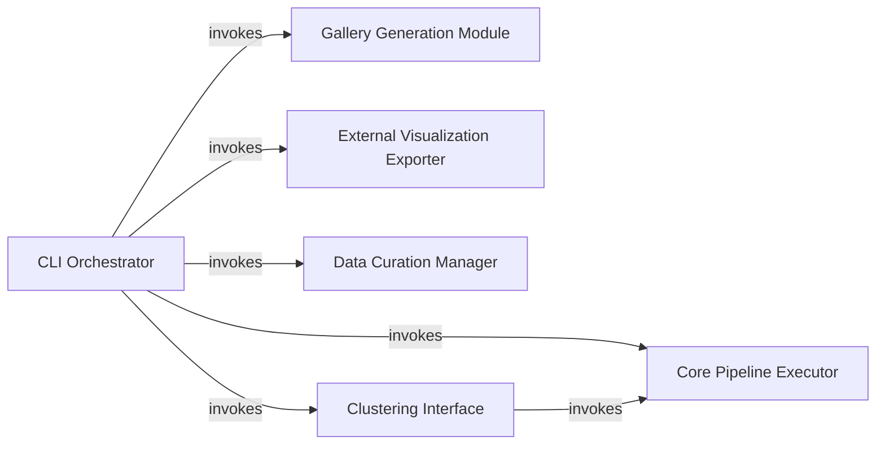

## Details

The `CLI & Public API` subsystem encompasses the top-level functions within the `fastdup` package, primarily defined in `fastdup/engine.py`. These functions serve as the direct interface for users, enabling interaction with the `fastdup` core engine through both command-line commands and programmatic API calls.

### CLI Orchestrator
The primary command-line interface entry point. It parses user arguments, validates inputs, and dispatches control to other high-level `fastdup` functions based on the specified command.

**Related Classes/Methods**:

- <a href="https://github.com/visual-layer/fastdup/blob/main/fastdup/__init__.py#L3005-L3013" target="_blank" rel="noopener noreferrer">`fastdup.__init__.cli`:3005-3013</a>

### Core Pipeline Executor
Executes the main `fastdup` data processing and analysis pipeline. This function is the primary programmatic interface to the core engine, orchestrating the underlying computations.

**Related Classes/Methods**:

- <a href="https://github.com/visual-layer/fastdup/blob/main/fastdup/__init__.py#L472-L791" target="_blank" rel="noopener noreferrer">`fastdup.__init__.run`:472-791</a>

### Gallery Generation Module
A collection of functions responsible for generating various interactive HTML galleries (duplicates, outliers, components, statistics, similarity) to visualize `fastdup`'s analysis results.

**Related Classes/Methods**:

- <a href="https://github.com/visual-layer/fastdup/blob/main/fastdup/__init__.py#L1084-L1166" target="_blank" rel="noopener noreferrer">`fastdup.__init__.create_duplicates_gallery`:1084-1166</a>
- <a href="https://github.com/visual-layer/fastdup/blob/main/fastdup/__init__.py#L1258-L1334" target="_blank" rel="noopener noreferrer">`fastdup.__init__.create_outliers_gallery`:1258-1334</a>
- <a href="https://github.com/visual-layer/fastdup/blob/main/fastdup/__init__.py#L1336-L1437" target="_blank" rel="noopener noreferrer">`fastdup.__init__.create_components_gallery`:1336-1437</a>
- <a href="https://github.com/visual-layer/fastdup/blob/main/fastdup/__init__.py#L2308-L2405" target="_blank" rel="noopener noreferrer">`fastdup.__init__.create_stats_gallery`:2308-2405</a>
- <a href="https://github.com/visual-layer/fastdup/blob/main/fastdup/__init__.py#L2407-L2483" target="_blank" rel="noopener noreferrer">`fastdup.__init__.create_similarity_gallery`:2407-2483</a>

### External Visualization Exporter
Prepares and exports `fastdup`'s feature vectors and metadata into a format compatible with external visualization tools like TensorBoard Projector, enabling deeper exploration of embeddings.

**Related Classes/Methods**:

- <a href="https://github.com/visual-layer/fastdup/blob/main/fastdup/__init__.py#L1880-L1944" target="_blank" rel="noopener noreferrer">`fastdup.__init__.export_to_tensorboard_projector`:1880-1944</a>

### Data Curation Manager
Provides functionality to manage and modify identified components (e.g., duplicate clusters, outlier groups) within the dataset or `fastdup`'s internal representation, supporting data curation workflows.

**Related Classes/Methods**:

- <a href="https://github.com/visual-layer/fastdup/blob/main/fastdup/__init__.py#L1629-L1679" target="_blank" rel="noopener noreferrer">`fastdup.__init__.delete_components`:1629-1679</a>

### Clustering Interface
Initiates and manages the KMeans clustering process on image embeddings, providing a high-level API for grouping similar images.

**Related Classes/Methods**:

- <a href="https://github.com/visual-layer/fastdup/blob/main/fastdup/__init__.py#L2681-L2743" target="_blank" rel="noopener noreferrer">`fastdup.__init__.run_kmeans`:2681-2743</a>

### [FAQ](https://github.com/CodeBoarding/GeneratedOnBoardings/tree/main?tab=readme-ov-file#faq)