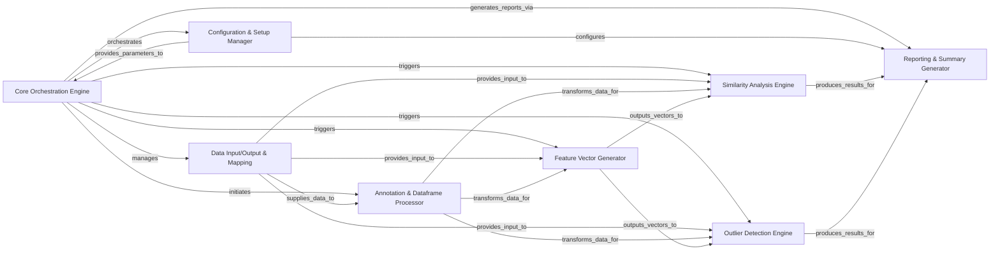

## Details

The `fastdup` project's core functionality is encapsulated within the `fastdup.fastdup_controller` subsystem, which orchestrates the entire data analysis pipeline. This subsystem manages configuration, data handling, feature generation, core analysis algorithms (similarity and outlier detection), and result reporting. The architecture is designed to process large datasets efficiently, leveraging internal data structures and optimized routines for performance. The `FastdupController` operates as a cohesive unit, initiating and directing the workflow from configuration and data input to feature generation, analysis, and final report generation.

### Core Orchestration Engine [[Expand]](./Core_Orchestration_Engine.md)
The central processing unit of `fastdup`, responsible for orchestrating the entire data analysis pipeline, including managing data flow, executing core algorithms (similarity, outliers, connected components), and handling intermediate results.

**Related Classes/Methods**:

- <a href="https://github.com/visual-layer/fastdup/blob/main/fastdup/fastdup_controller.py" target="_blank" rel="noopener noreferrer">`fastdup.fastdup_controller`</a>

### Configuration & Setup Manager
Manages the setup of the analysis run, validating inputs, and handling all configuration parameters.

**Related Classes/Methods**:

- <a href="https://github.com/visual-layer/fastdup/blob/main/fastdup/fastdup_controller.py" target="_blank" rel="noopener noreferrer">`fastdup.fastdup_controller:__init__`</a>
- <a href="https://github.com/visual-layer/fastdup/blob/main/fastdup/fastdup_controller.py" target="_blank" rel="noopener noreferrer">`fastdup.fastdup_controller:_init_run`</a>
- <a href="https://github.com/visual-layer/fastdup/blob/main/fastdup/fastdup_controller.py" target="_blank" rel="noopener noreferrer">`fastdup.fastdup_controller:_get_fastdup_state`</a>

### Data Input/Output & Mapping
Oversees the ingestion of raw data, creating internal data mappings (e.g., image to ID), retrieving intermediate dataframes, and persisting final artifacts.

**Related Classes/Methods**:

- <a href="https://github.com/visual-layer/fastdup/blob/main/fastdup/fastdup_controller.py" target="_blank" rel="noopener noreferrer">`fastdup.fastdup_controller:_set_fastdup_input`</a>
- <a href="https://github.com/visual-layer/fastdup/blob/main/fastdup/fastdup_controller.py" target="_blank" rel="noopener noreferrer">`fastdup.fastdup_controller:_save_artifacts`</a>
- <a href="https://github.com/visual-layer/fastdup/blob/main/fastdup/fastdup_controller.py" target="_blank" rel="noopener noreferrer">`fastdup.fastdup_controller:_fetch_df`</a>

### Annotation & Dataframe Processor
Processes and manipulates annotation dataframes, including indexing, expansion, and merging, preparing data for core analysis engines.

**Related Classes/Methods**:

- <a href="https://github.com/visual-layer/fastdup/blob/main/fastdup/fastdup_controller.py" target="_blank" rel="noopener noreferrer">`fastdup.fastdup_controller:_index_annot_df`</a>
- <a href="https://github.com/visual-layer/fastdup/blob/main/fastdup/fastdup_controller.py" target="_blank" rel="noopener noreferrer">`fastdup.fastdup_controller:annotations`</a>
- <a href="https://github.com/visual-layer/fastdup/blob/main/fastdup/fastdup_controller.py" target="_blank" rel="noopener noreferrer">`fastdup.fastdup_controller:_add_annot_and_split`</a>

### Feature Vector Generator
Manages the generation or utilization of feature vectors from input data, crucial for subsequent similarity and outlier analyses. This component interacts with underlying `fastdup` libraries for vector creation or uses pre-calculated embeddings.

**Related Classes/Methods**:

- <a href="https://github.com/visual-layer/fastdup/blob/main/fastdup/fastdup_controller.py" target="_blank" rel="noopener noreferrer">`fastdup.fastdup_controller:vector_search`</a>
- <a href="https://github.com/visual-layer/fastdup/blob/main/fastdup/fastdup_controller.py" target="_blank" rel="noopener noreferrer">`fastdup.fastdup_controller:init_search`</a>

### Similarity Analysis Engine
Executes core analysis algorithms specifically for similarity detection within the dataset, leveraging generated feature vectors.

**Related Classes/Methods**:

- <a href="https://github.com/visual-layer/fastdup/blob/main/fastdup/fastdup_controller.py" target="_blank" rel="noopener noreferrer">`fastdup.fastdup_controller:similarity`</a>
- <a href="https://github.com/visual-layer/fastdup/blob/main/fastdup/fastdup_controller.py" target="_blank" rel="noopener noreferrer">`fastdup.fastdup_controller:search`</a>

### Outlier Detection Engine
Executes core analysis algorithms for identifying outliers within the dataset, utilizing feature vectors.

**Related Classes/Methods**:

- <a href="https://github.com/visual-layer/fastdup/blob/main/fastdup/fastdup_controller.py" target="_blank" rel="noopener noreferrer">`fastdup.fastdup_controller:outliers`</a>

### Reporting & Summary Generator
Aggregates results from various analysis stages and generates comprehensive summaries, status reports, and specific metrics for user consumption.

**Related Classes/Methods**:

- <a href="https://github.com/visual-layer/fastdup/blob/main/fastdup/fastdup_controller.py" target="_blank" rel="noopener noreferrer">`fastdup.fastdup_controller:summary`</a>
- <a href="https://github.com/visual-layer/fastdup/blob/main/fastdup/fastdup_controller.py" target="_blank" rel="noopener noreferrer">`fastdup.fastdup_controller:pct`</a>

### [FAQ](https://github.com/CodeBoarding/GeneratedOnBoardings/tree/main?tab=readme-ov-file#faq)