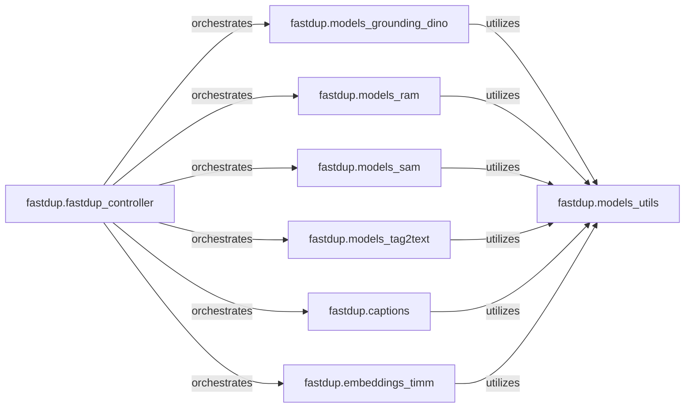

## Details

The `fastdup` project's core ML subsystem is designed around a central orchestration pattern. The `fastdup_controller` acts as the primary entry point for initiating various image analysis tasks. It delegates specific responsibilities to specialized model components such as `embeddings_timm` for generating image embeddings, `captions` for text descriptions, `models_grounding_dino` for object detection, `models_ram` for general image recognition, `models_sam` for segmentation, and `models_tag2text` for tag-to-text generation. A common `models_utils` component provides shared functionalities like post-processing and data formatting, ensuring consistency across different model outputs. This modular design allows for easy integration of new models and clear separation of concerns.

### fastdup.fastdup_controller
Acts as the primary orchestrator for ML-related tasks. It initiates and coordinates calls to various model-specific components based on the required analysis (e.g., captioning, embedding generation, object detection). This component is fundamental as it provides the central control flow for all ML operations.

**Related Classes/Methods**:

- <a href="https://github.com/visual-layer/fastdup/blob/main/fastdup/fastdup_controller.py" target="_blank" rel="noopener noreferrer">`fastdup.fastdup_controller`</a>

### fastdup.embeddings_timm
Handles the initialization, loading, and inference of TIMM (PyTorch Image Models) models to produce numerical image embeddings, which are crucial for similarity search and other downstream tasks. This is a core data analysis capability.

**Related Classes/Methods**:

- <a href="https://github.com/visual-layer/fastdup/blob/main/fastdup/embeddings_timm.py" target="_blank" rel="noopener noreferrer">`fastdup.embeddings_timm`</a>

### fastdup.captions
Manages the generation of descriptive text captions for images using a dedicated captioning model. This component encompasses all image captioning functionalities, providing rich textual metadata for images.

**Related Classes/Methods**:

- <a href="https://github.com/visual-layer/fastdup/blob/main/fastdup/captions.py" target="_blank" rel="noopener noreferrer">`fastdup.captions`</a>

### fastdup.models_grounding_dino
Encapsulates the Grounding DINO model for performing zero-shot object detection, allowing the system to identify and locate objects based on text prompts, and extract bounding box information. This is a key computer vision capability.

**Related Classes/Methods**:

- <a href="https://github.com/visual-layer/fastdup/blob/main/fastdup/models_grounding_dino.py" target="_blank" rel="noopener noreferrer">`fastdup.models_grounding_dino`</a>

### fastdup.models_ram
Manages the loading and inference of the Recognize Anything Model (RAM) for general image recognition and tagging. This adds broad image understanding capabilities.

**Related Classes/Methods**:

- <a href="https://github.com/visual-layer/fastdup/blob/main/fastdup/models_ram.py" target="_blank" rel="noopener noreferrer">`fastdup.models_ram`</a>

### fastdup.models_sam
Handles the Segment Anything Model (SAM) for precise image segmentation tasks, generating masks for objects within images. This provides detailed object boundary information.

**Related Classes/Methods**:

- <a href="https://github.com/visual-layer/fastdup/blob/main/fastdup/models_sam.py" target="_blank" rel="noopener noreferrer">`fastdup.models_sam`</a>

### fastdup.models_tag2text
Manages the loading and inference of a Tag2Text model for generating descriptive tags or text for images. This provides additional textual metadata for image analysis.

**Related Classes/Methods**:

- <a href="https://github.com/visual-layer/fastdup/blob/main/fastdup/models_tag2text.py" target="_blank" rel="noopener noreferrer">`fastdup.models_tag2text`</a>

### fastdup.models_utils
Provides common utility functions for post-processing model outputs, visualization, and data formatting, ensuring consistency across different ML model integrations. This component is crucial for standardizing outputs and supporting downstream analysis.

**Related Classes/Methods**:

- <a href="https://github.com/visual-layer/fastdup/blob/main/fastdup/models_utils.py" target="_blank" rel="noopener noreferrer">`fastdup.models_utils`</a>

### [FAQ](https://github.com/CodeBoarding/GeneratedOnBoardings/tree/main?tab=readme-ov-file#faq)