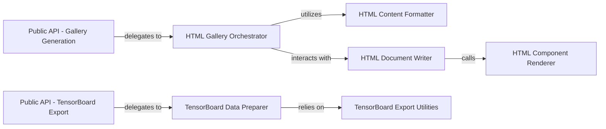

## Details

The `Visualization & Reporting` subsystem in `fastdup` is responsible for transforming analysis results into user-friendly visual formats, specifically interactive HTML galleries and data exports for external tools like TensorBoard Projector.

### Public API - Gallery Generation
Provides the primary user-facing functions (`create_*_gallery`) for initiating the generation of various interactive HTML galleries (e.g., duplicates, outliers). It handles initial parameter validation and data loading.

**Related Classes/Methods**:

- <a href="https://github.com/visual-layer/fastdup/blob/main/fastdup/__init__.py" target="_blank" rel="noopener noreferrer">`fastdup.create_*_gallery`</a>

### Public API - TensorBoard Export
Offers the public API (`export_to_tensorboard_projector`) for users to export analysis data, such as embeddings and labels, in a format compatible with TensorBoard Projector for advanced visualization.

**Related Classes/Methods**:

- <a href="https://github.com/visual-layer/fastdup/blob/main/fastdup/__init__.py" target="_blank" rel="noopener noreferrer">`fastdup.export_to_tensorboard_projector`</a>

### HTML Gallery Orchestrator
Manages the end-to-end workflow for constructing specific HTML galleries. This involves processing analysis results, preparing image paths, and coordinating with HTML writing utilities to assemble the gallery content.

**Related Classes/Methods**:

- <a href="https://github.com/visual-layer/fastdup/blob/main/fastdup/galleries.py" target="_blank" rel="noopener noreferrer">`fastdup.galleries.do_create_*_gallery`</a>

### HTML Content Formatter
A utility component responsible for transforming raw data (e.g., image paths, metadata) into structured HTML string representations suitable for embedding within the galleries.

**Related Classes/Methods**:

- <a href="https://github.com/visual-layer/fastdup/blob/main/fastdup/galleries.py#L61-L65" target="_blank" rel="noopener noreferrer">`fastdup.galleries.format_image_html_string`:61-65</a>

### HTML Document Writer
The core component for assembling and writing complete HTML documents to a specified file. It takes various HTML sections (headers, body, footers) and combines them into a well-formed HTML file.

**Related Classes/Methods**:

- <a href="https://github.com/visual-layer/fastdup/blob/main/fastdup/html_writer.py#L863-L893" target="_blank" rel="noopener noreferrer">`fastdup.html_writer.write_to_html_file`:863-893</a>

### HTML Component Renderer
Renders individual visual components (e.g., an image with associated metadata, a table, or a text block) into their specific HTML markup, which can then be integrated into a larger HTML document.

**Related Classes/Methods**:

- <a href="https://github.com/visual-layer/fastdup/blob/main/fastdup/html_writer.py#L837-L860" target="_blank" rel="noopener noreferrer">`fastdup.html_writer.write_component`:837-860</a>

### TensorBoard Data Preparer
Manages the internal process of preparing and exporting embeddings and associated metadata into the specific file formats (`.tsv` for labels, sprite images for visuals) required by TensorBoard Projector.

**Related Classes/Methods**:

- <a href="https://github.com/visual-layer/fastdup/blob/main/fastdup/tensorboard_projector.py#L126-L171" target="_blank" rel="noopener noreferrer">`fastdup.tensorboard_projector.export_to_tensorboard_projector_inner`:126-171</a>

### TensorBoard Export Utilities
A collection of helper functions that perform specific, low-level tasks necessary for TensorBoard Projector export, such as saving TSV files, registering embeddings, and generating sprite images from a collection of individual images.

**Related Classes/Methods**:

- <a href="https://github.com/visual-layer/fastdup/blob/main/fastdup/tensorboard_projector.py#L28-L31" target="_blank" rel="noopener noreferrer">`fastdup.tensorboard_projector.save_labels_tsv`:28-31</a>
- <a href="https://github.com/visual-layer/fastdup/blob/main/fastdup/tensorboard_projector.py#L16-L25" target="_blank" rel="noopener noreferrer">`fastdup.tensorboard_projector.register_embedding`:16-25</a>
- <a href="https://github.com/visual-layer/fastdup/blob/main/fastdup/tensorboard_projector.py#L33-L121" target="_blank" rel="noopener noreferrer">`fastdup.tensorboard_projector.generate_sprite_image`:33-121</a>

### [FAQ](https://github.com/CodeBoarding/GeneratedOnBoardings/tree/main?tab=readme-ov-file#faq)