```mermaid
graph LR
    CLI_Public_API["CLI & Public API"]
    Core_Orchestration_Engine["Core Orchestration Engine"]
    Data_Management_I_O["Data Management & I/O"]
    ML_Model_Integration["ML Model Integration"]
    Visualization_Reporting["Visualization & Reporting"]
    External_Tool_Export["External Tool Export"]
    CLI_Public_API -- "initiates analysis workflow to" --> Core_Orchestration_Engine
    Core_Orchestration_Engine -- "requests raw data from" --> Data_Management_I_O
    Data_Management_I_O -- "provides raw data to" --> Core_Orchestration_Engine
    Data_Management_I_O -- "provides raw data for inference to" --> ML_Model_Integration
    ML_Model_Integration -- "provides processed features/annotations to" --> Core_Orchestration_Engine
    Core_Orchestration_Engine -- "sends analysis results to" --> Visualization_Reporting
    Core_Orchestration_Engine -- "sends processed data for export to" --> External_Tool_Export
    Visualization_Reporting -- "requests image data for display from" --> Data_Management_I_O
    click CLI_Public_API href "https://github.com/CodeBoarding/GeneratedOnBoardings/blob/main/fastdup/CLI_Public_API.md" "Details"
    click Core_Orchestration_Engine href "https://github.com/CodeBoarding/GeneratedOnBoardings/blob/main/fastdup/Core_Orchestration_Engine.md" "Details"
    click Data_Management_I_O href "https://github.com/CodeBoarding/GeneratedOnBoardings/blob/main/fastdup/Data_Management_I_O.md" "Details"
    click ML_Model_Integration href "https://github.com/CodeBoarding/GeneratedOnBoardings/blob/main/fastdup/ML_Model_Integration.md" "Details"
    click Visualization_Reporting href "https://github.com/CodeBoarding/GeneratedOnBoardings/blob/main/fastdup/Visualization_Reporting.md" "Details"
```

## Details

The `fastdup` system is designed around a modular architecture, facilitating efficient image data analysis. The `CLI & Public API` serves as the primary entry point, allowing users to initiate various operations. These requests are then handled by the `Core Orchestration Engine`, which acts as the central control unit, coordinating data flow and executing core analysis algorithms. Data is managed by the `Data Management & I/O` component, responsible for handling all data ingestion and retrieval. Machine learning tasks, such as embedding generation and object detection, are delegated to the `ML Model Integration` component. Finally, results are presented through the `Visualization & Reporting` component or exported for external tools via the `External Tool Export` component. This structure ensures clear separation of concerns and a streamlined data processing pipeline.

### CLI & Public API [[Expand]](./CLI_Public_API.md)
The primary user-facing layer, providing high-level functions and a command-line interface to initiate and control `fastdup` operations.

**Related Classes/Methods**:

- <a href="https://github.com/visual-layer/fastdup/blob/main/fastdup/engine.py#L9-L158" target="_blank" rel="noopener noreferrer">`fastdup`:9-158</a>

### Core Orchestration Engine [[Expand]](./Core_Orchestration_Engine.md)
The central processing unit of `fastdup`, responsible for orchestrating the entire data analysis pipeline, including managing data flow, executing core algorithms (similarity, outliers, connected components), and handling intermediate results.

**Related Classes/Methods**:

- <a href="https://github.com/visual-layer/fastdup/blob/main/fastdup/fastdup_controller.py" target="_blank" rel="noopener noreferrer">`fastdup.fastdup_controller`</a>

### Data Management & I/O [[Expand]](./Data_Management_I_O.md)
Handles all aspects of data ingestion, storage, and retrieval. This includes scanning directories, reading/writing image files, and managing dataset metadata.

**Related Classes/Methods**:

- <a href="https://github.com/visual-layer/fastdup/blob/main/fastdup/datasets.py" target="_blank" rel="noopener noreferrer">`fastdup.datasets`</a>
- <a href="https://github.com/visual-layer/fastdup/blob/main/fastdup/image.py" target="_blank" rel="noopener noreferrer">`fastdup.image`</a>

### ML Model Integration [[Expand]](./ML_Model_Integration.md)
Provides a standardized interface for integrating and utilizing various machine learning models (e.g., TIMM, Grounding DINO, RAM, SAM, Tag2Text) for tasks like embedding generation, image captioning, and object detection.

**Related Classes/Methods**:

- <a href="https://github.com/visual-layer/fastdup/blob/main/fastdup/captions.py" target="_blank" rel="noopener noreferrer">`fastdup.captions`</a>
- <a href="https://github.com/visual-layer/fastdup/blob/main/fastdup/fast_captions.py" target="_blank" rel="noopener noreferrer">`fastdup.fast_captions`</a>
- <a href="https://github.com/visual-layer/fastdup/blob/main/fastdup/embeddings_timm.py" target="_blank" rel="noopener noreferrer">`fastdup.embeddings_timm`</a>
- <a href="https://github.com/visual-layer/fastdup/blob/main/fastdup/models_grounding_dino.py" target="_blank" rel="noopener noreferrer">`fastdup.models_grounding_dino`</a>

### Visualization & Reporting [[Expand]](./Visualization_Reporting.md)
Generates interactive HTML galleries and prepares data for external visualization tools, allowing users to explore analysis results visually.

**Related Classes/Methods**:

- <a href="https://github.com/visual-layer/fastdup/blob/main/fastdup/galleries.py" target="_blank" rel="noopener noreferrer">`fastdup.galleries`</a>
- <a href="https://github.com/visual-layer/fastdup/blob/main/fastdup/html_writer.py" target="_blank" rel="noopener noreferrer">`fastdup.html_writer`</a>
- <a href="https://github.com/visual-layer/fastdup/blob/main/fastdup/tensorboard_projector.py" target="_blank" rel="noopener noreferrer">`fastdup.tensorboard_projector`</a>

### External Tool Export
Facilitates interoperability by exporting processed data and annotations into formats compatible with popular external annotation and labeling tools.

**Related Classes/Methods**:

- <a href="https://github.com/visual-layer/fastdup/blob/main/fastdup/cvat.py" target="_blank" rel="noopener noreferrer">`fastdup.cvat`</a>
- <a href="https://github.com/visual-layer/fastdup/blob/main/fastdup/label_img.py" target="_blank" rel="noopener noreferrer">`fastdup.label_img`</a>

### [FAQ](https://github.com/CodeBoarding/GeneratedOnBoardings/tree/main?tab=readme-ov-file#faq)