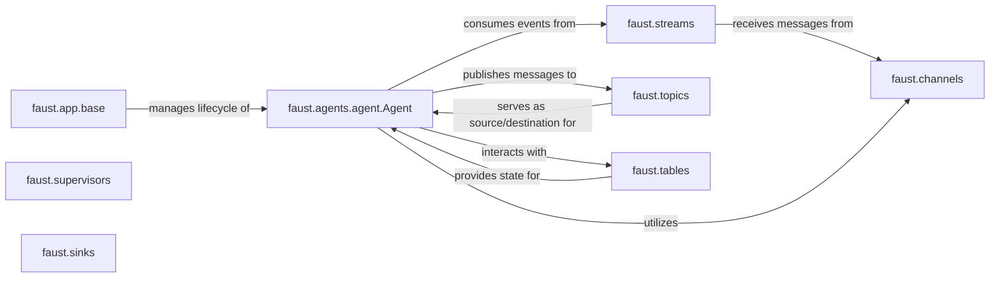

## Details

The Faust stream processing application centers around the `Agent` component, which encapsulates the core business logic. The `App` component serves as the central orchestrator, managing the lifecycle of these `Agent` instances. `Agents` consume event streams, which are abstracted by the `Stream` component, providing a unified interface for event consumption. Events typically originate from or are published to `Topics`, which represent Kafka topics, acting as the primary external communication points. For internal message passing and flexible event routing, `Agents` can utilize `Channels`. Stateful processing is enabled through `Tables`, which provide persistent and queryable storage for `Agents`. Finally, `Supervisors` ensure the resilient execution of `Agent` tasks, while `Sinks` handle the output of processed events, directing them to external systems or other topics.

### faust.agents.agent.Agent
The core, encapsulated stream processing unit responsible for defining and executing specific business logic on event streams. It acts as a "worker" or "processor" in the stream processing paradigm, handling event consumption, business logic application, state management, and event production.

**Related Classes/Methods**:

- <a href="https://github.com/faust-streaming/faust/blob/master/faust/agents/agent.py" target="_blank" rel="noopener noreferrer">`faust.agents.agent.Agent`</a>

### faust.channels
Provides an abstraction for internal message delivery within the Faust application, allowing agents to receive messages from various sources before they are processed.

**Related Classes/Methods**:

- <a href="https://github.com/faust-streaming/faust/blob/master/faust/channels.py#L57-L588" target="_blank" rel="noopener noreferrer">`faust.channels.Channel`:57-588</a>

### faust.streams
Represents an iterable sequence of events that an agent consumes. It abstracts the underlying message queue, providing a high-level interface for event consumption.

**Related Classes/Methods**:

- <a href="https://github.com/faust-streaming/faust/blob/master/faust/streams.py" target="_blank" rel="noopener noreferrer">`faust.streams.Stream`</a>

### faust.app.base
The base Faust application class responsible for managing the overall lifecycle of agents, including their registration, startup, and shutdown within the application context.

**Related Classes/Methods**:

- <a href="https://github.com/faust-streaming/faust/blob/master/faust/app/base.py" target="_blank" rel="noopener noreferrer">`faust.app.base.App`</a>

### faust.topics
Represents Kafka topics, serving as the primary source for input events and the ultimate destination for output events produced by agents. They are the external communication points for the agent.

**Related Classes/Methods**:

- <a href="https://github.com/faust-streaming/faust/blob/master/faust/topics.py" target="_blank" rel="noopener noreferrer">`faust.topics.Topic`</a>

### faust.supervisors
Manages the resilient and continuous execution of asynchronous processing tasks for agents, ensuring fault tolerance and automatic recovery in case of failures.

**Related Classes/Methods**: _None_

### faust.sinks
Components that receive and handle the output (processed events) from agents, potentially writing them to external systems, databases, or other topics.

**Related Classes/Methods**: _None_

### faust.tables
Provides persistent and queryable state for agents, enabling stateful stream processing, aggregations, and joins by storing and retrieving data across events.

**Related Classes/Methods**:

- <a href="https://github.com/faust-streaming/faust/blob/master/faust/tables/base.py#L71-L678" target="_blank" rel="noopener noreferrer">`faust.tables.base.Collection`:71-678</a>

### [FAQ](https://github.com/CodeBoarding/GeneratedOnBoardings/tree/main?tab=readme-ov-file#faq)