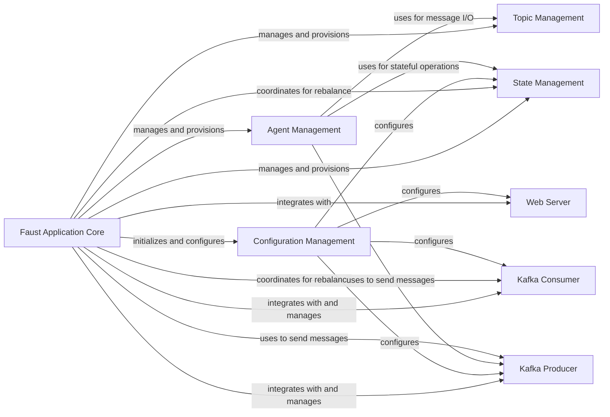

## Details

The `Faust Application Definition` subsystem is centered around the `Faust Application Core` component, which serves as the declarative blueprint and orchestrator for the entire Faust application. It defines and manages the lifecycle and interactions of the core stream processing elements.

### Faust Application Core
The central orchestrator and declarative blueprint of a Faust application. It defines and manages the lifecycle of agents, topics, tables, and integrates with core services like Kafka producers/consumers and the web server. It also handles the overall application startup and shutdown sequences.

**Related Classes/Methods**:

- <a href="https://github.com/faust-streaming/faust/blob/master/faust/app/base.py" target="_blank" rel="noopener noreferrer">`faust.app.base.App`</a>

### Configuration Management
Manages and provides access to all application-wide configuration settings, including Kafka broker details, state store backends, web server settings, and other operational parameters.

**Related Classes/Methods**:

- <a href="https://github.com/faust-streaming/faust/blob/master/faust/app/base.py#L1931-L1933" target="_blank" rel="noopener noreferrer">`faust.app.base.conf`:1931-1933</a>

### Topic Management
Provides an interface for defining, managing, and interacting with Kafka topics used by the Faust application. This includes topic creation, serialization, and deserialization.

**Related Classes/Methods**:

- <a href="https://github.com/faust-streaming/faust/blob/master/faust/app/base.py#L2000-L2011" target="_blank" rel="noopener noreferrer">`faust.app.base.topics`:2000-2011</a>

### State Management
Manages the application's state tables, which are changelogged key-value stores used by agents for stateful stream processing. This includes mechanisms for persistence, recovery, and replication.

**Related Classes/Methods**:

- <a href="https://github.com/faust-streaming/faust/blob/master/faust/app/base.py#L1990-L1998" target="_blank" rel="noopener noreferrer">`faust.app.base.tables`:1990-1998</a>

### Agent Management
Manages the lifecycle, execution, and coordination of Faust agents, which are the core stream processing units containing business logic.

**Related Classes/Methods**:

- <a href="https://github.com/faust-streaming/faust/blob/master/faust/app/base.py" target="_blank" rel="noopener noreferrer">`faust.app.base.agents`</a>

### Kafka Consumer
Represents and manages the underlying `aiokafka` consumer client responsible for fetching messages from Kafka topics.

**Related Classes/Methods**:

- <a href="https://github.com/faust-streaming/faust/blob/master/faust/app/base.py" target="_blank" rel="noopener noreferrer">`faust.app.base.consumer`</a>

### Kafka Producer
Represents and manages the underlying `aiokafka` producer client responsible for sending messages to Kafka topics.

**Related Classes/Methods**:

- <a href="https://github.com/faust-streaming/faust/blob/master/faust/app/base.py" target="_blank" rel="noopener noreferrer">`faust.app.base.producer`</a>

### Web Server
Manages the integrated web server (e.g., Aiohttp) for exposing HTTP endpoints, often used for health checks, metrics, or administrative interfaces.

**Related Classes/Methods**:

- <a href="https://github.com/faust-streaming/faust/blob/master/faust/app/base.py#L2098-L2101" target="_blank" rel="noopener noreferrer">`faust.app.base.web`:2098-2101</a>

### [FAQ](https://github.com/CodeBoarding/GeneratedOnBoardings/tree/main?tab=readme-ov-file#faq)