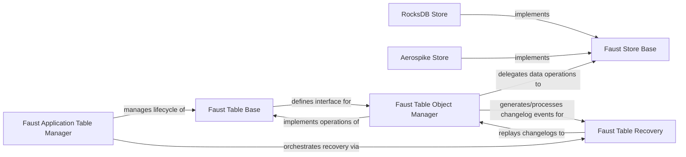

## Details

The `Faust State Stores` subsystem is responsible for providing durable and queryable state for Faust Agents. It achieves this by abstracting over various underlying key-value store implementations (such as RocksDB for local storage and Aerospike for distributed storage) and integrating changelog capabilities to ensure data consistency and fault tolerance. The core components of this subsystem are primarily found within the `faust.tables` and `faust.stores` packages.

### Faust Table Base
Serves as the abstract base class for all Faust tables, defining the core interface for state management operations (e.g., `__getitem__`, `__setitem__`, `__delitem__`, windowing). It provides the high-level API for agents to interact with their state.

**Related Classes/Methods**:

- <a href="https://github.com/faust-streaming/faust/blob/master/faust/tables/base.py" target="_blank" rel="noopener noreferrer">`Faust Table Base`</a>

### Faust Store Base
Defines the abstract contract for all key-value store implementations. This provides the necessary abstraction for "Pluggable Storage," allowing Faust to support various backends (like RocksDB or Aerospike) without changing the core table logic.

**Related Classes/Methods**:

- <a href="https://github.com/faust-streaming/faust/blob/master/faust/stores/base.py" target="_blank" rel="noopener noreferrer">`Faust Store Base`</a>

### RocksDB Store
Provides a concrete, local, persistent, and high-performance key-value store implementation using RocksDB. This component directly supports "Stateful Processing" and "Fault Tolerance" by enabling local, embedded state that can be recovered from changelogs.

**Related Classes/Methods**:

- <a href="https://github.com/faust-streaming/faust/blob/master/faust/stores/rocksdb.py" target="_blank" rel="noopener noreferrer">`RocksDB Store`</a>

### Aerospike Store
Provides a concrete, distributed, persistent key-value store implementation using Aerospike. This enables "Distributed Systems" and "Scalability" by allowing table state to be managed externally across a cluster, offering high availability and horizontal scaling.

**Related Classes/Methods**:

- <a href="https://github.com/faust-streaming/faust/blob/master/faust/stores/aerospike.py" target="_blank" rel="noopener noreferrer">`Aerospike Store`</a>

### Faust Table Object Manager
Manages the data within a specific table instance. It translates high-level table operations from `Faust Table Base` into calls to the underlying `Faust Store Base` implementation and handles the sending and application of changelog events for consistency.

**Related Classes/Methods**:

- <a href="https://github.com/faust-streaming/faust/blob/master/faust/tables/objects.py" target="_blank" rel="noopener noreferrer">`Faust Table Object Manager`</a>

### Faust Table Recovery
Orchestrates the recovery of table state, particularly during rebalances and application startup, by replaying changelog events. This is a cornerstone of "Fault Tolerance" and "Exactly-Once Processing" guarantees in stream processing.

**Related Classes/Methods**:

- <a href="https://github.com/faust-streaming/faust/blob/master/faust/tables/recovery.py" target="_blank" rel="noopener noreferrer">`Faust Table Recovery`</a>

### Faust Application Table Manager
A higher-level component responsible for managing all tables within a Faust application. It coordinates table lifecycle, commit handling, and overall recovery orchestration, providing a centralized mechanism for managing the application's collective state.

**Related Classes/Methods**:

- <a href="https://github.com/faust-streaming/faust/blob/master/faust/tables/manager.py" target="_blank" rel="noopener noreferrer">`Faust Application Table Manager`</a>

### [FAQ](https://github.com/CodeBoarding/GeneratedOnBoardings/tree/main?tab=readme-ov-file#faq)