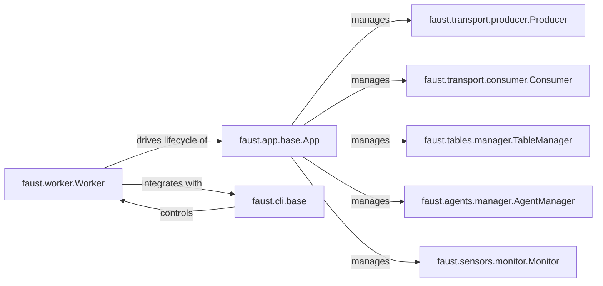

## Details

The `Faust Worker Runtime` subsystem is the operational core of a Faust application, responsible for its lifecycle, interaction with Kafka, and exposing monitoring interfaces.

### faust.worker.Worker
The primary entry point and orchestrator for a Faust application instance. It manages the complete lifecycle of the application, including startup, shutdown, signal handling, and ensuring the application's services are properly initialized and run. It acts as the runtime container for the Faust application.

**Related Classes/Methods**:

- <a href="https://github.com/faust-streaming/faust/blob/master/faust/worker.py#L142-L391" target="_blank" rel="noopener noreferrer">`faust.worker.Worker`:142-391</a>

### faust.app.base.App
The core Faust application instance, responsible for initializing and managing all essential services and components required for stream processing. This includes Kafka I/O, state tables, agents, and sensors. It's the central hub for the application's business logic and data flow.

**Related Classes/Methods**:

- <a href="https://github.com/faust-streaming/faust/blob/master/faust/app/base.py" target="_blank" rel="noopener noreferrer">`faust.app.base.App`</a>

### faust.cli.base
Provides the foundational command-line interface (CLI) utilities and base classes for Faust applications, enabling users to interact with and control the Faust worker from the terminal.

**Related Classes/Methods**:

- <a href="https://github.com/faust-streaming/faust/blob/master/faust/cli/base.py" target="_blank" rel="noopener noreferrer">`faust.cli.base`</a>

### faust.transport.producer.Producer
Handles the asynchronous production of messages to Kafka topics, ensuring reliable data output from the Faust application.

**Related Classes/Methods**:

- <a href="https://github.com/faust-streaming/faust/blob/master/faust/transport/producer.py#L119-L245" target="_blank" rel="noopener noreferrer">`faust.transport.producer.Producer`:119-245</a>

### faust.transport.consumer.Consumer
Manages the asynchronous consumption of messages from Kafka topics, providing the input streams for the Faust application's processing logic.

**Related Classes/Methods**:

- <a href="https://github.com/faust-streaming/faust/blob/master/faust/transport/consumer.py" target="_blank" rel="noopener noreferrer">`faust.transport.consumer.Consumer`</a>

### faust.tables.manager.TableManager
Oversees the creation, management, and persistence of state tables, which are crucial for stateful stream processing and maintaining application state across events.

**Related Classes/Methods**:

- <a href="https://github.com/faust-streaming/faust/blob/master/faust/tables/manager.py#L28-L211" target="_blank" rel="noopener noreferrer">`faust.tables.manager.TableManager`:28-211</a>

### faust.agents.manager.AgentManager
Manages the lifecycle and execution of Faust agents, which encapsulate the core stream processing business logic, consuming from and producing to topics, and interacting with state tables.

**Related Classes/Methods**:

- <a href="https://github.com/faust-streaming/faust/blob/master/faust/agents/manager.py#L34-L131" target="_blank" rel="noopener noreferrer">`faust.agents.manager.AgentManager`:34-131</a>

### faust.sensors.monitor.Monitor
Collects and exposes metrics and monitoring data about the Faust application's runtime performance, Kafka I/O, and agent activity, enabling operational visibility.

**Related Classes/Methods**:

- <a href="https://github.com/faust-streaming/faust/blob/master/faust/sensors/monitor.py#L92-L673" target="_blank" rel="noopener noreferrer">`faust.sensors.monitor.Monitor`:92-673</a>

### [FAQ](https://github.com/CodeBoarding/GeneratedOnBoardings/tree/main?tab=readme-ov-file#faq)