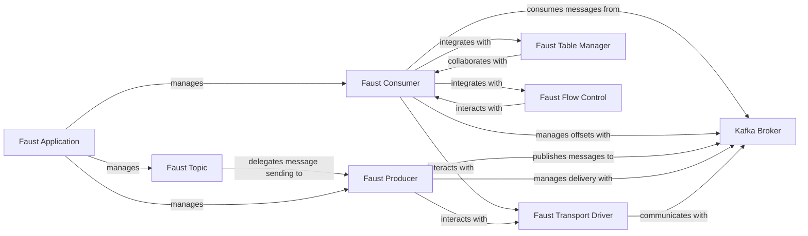

## Details

The Faust subsystem orchestrates real-time stream processing by interacting with an external `Kafka Broker`. The `Faust Application` serves as the central manager, configuring and overseeing `Faust Topics`, `Faust Consumers`, and `Faust Producers`. `Faust Consumers` are responsible for ingesting messages from the `Kafka Broker`, managing offsets, and integrating with `Faust Table Manager` for stateful processing and `Faust Flow Control` for backpressure. Conversely, `Faust Producers` publish processed events or new messages to the `Kafka Broker`, ensuring reliable delivery. Both consumers and producers abstract their low-level Kafka interactions through the `Faust Transport Driver`. This setup enables a robust, scalable, and fault-tolerant event-driven architecture.

### Faust Topic
Provides a declarative interface for defining Kafka topics, including their names, key/value types, and serialization/deserialization schemas. It represents the logical channels for event streams within the Faust application.

**Related Classes/Methods**:

- <a href="https://github.com/faust-streaming/faust/blob/master/faust/topics.py" target="_blank" rel="noopener noreferrer">`faust.topics.Topic`</a>

### Faust Consumer
Manages the consumption of messages from assigned Kafka partitions, handling offset management, group coordination, and deserialization of incoming event streams. It acts as the primary ingress point for data into the Faust application.

**Related Classes/Methods**:

- <a href="https://github.com/faust-streaming/faust/blob/master/faust/transport/consumer.py" target="_blank" rel="noopener noreferrer">`faust.transport.consumer.Consumer`</a>

### Faust Producer
Manages the sending of messages to Kafka topics, including message serialization, buffering, and flushing to the Kafka broker. It ensures reliable egress of processed events or new event streams generated by the application.

**Related Classes/Methods**:

- <a href="https://github.com/faust-streaming/faust/blob/master/faust/transport/producer.py#L119-L245" target="_blank" rel="noopener noreferrer">`faust.transport.producer.Producer`:119-245</a>

### Kafka Broker
The external Apache Kafka cluster that serves as the distributed, fault-tolerant message bus. It stores, replicates, and delivers event streams, acting as the central hub for all inter-component communication within the ecosystem.

**Related Classes/Methods**: _None_

### Faust Application
The main orchestrator and lifecycle manager for a Faust stream processing application. It initializes, configures, and manages the various messaging components (topics, consumers, producers) and agents, binding them into a cohesive processing unit.

**Related Classes/Methods**:

- <a href="https://github.com/faust-streaming/faust/blob/master/examples/fastapi/my_faust/app.py" target="_blank" rel="noopener noreferrer">`faust.app.App`</a>

### Faust Transport Driver
Provides an abstract interface for low-level communication with the underlying messaging system (e.g., `aiokafka` for Kafka). It encapsulates the specific details of connecting to and interacting with the Kafka Broker for both message production and consumption.

**Related Classes/Methods**:

- <a href="https://github.com/faust-streaming/faust/blob/master/faust/transport/base.py#L35-L88" target="_blank" rel="noopener noreferrer">`faust.transport.base.Transport`:35-88</a>

### Faust Table Manager
Manages the state recovery and consistency for Faust tables (state stores). It collaborates closely with the `Faust Consumer` to ensure that local application state is correctly synchronized with Kafka changelog topics, enabling fault-tolerant stateful processing.

**Related Classes/Methods**:

- <a href="https://github.com/faust-streaming/faust/blob/master/faust/tables/manager.py#L28-L211" target="_blank" rel="noopener noreferrer">`faust.tables.manager.TableManager`:28-211</a>

### Faust Flow Control
Regulates the rate of message consumption to prevent the Faust application from being overwhelmed by high message throughput. It implements backpressure mechanisms, pausing and resuming consumption to ensure stable and efficient operation.

**Related Classes/Methods**:

- <a href="https://github.com/faust-streaming/faust/blob/master/faust/transport/flow.py#L28-L100" target="_blank" rel="noopener noreferrer">`faust.transport.flow.FlowControl`:28-100</a>

### [FAQ](https://github.com/CodeBoarding/GeneratedOnBoardings/tree/main?tab=readme-ov-file#faq)