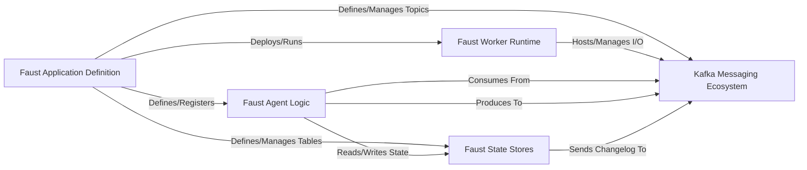

## Details

The Faust project provides a robust stream processing framework built around a declarative application definition. The `Faust Application Definition` serves as the central configuration, where developers define `Faust Agent Logic` (stream processing units), `Kafka Messaging Ecosystem` topics for data ingress/egress, and `Faust State Stores` for managing durable state. This definition is then deployed and executed by the `Faust Worker Runtime`, which manages the application's lifecycle and handles all interactions with Kafka. `Faust Agent Logic` components are the core of the processing, consuming events from Kafka, applying business logic, and potentially producing new events back to Kafka. They also interact with `Faust State Stores` for stateful operations, with state changes often being replicated back to Kafka as changelogs for consistency and recovery. This architecture ensures a clear separation of concerns, enabling scalable and resilient real-time data processing.

The analysis of the Control Flow Graph (CFG) and relevant source code reveals a highly modular and event-driven architecture centered around Kafka. The core interaction pathways are:

1.  **Application Definition to Runtime & Components:** The `Faust Application Definition` acts as the orchestrator, defining and registering agents, topics, and tables. This definition is then used by the `Faust Worker Runtime` to instantiate and manage the application's execution. This pathway is critical for initial setup and deployment.
    *   `(Faust Application Definition, Deploys/Runs, Faust Worker Runtime)`
    *   `(Faust Application Definition, Defines/Registers, Faust Agent Logic)`
    *   `(Faust Application Definition, Defines/Manages Topics, Kafka Messaging Ecosystem)`
    *   `(Faust Application Definition, Defines/Manages Tables, Faust State Stores)`

2.  **Worker Runtime and Kafka I/O:** The `Faust Worker Runtime` is responsible for the operational aspects, including managing the I/O with the `Kafka Messaging Ecosystem`. It ensures that agents can reliably consume and produce messages.
    *   `(Faust Worker Runtime, Hosts/Manages I/O, Kafka Messaging Ecosystem)`

3.  **Agent Logic and Kafka Messaging:** `Faust Agent Logic` is the active processing unit. It directly interacts with the `Kafka Messaging Ecosystem` to consume input events and produce output events, forming the primary data flow.
    *   `(Faust Agent Logic, Consumes From, Kafka Messaging Ecosystem)`
    *   `(Faust Agent Logic, Produces To, Kafka Messaging Ecosystem)`

4.  **Agent Logic and State Management:** `Faust Agent Logic` leverages `Faust State Stores` for maintaining and querying state. This interaction is crucial for stateful stream processing, allowing agents to remember past events or aggregate data.
    *   `(Faust Agent Logic, Reads/Writes State, Faust State Stores)`

5.  **State Stores and Kafka Changelog:** For durability and consistency, `Faust State Stores` often send changelogs back to the `Kafka Messaging Ecosystem`. This ensures that state changes are recorded and can be replayed for fault tolerance or recovery.
    *   `(Faust State Stores, Sends Changelog To, Kafka Messaging Ecosystem)`

These pathways highlight the flow of control and data, from application definition and deployment to real-time event processing and state management, all orchestrated around Kafka as the central messaging backbone.

### Faust Application Definition [[Expand]](./Faust_Application_Definition.md)
The declarative blueprint of a Faust application, defining its agents, topics, and tables. It's the central configuration and orchestration point.

**Related Classes/Methods**:

- <a href="https://github.com/faust-streaming/faust/blob/master/faust/app/base.py" target="_blank" rel="noopener noreferrer">`faust.app.base.App`</a>

### Faust Worker Runtime [[Expand]](./Faust_Worker_Runtime.md)
The operational process that executes a Faust application instance, managing its lifecycle, I/O with Kafka, and exposing monitoring interfaces.

**Related Classes/Methods**:

- <a href="https://github.com/faust-streaming/faust/blob/master/faust/worker.py#L142-L391" target="_blank" rel="noopener noreferrer">`faust.worker.Worker`:142-391</a>

### Faust Agent Logic [[Expand]](./Faust_Agent_Logic.md)
The encapsulated stream processing unit, responsible for consuming events, applying business logic, interacting with state, and producing new events.

**Related Classes/Methods**:

- <a href="https://github.com/faust-streaming/faust/blob/master/faust/agents/agent.py" target="_blank" rel="noopener noreferrer">`faust.agents.agent.Agent`</a>

### Kafka Messaging Ecosystem [[Expand]](./Kafka_Messaging_Ecosystem.md)
The central nervous system for event streams, encompassing Kafka Topics for data channels, and Kafka Consumers/Producers for reliable message ingress and egress.

**Related Classes/Methods**:

- <a href="https://github.com/faust-streaming/faust/blob/master/faust/topics.py" target="_blank" rel="noopener noreferrer">`faust.topics.Topic`</a>
- <a href="https://github.com/faust-streaming/faust/blob/master/faust/transport/consumer.py" target="_blank" rel="noopener noreferrer">`faust.transport.consumer.Consumer`</a>
- <a href="https://github.com/faust-streaming/faust/blob/master/faust/transport/producer.py#L119-L245" target="_blank" rel="noopener noreferrer">`faust.transport.producer.Producer`:119-245</a>

### Faust State Stores [[Expand]](./Faust_State_Stores.md)
Provides durable, queryable state for Faust Agents, abstracting over local (RocksDB) or distributed (Aerospike) key-value stores, with changelog capabilities for consistency.

**Related Classes/Methods**:

- <a href="https://github.com/faust-streaming/faust/blob/master/faust/tables/base.py" target="_blank" rel="noopener noreferrer">`faust.tables.base.Table`</a>
- <a href="https://github.com/faust-streaming/faust/blob/master/faust/stores/rocksdb.py" target="_blank" rel="noopener noreferrer">`faust.stores.rocksdb.RocksDBStore`</a>
- <a href="https://github.com/faust-streaming/faust/blob/master/faust/stores/aerospike.py#L39-L303" target="_blank" rel="noopener noreferrer">`faust.stores.aerospike.AerospikeStore`:39-303</a>

### [FAQ](https://github.com/CodeBoarding/GeneratedOnBoardings/tree/main?tab=readme-ov-file#faq)