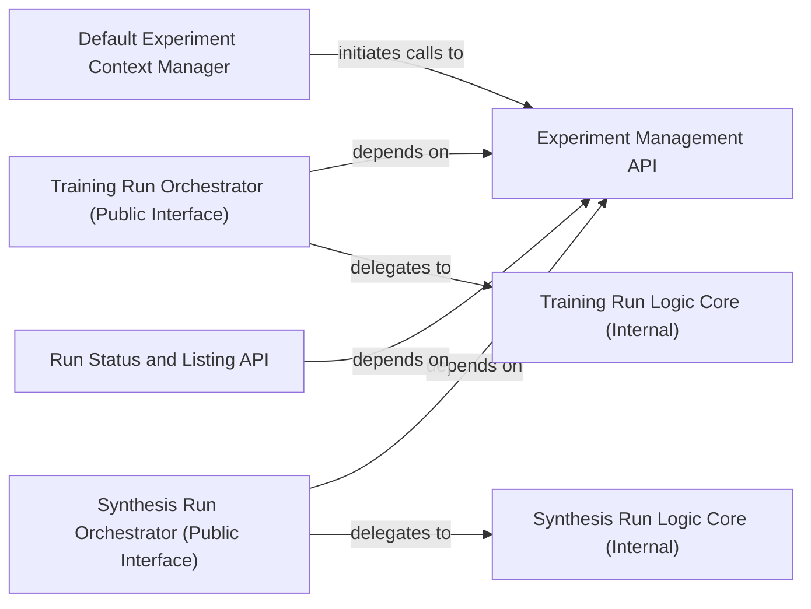

## Details

The `Experiment & Run Orchestration Module` is a core subsystem within `finetuner` responsible for managing the complete lifecycle of fine-tuning experiments and their associated training and synthesis runs on Jina AI Cloud. It provides the necessary APIs for users to define, initiate, and monitor their machine learning experiments.

### Experiment Management API
Provides the public interface for creating and retrieving fine-tuning experiments on Jina AI Cloud, serving as the primary entry point for experiment lifecycle management.

**Related Classes/Methods**:

- <a href="https://github.com/jina-ai/finetuner/blob/main/finetuner/finetuner.py#L49-L67" target="_blank" rel="noopener noreferrer">`finetuner.finetuner.create_experiment`:49-67</a>
- <a href="https://github.com/jina-ai/finetuner/blob/main/finetuner/finetuner.py#L69-L83" target="_blank" rel="noopener noreferrer">`finetuner.finetuner.get_experiment`:69-83</a>

### Default Experiment Context Manager
Ensures an active experiment context is available for operations, automatically creating a default experiment if none is explicitly set or retrieved, simplifying user interaction.

**Related Classes/Methods**:

- <a href="https://github.com/jina-ai/finetuner/blob/main/finetuner/finetuner.py#L41-L47" target="_blank" rel="noopener noreferrer">`finetuner.finetuner._get_default_experiment`:41-47</a>

### Training Run Orchestrator (Public Interface)
The public entry point for users to initiate and manage fine-tuning training runs on Jina AI Cloud, abstracting the underlying run setup complexities.

**Related Classes/Methods**:

- <a href="https://github.com/jina-ai/finetuner/blob/main/finetuner/finetuner.py#L142-L226" target="_blank" rel="noopener noreferrer">`finetuner.finetuner.create_training_run`:142-226</a>

### Training Run Logic Core (Internal)
Encapsulates the core logic for preparing, configuring, and initiating a fine-tuning training run, including interaction with cloud services for resource allocation and job submission.

**Related Classes/Methods**:

- <a href="https://github.com/jina-ai/finetuner/blob/main/finetuner/experiment.py#L146-L225" target="_blank" rel="noopener noreferrer">`finetuner.experiment.create_training_run`:146-225</a>

### Synthesis Run Orchestrator (Public Interface)
The public entry point for users to initiate and manage data synthesis runs on Jina AI Cloud, facilitating the generation of synthetic data for fine-tuning.

**Related Classes/Methods**:

- <a href="https://github.com/jina-ai/finetuner/blob/main/finetuner/finetuner.py#L228-L272" target="_blank" rel="noopener noreferrer">`finetuner.finetuner.create_synthesis_run`:228-272</a>

### Synthesis Run Logic Core (Internal)
Implements the core logic for setting up, configuring, and initiating a data synthesis run, handling the specifics of data generation and cloud interaction.

**Related Classes/Methods**:

- <a href="https://github.com/jina-ai/finetuner/blob/main/finetuner/experiment.py#L227-L294" target="_blank" rel="noopener noreferrer">`finetuner.experiment.create_synthesis_run`:227-294</a>

### Run Status and Listing API
Provides functionality to retrieve the status of individual runs and list all runs associated with a specific experiment, enabling users to monitor their fine-tuning processes.

**Related Classes/Methods**:

- <a href="https://github.com/jina-ai/finetuner/blob/main/finetuner/finetuner.py#L291-L314" target="_blank" rel="noopener noreferrer">`finetuner.finetuner.list_runs`:291-314</a>

### [FAQ](https://github.com/CodeBoarding/GeneratedOnBoardings/tree/main?tab=readme-ov-file#faq)