```mermaid
graph LR
    User_Client_Application["User/Client Application"]
    Authentication_Session_Management["Authentication & Session Management"]
    Data_Preparation_Module["Data Preparation Module"]
    Model_Acquisition_Module["Model Acquisition Module"]
    Experiment_Run_Orchestration_Module["Experiment & Run Orchestration Module"]
    Cloud_Data_Upload_Module["Cloud Data Upload Module"]
    Run_Monitoring_Results_Module["Run Monitoring & Results Module"]
    Jina_AI_Cloud_External_["Jina AI Cloud (External)"]
    User_Client_Application -- "initiates interaction with" --> Authentication_Session_Management
    User_Client_Application -- "provides raw data to" --> Data_Preparation_Module
    User_Client_Application -- "specifies model requirements to" --> Model_Acquisition_Module
    User_Client_Application -- "interacts with" --> Experiment_Run_Orchestration_Module
    Authentication_Session_Management -- " establishes a session with" --> Jina_AI_Cloud_External_
    Data_Preparation_Module -- "outputs prepared DocumentArray data to" --> Cloud_Data_Upload_Module
    Model_Acquisition_Module -- "provides acquired model artifacts to" --> Experiment_Run_Orchestration_Module
    Experiment_Run_Orchestration_Module -- "triggers data upload via" --> Cloud_Data_Upload_Module
    Experiment_Run_Orchestration_Module -- "sends run configurations and references to uploaded data/models to" --> Jina_AI_Cloud_External_
    Cloud_Data_Upload_Module -- "transfers prepared data to" --> Jina_AI_Cloud_External_
    Jina_AI_Cloud_External_ -- "provides run status, metrics, and artifacts to" --> Run_Monitoring_Results_Module
    Run_Monitoring_Results_Module -- "delivers retrieved insights and results back to" --> User_Client_Application
    click Model_Acquisition_Module href "https://github.com/CodeBoarding/GeneratedOnBoardings/blob/main/finetuner/Model_Acquisition_Module.md" "Details"
    click Experiment_Run_Orchestration_Module href "https://github.com/CodeBoarding/GeneratedOnBoardings/blob/main/finetuner/Experiment_Run_Orchestration_Module.md" "Details"
```

## Details

The Finetuner library acts as an intermediary, enabling a `User/Client Application` to interact with `Jina AI Cloud (External)` for fine-tuning deep learning models. The workflow begins with the `User/Client Application` authenticating and preparing data through the `Authentication & Session Management` and `Data Preparation Module` respectively. Pre-trained models are acquired by the `Model Acquisition Module`. `Experiment & Run Orchestration Module` then coordinates the fine-tuning process, leveraging the `Cloud Data Upload Module` to transfer data to `Jina AI Cloud (External)`. Finally, the `Run Monitoring & Results Module` retrieves and presents the outcomes from `Jina AI Cloud (External)` back to the `User/Client Application`, completing the fine-tuning lifecycle.

### User/Client Application
Represents the external user or application interacting with the Finetuner library's public API to initiate workflows and consume results. This component does not have internal source code within the Finetuner project.

**Related Classes/Methods**:

- <a href="https://github.com/jina-ai/finetuner/blob/main/finetuner/finetuner.py#L23-L33" target="_blank" rel="noopener noreferrer">`finetuner.finetuner.login`:23-33</a>
- <a href="https://github.com/jina-ai/finetuner/blob/main/finetuner/data.py#L296-L306" target="_blank" rel="noopener noreferrer">`finetuner.data.build_dataset`:296-306</a>
- <a href="https://github.com/jina-ai/finetuner/blob/main/finetuner/__init__.py#L545-L622" target="_blank" rel="noopener noreferrer">`finetuner.__init__.get_model`:545-622</a>
- <a href="https://github.com/jina-ai/finetuner/blob/main/finetuner/finetuner.py#L49-L67" target="_blank" rel="noopener noreferrer">`finetuner.finetuner.create_experiment`:49-67</a>
- <a href="https://github.com/jina-ai/finetuner/blob/main/finetuner/finetuner.py#L69-L83" target="_blank" rel="noopener noreferrer">`finetuner.finetuner.get_experiment`:69-83</a>
- <a href="https://github.com/jina-ai/finetuner/blob/main/finetuner/run.py" target="_blank" rel="noopener noreferrer">`finetuner.run.status`</a>
- <a href="https://github.com/jina-ai/finetuner/blob/main/finetuner/run.py" target="_blank" rel="noopener noreferrer">`finetuner.run.metrics`</a>
- <a href="https://github.com/jina-ai/finetuner/blob/main/finetuner/run.py#L189-L201" target="_blank" rel="noopener noreferrer">`finetuner.run.save_artifact`:189-201</a>
- <a href="https://github.com/jina-ai/finetuner/blob/main/finetuner/run.py" target="_blank" rel="noopener noreferrer">`finetuner.run.example_results`</a>

### Authentication & Session Management
Handles user authentication and session establishment with Jina AI Cloud.

**Related Classes/Methods**:

- <a href="https://github.com/jina-ai/finetuner/blob/main/finetuner/finetuner.py#L23-L33" target="_blank" rel="noopener noreferrer">`finetuner.finetuner.login`:23-33</a>

### Data Preparation Module
Prepares raw input data into DocumentArray format for fine-tuning.

**Related Classes/Methods**:

- <a href="https://github.com/jina-ai/finetuner/blob/main/finetuner/data.py#L296-L306" target="_blank" rel="noopener noreferrer">`finetuner.data.build_dataset`:296-306</a>
- <a href="https://github.com/jina-ai/finetuner/blob/main/finetuner/data.py#L274-L294" target="_blank" rel="noopener noreferrer">`finetuner.data._get_csv_parser`:274-294</a>
- <a href="https://github.com/jina-ai/finetuner/blob/main/finetuner/data.py#L236-L244" target="_blank" rel="noopener noreferrer">`finetuner.data.parse`:236-244</a>

### Model Acquisition Module [[Expand]](./Model_Acquisition_Module.md)
Acquires and loads pre-trained base models from various sources.

**Related Classes/Methods**:

- <a href="https://github.com/jina-ai/finetuner/blob/main/finetuner/__init__.py#L545-L622" target="_blank" rel="noopener noreferrer">`finetuner.__init__.get_model`:545-622</a>

### Experiment & Run Orchestration Module [[Expand]](./Experiment_Run_Orchestration_Module.md)
Manages the lifecycle of fine-tuning experiments and runs on Jina AI Cloud.

**Related Classes/Methods**:

- <a href="https://github.com/jina-ai/finetuner/blob/main/finetuner/finetuner.py#L49-L67" target="_blank" rel="noopener noreferrer">`finetuner.finetuner.create_experiment`:49-67</a>
- <a href="https://github.com/jina-ai/finetuner/blob/main/finetuner/finetuner.py#L69-L83" target="_blank" rel="noopener noreferrer">`finetuner.finetuner.get_experiment`:69-83</a>
- <a href="https://github.com/jina-ai/finetuner/blob/main/finetuner/experiment.py#L146-L225" target="_blank" rel="noopener noreferrer">`finetuner.experiment.create_training_run`:146-225</a>
- <a href="https://github.com/jina-ai/finetuner/blob/main/finetuner/experiment.py#L227-L294" target="_blank" rel="noopener noreferrer">`finetuner.experiment.create_synthesis_run`:227-294</a>

### Cloud Data Upload Module
Transfers prepared datasets to Jina AI Cloud.

**Related Classes/Methods**:

- <a href="https://github.com/jina-ai/finetuner/blob/main/finetuner/hubble.py#L26-L66" target="_blank" rel="noopener noreferrer">`finetuner.hubble.push_training_data`:26-66</a>
- <a href="https://github.com/jina-ai/finetuner/blob/main/finetuner/hubble.py#L69-L98" target="_blank" rel="noopener noreferrer">`finetuner.hubble.push_synthesis_data`:69-98</a>

### Run Monitoring & Results Module
Monitors run status, retrieves metrics, and accesses artifacts from Jina AI Cloud.

**Related Classes/Methods**:

- <a href="https://github.com/jina-ai/finetuner/blob/main/finetuner/run.py" target="_blank" rel="noopener noreferrer">`finetuner.run.status`</a>
- <a href="https://github.com/jina-ai/finetuner/blob/main/finetuner/run.py" target="_blank" rel="noopener noreferrer">`finetuner.run.metrics`</a>
- <a href="https://github.com/jina-ai/finetuner/blob/main/finetuner/run.py#L189-L201" target="_blank" rel="noopener noreferrer">`finetuner.run.save_artifact`:189-201</a>
- <a href="https://github.com/jina-ai/finetuner/blob/main/finetuner/run.py" target="_blank" rel="noopener noreferrer">`finetuner.run.example_results`</a>

### Jina AI Cloud (External)
The remote platform for computation, training, and data storage. This is an external service and does not have internal source code within the Finetuner project. The listed references are the Finetuner internal functions that interact with Jina AI Cloud.

**Related Classes/Methods**:

- <a href="https://github.com/jina-ai/finetuner/blob/main/finetuner/finetuner.py#L23-L33" target="_blank" rel="noopener noreferrer">`finetuner.finetuner.login`:23-33</a>
- <a href="https://github.com/jina-ai/finetuner/blob/main/finetuner/hubble.py#L26-L66" target="_blank" rel="noopener noreferrer">`finetuner.hubble.push_training_data`:26-66</a>
- <a href="https://github.com/jina-ai/finetuner/blob/main/finetuner/hubble.py#L69-L98" target="_blank" rel="noopener noreferrer">`finetuner.hubble.push_synthesis_data`:69-98</a>
- <a href="https://github.com/jina-ai/finetuner/blob/main/finetuner/experiment.py#L146-L225" target="_blank" rel="noopener noreferrer">`finetuner.experiment.create_training_run`:146-225</a>
- <a href="https://github.com/jina-ai/finetuner/blob/main/finetuner/experiment.py#L227-L294" target="_blank" rel="noopener noreferrer">`finetuner.experiment.create_synthesis_run`:227-294</a>
- <a href="https://github.com/jina-ai/finetuner/blob/main/finetuner/run.py" target="_blank" rel="noopener noreferrer">`finetuner.run.status`</a>
- <a href="https://github.com/jina-ai/finetuner/blob/main/finetuner/run.py" target="_blank" rel="noopener noreferrer">`finetuner.run.metrics`</a>
- <a href="https://github.com/jina-ai/finetuner/blob/main/finetuner/run.py#L189-L201" target="_blank" rel="noopener noreferrer">`finetuner.run.save_artifact`:189-201</a>
- <a href="https://github.com/jina-ai/finetuner/blob/main/finetuner/run.py" target="_blank" rel="noopener noreferrer">`finetuner.run.example_results`</a>

### [FAQ](https://github.com/CodeBoarding/GeneratedOnBoardings/tree/main?tab=readme-ov-file#faq)