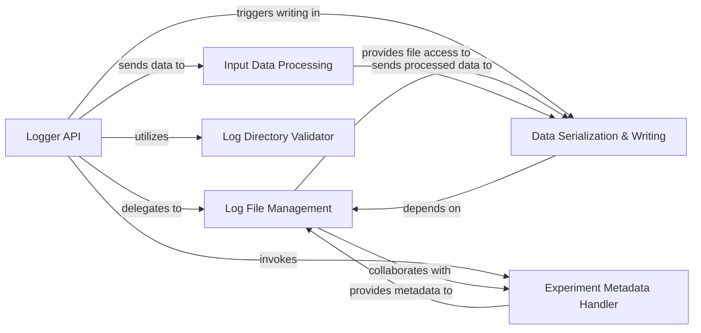

## Details

The `Experiment Logger` subsystem is primarily defined by the `fitlog.fastlog.logger` module, encompassing the `Logger` class and its associated functions responsible for the core logging functionalities. It also includes the `fitlog.fastlog.log_read` module, specifically for directory validation.

### Logger API
The primary user-facing interface for logging experiment data (metrics, losses, hyperparameters) and managing the experiment lifecycle (start, finish). It orchestrates interactions with other internal components.

**Related Classes/Methods**:

- <a href="https://github.com/fastnlp/fitlog/blob/master/fitlog/fastlog/logger.py" target="_blank" rel="noopener noreferrer">`fitlog.fastlog.logger.Logger`</a>
- <a href="https://github.com/fastnlp/fitlog/blob/master/fitlog/fastlog/logger.py" target="_blank" rel="noopener noreferrer">`fitlog.fastlog.logger.Logger:add_metric`</a>
- <a href="https://github.com/fastnlp/fitlog/blob/master/fitlog/fastlog/logger.py" target="_blank" rel="noopener noreferrer">`fitlog.fastlog.logger.Logger:add_loss`</a>
- <a href="https://github.com/fastnlp/fitlog/blob/master/fitlog/fastlog/logger.py" target="_blank" rel="noopener noreferrer">`fitlog.fastlog.logger.Logger:add_hyper`</a>
- <a href="https://github.com/fastnlp/fitlog/blob/master/fitlog/fastlog/logger.py" target="_blank" rel="noopener noreferrer">`fitlog.fastlog.logger.Logger:finish`</a>
- <a href="https://github.com/fastnlp/fitlog/blob/master/fitlog/fastlog/logger.py" target="_blank" rel="noopener noreferrer">`fitlog.fastlog.logger.Logger:set_log_dir`</a>

### Log File Management
Manages the creation, initialization, and persistence of log files and directories on the file system, ensuring proper organization and storage of experiment logs.

**Related Classes/Methods**:

- <a href="https://github.com/fastnlp/fitlog/blob/master/fitlog/fastlog/logger.py#L193-L202" target="_blank" rel="noopener noreferrer">`fitlog.fastlog.logger.create_log_folder`:193-202</a>
- <a href="https://github.com/fastnlp/fitlog/blob/master/fitlog/fastlog/logger.py#L282-L317" target="_blank" rel="noopener noreferrer">`fitlog.fastlog.logger._create_log_files`:282-317</a>
- <a href="https://github.com/fastnlp/fitlog/blob/master/fitlog/fastlog/logger.py#L652-L660" target="_blank" rel="noopener noreferrer">`fitlog.fastlog.logger._save`:652-660</a>
- <a href="https://github.com/fastnlp/fitlog/blob/master/fitlog/fastlog/logger.py#L257-L280" target="_blank" rel="noopener noreferrer">`fitlog.fastlog.logger._clear`:257-280</a>

### Data Serialization & Writing
Handles the low-level formatting and writing of processed experiment data into the designated log files, acting as the core persistence mechanism.

**Related Classes/Methods**:

- <a href="https://github.com/fastnlp/fitlog/blob/master/fitlog/fastlog/logger.py#L662-L681" target="_blank" rel="noopener noreferrer">`fitlog.fastlog.logger._write_to_logger`:662-681</a>
- <a href="https://github.com/fastnlp/fitlog/blob/master/fitlog/fastlog/logger.py#L410-L422" target="_blank" rel="noopener noreferrer">`fitlog.fastlog.logger.add_to_file`:410-422</a>

### Input Data Processing
Pre-processes, validates, and transforms raw input data provided by the user into a standardized format suitable for logging, ensuring data consistency.

**Related Classes/Methods**:

- <a href="https://github.com/fastnlp/fitlog/blob/master/fitlog/fastlog/logger.py#L708-L761" target="_blank" rel="noopener noreferrer">`fitlog.fastlog.logger._parse_value`:708-761</a>
- <a href="https://github.com/fastnlp/fitlog/blob/master/fitlog/fastlog/logger.py#L764-L801" target="_blank" rel="noopener noreferrer">`fitlog.fastlog.logger._check_dict_value`:764-801</a>
- <a href="https://github.com/fastnlp/fitlog/blob/master/fitlog/fastlog/logger.py#L690-L705" target="_blank" rel="noopener noreferrer">`fitlog.fastlog.logger._convert_configparser_to_dict`:690-705</a>
- <a href="https://github.com/fastnlp/fitlog/blob/master/fitlog/fastlog/logger.py#L31-L43" target="_blank" rel="noopener noreferrer">`fitlog.fastlog.logger._get_config_args`:31-43</a>

### Experiment Metadata Handler
Manages the addition of initial and final metadata related to the experiment, such as start/end times, configuration, and other contextual information.

**Related Classes/Methods**:

- <a href="https://github.com/fastnlp/fitlog/blob/master/fitlog/fastlog/logger.py#L319-L340" target="_blank" rel="noopener noreferrer">`fitlog.fastlog.logger.__add_meta`:319-340</a>
- <a href="https://github.com/fastnlp/fitlog/blob/master/fitlog/fastlog/logger.py#L804-L812" target="_blank" rel="noopener noreferrer">`fitlog.fastlog.logger.get_hour_min_second`:804-812</a>

### Log Directory Validator
Validates the integrity and existence of specified log directories, ensuring they conform to expected patterns before logging commences.

**Related Classes/Methods**:

- <a href="https://github.com/fastnlp/fitlog/blob/master/fitlog/fastlog/log_read.py#L234-L250" target="_blank" rel="noopener noreferrer">`fitlog.fastlog.log_read.is_dirname_log_record`:234-250</a>

### [FAQ](https://github.com/CodeBoarding/GeneratedOnBoardings/tree/main?tab=readme-ov-file#faq)