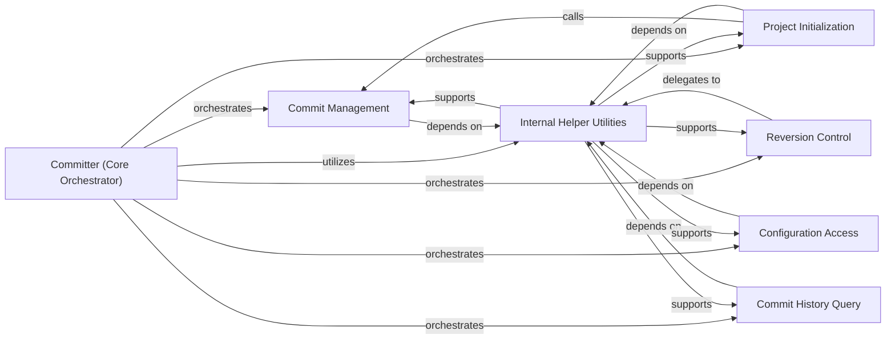

## Details

The fitlog version control subsystem, centered around the Committer (Core Orchestrator), provides comprehensive Git integration for experiment tracking. This core component orchestrates key functionalities such as Commit Management for capturing experiment states, Project Initialization for setting up new projects, Reversion Control for rolling back to previous versions, Configuration Access for managing Git settings, and Commit History Query for retrieving historical data. These specialized components, along with the Committer itself, extensively utilize and depend on Internal Helper Utilities for executing low-level Git commands and handling common operational logic, ensuring a robust and efficient versioning process for scientific experiments.

### Committer (Core Orchestrator)
This is the primary class that orchestrates all Git-related operations within fitlog. It acts as the central interface for managing the version control lifecycle of experiments, ensuring reproducibility and tracking.

**Related Classes/Methods**:

- <a href="https://github.com/fastnlp/fitlog/blob/master/fitlog/fastgit/committer.py#L71-L644" target="_blank" rel="noopener noreferrer">`fitlog.fastgit.committer.Committer`:71-644</a>

### Commit Management
Responsible for capturing the exact state of an experiment at a given point by performing Git commits. This is crucial for versioning experiment code, dependencies, and configurations, enabling a snapshot of the experiment environment.

**Related Classes/Methods**:

- <a href="https://github.com/fastnlp/fitlog/blob/master/fitlog/fastgit/committer.py" target="_blank" rel="noopener noreferrer">`fitlog.fastgit.committer.Committer:commit`</a>

### Project Initialization
Handles the initial setup of Git integration for a new experiment project. This component ensures that the project directory is correctly configured for version control from the outset, often involving Git repository initialization.

**Related Classes/Methods**:

- <a href="https://github.com/fastnlp/fitlog/blob/master/fitlog/fastgit/committer.py" target="_blank" rel="noopener noreferrer">`fitlog.fastgit.committer.Committer:init_project`</a>

### Reversion Control
Provides functionalities to roll back the project's state to previous experiment versions. This is critical for debugging, re-running experiments with specific configurations, or comparing results across different iterations. It includes both general and directory-specific reverts.

**Related Classes/Methods**:

- <a href="https://github.com/fastnlp/fitlog/blob/master/fitlog/fastgit/committer.py" target="_blank" rel="noopener noreferrer">`fitlog.fastgit.committer.Committer:_revert`</a>
- <a href="https://github.com/fastnlp/fitlog/blob/master/fitlog/fastgit/committer.py" target="_blank" rel="noopener noreferrer">`fitlog.fastgit.committer.Committer:revert_to_directory`</a>

### Configuration Access
Manages and provides access to Git-related configurations, which may include user credentials, repository paths, or specific Git settings relevant to the experiment tracking process.

**Related Classes/Methods**:

- <a href="https://github.com/fastnlp/fitlog/blob/master/fitlog/fastgit/committer.py" target="_blank" rel="noopener noreferrer">`fitlog.fastgit.committer.Committer:get_config`</a>

### Commit History Query
Responsible for retrieving and providing various forms of commit information. This includes native Git commit details, fitlog-specific commit metadata, and concise log summaries, essential for auditing and understanding the history of experiments.

**Related Classes/Methods**:

- <a href="https://github.com/fastnlp/fitlog/blob/master/fitlog/fastgit/committer.py" target="_blank" rel="noopener noreferrer">`fitlog.fastgit.committer.Committer:git_last_commit_info`</a>
- <a href="https://github.com/fastnlp/fitlog/blob/master/fitlog/fastgit/committer.py" target="_blank" rel="noopener noreferrer">`fitlog.fastgit.committer.Committer:fit_last_commit_info`</a>
- <a href="https://github.com/fastnlp/fitlog/blob/master/fitlog/fastgit/committer.py" target="_blank" rel="noopener noreferrer">`fitlog.fastgit.committer.Committer:short_logs`</a>

### Internal Helper Utilities
This component encapsulates common, reusable logic and low-level Git interactions that support the higher-level components. It includes tasks such as directory validation, executing Git commands, and formatting output.

**Related Classes/Methods**:

- <a href="https://github.com/fastnlp/fitlog/blob/master/fitlog/fastgit/committer.py#L71-L644" target="_blank" rel="noopener noreferrer">`fitlog.fastgit.committer.Committer`:71-644</a>

### [FAQ](https://github.com/CodeBoarding/GeneratedOnBoardings/tree/main?tab=readme-ov-file#faq)