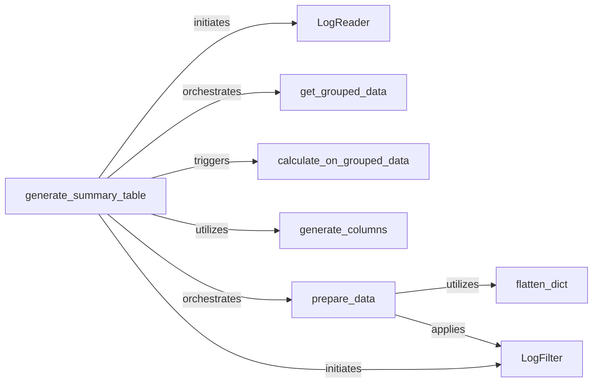

## Details

The Log Data Processor subsystem is responsible for the entire lifecycle of log data from ingestion to preparation for display. Its boundaries encompass reading raw log files, parsing their content, aggregating and transforming this data into structured formats, and finally preparing it for analysis and presentation, typically within a web user interface. This subsystem acts as the core data pipeline for experiment results.

### LogReader
Manages the low-level operations of reading raw log files from the file system, handling file I/O, and merging log entries from various sources. It ensures efficient ingestion and consolidation of experiment data. This component is architecturally central as it's the primary interface for raw log data input.

**Related Classes/Methods**:

- <a href="https://github.com/fastnlp/fitlog/blob/master/fitlog/fastlog/log_read.py#L11-L90" target="_blank" rel="noopener noreferrer">`fitlog.fastlog.log_read.LogReader`:11-90</a>

### generate_summary_table
Acts as the primary orchestrator for transforming raw log data into structured summary tables. It coordinates the entire data processing pipeline, including data retrieval, grouping, calculation, and final formatting for display. This component is critical as it defines the overall flow and output of the log processing.

**Related Classes/Methods**:

- <a href="https://github.com/fastnlp/fitlog/blob/master/fitlog/fastserver/server/summary_utils.py#L270-L440" target="_blank" rel="noopener noreferrer">`fitlog.fastserver.server.summary_utils.generate_summary_table`:270-440</a>

### get_grouped_data
Groups log data based on specified criteria (e.g., experiment runs, hyperparameters), preparing it for aggregation and statistical analysis. This is crucial for deriving meaningful insights from multiple experiment trials. It's a fundamental step in structuring data for analytical purposes.

**Related Classes/Methods**:

- <a href="https://github.com/fastnlp/fitlog/blob/master/fitlog/fastserver/server/summary_utils.py#L189-L206" target="_blank" rel="noopener noreferrer">`fitlog.fastserver.server.summary_utils.get_grouped_data`:189-206</a>

### calculate_on_grouped_data
Performs computations and aggregations on the grouped log data, deriving key metrics (e.g., averages, standard deviations, min/max) for summarization and performance evaluation. This component is essential for extracting quantitative insights from the raw logs.

**Related Classes/Methods**:

- <a href="https://github.com/fastnlp/fitlog/blob/master/fitlog/fastserver/server/summary_utils.py#L224-L249" target="_blank" rel="noopener noreferrer">`fitlog.fastserver.server.summary_utils.calculate_on_grouped_data`:224-249</a>

### generate_columns
Defines and structures the columns for the summary tables, ensuring that processed data is presented in a consistent, readable, and user-friendly format for analysis. This component is vital for defining the schema and presentation layer of the processed data.

**Related Classes/Methods**:

- <a href="https://github.com/fastnlp/fitlog/blob/master/fitlog/fastserver/server/table_utils.py#L20-L150" target="_blank" rel="noopener noreferrer">`fitlog.fastserver.server.table_utils.generate_columns`:20-150</a>

### prepare_data
Performs final preparations and transformations on the processed and formatted log data before it is displayed. This may involve additional data enrichment or adjustments for presentation. This component ensures the data is fully ready for consumption by the UI or other downstream components.

**Related Classes/Methods**:

- <a href="https://github.com/fastnlp/fitlog/blob/master/fitlog/fastserver/server/table_utils.py#L382-L431" target="_blank" rel="noopener noreferrer">`fitlog.fastserver.server.table_utils.prepare_data`:382-431</a>

### LogFilter
Provides filtering capabilities for log entries, allowing users or other components to select specific data subsets based on defined criteria (e.g., by experiment ID, status, or specific metric values). This component is crucial for enabling dynamic data exploration and focused analysis.

**Related Classes/Methods**:

- <a href="https://github.com/fastnlp/fitlog/blob/master/fitlog/fastserver/server/utils.py#L84-L124" target="_blank" rel="noopener noreferrer">`fitlog.fastserver.server.utils._filter_this_log_or_not`:84-124</a>

### flatten_dict
A utility component that flattens nested dictionary structures within log entries. This simplifies data access and processing for other components by providing a more uniform data structure. While a utility, its role in standardizing complex log data makes it architecturally significant for efficient processing.

**Related Classes/Methods**:

- <a href="https://github.com/fastnlp/fitlog/blob/master/fitlog/fastserver/server/utils.py#L6-L25" target="_blank" rel="noopener noreferrer">`fitlog.fastserver.server.utils.flatten_dict`:6-25</a>

### [FAQ](https://github.com/CodeBoarding/GeneratedOnBoardings/tree/main?tab=readme-ov-file#faq)