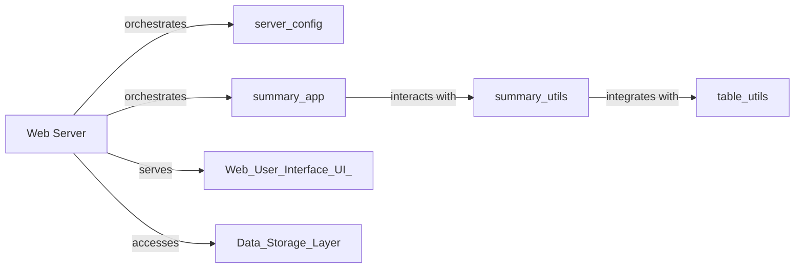

## Details

The fitlog.fastserver subsystem acts as a central web server for managing and presenting experiment logs. The core Web Server component orchestrates the overall application, handling incoming requests from the Web User Interface (UI) and serving the necessary UI components. It manages server configurations through server_config and delegates log summary operations to summary_app. The summary_app is responsible for handling API requests related to log summaries, interacting with summary_utils to process and aggregate raw log data. summary_utils further integrates with table_utils to format this data into a tabular structure suitable for web display. The Web Server also interacts with an External Data Storage layer for persistent data management.

### Web Server [[Expand]](./Web_Server.md)
The overarching component that handles HTTP requests, serves the web UI, manages server configurations, and orchestrates data flow between the UI and data processing components. It is the entry point for user interactions.

**Related Classes/Methods**:

- <a href="https://github.com/fastnlp/fitlog/blob/master/fitlog/fastserver/server/server_config.py" target="_blank" rel="noopener noreferrer">`fitlog.fastserver.server.server_config`</a>
- <a href="https://github.com/fastnlp/fitlog/blob/master/fitlog/fastserver/summary_app.py" target="_blank" rel="noopener noreferrer">`fitlog.fastserver.summary_app`</a>

### server_config
Manages server-specific configurations, including reading, saving, and validating settings. Essential for persistent server behavior, it relies on a specialized configuration parsing mechanism.

**Related Classes/Methods**:

- <a href="https://github.com/fastnlp/fitlog/blob/master/fitlog/fastserver/server/server_config.py" target="_blank" rel="noopener noreferrer">`fitlog.fastserver.server.server_config`</a>

### summary_app
Handles API requests and serves UI components related to log summaries, enabling creation, saving, and deletion of summary data. This is the primary interface for summary management within the web server.

**Related Classes/Methods**:

- <a href="https://github.com/fastnlp/fitlog/blob/master/fitlog/fastserver/summary_app.py" target="_blank" rel="noopener noreferrer">`fitlog.fastserver.summary_app`</a>

### summary_utils
Processes and aggregates raw log data to generate summarized tables for the web UI. It acts as a data processing layer specifically for summary generation, transforming raw logs into a consumable format.

**Related Classes/Methods**:

- <a href="https://github.com/fastnlp/fitlog/blob/master/fitlog/fastserver/server/summary_utils.py" target="_blank" rel="noopener noreferrer">`fitlog.fastserver.server.summary_utils`</a>

### table_utils
Prepares and structures raw log data into a tabular format suitable for web display, including column generation and filtering. This component focuses on the presentation logic of log data for the user interface.

**Related Classes/Methods**:

- <a href="https://github.com/fastnlp/fitlog/blob/master/fitlog/fastserver/server/table_utils.py" target="_blank" rel="noopener noreferrer">`fitlog.fastserver.server.table_utils`</a>

### [FAQ](https://github.com/CodeBoarding/GeneratedOnBoardings/tree/main?tab=readme-ov-file#faq)