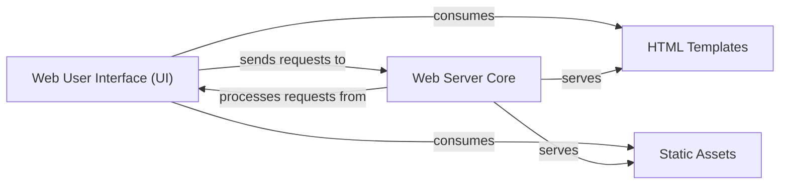

## Details

The `fitlog` project's web interface subsystem is designed around a clear separation of concerns. The `Web Server Core` acts as the central orchestrator, handling client requests, serving static assets, and dynamically rendering HTML templates. The `Web User Interface (UI)` represents the client-side presentation layer, consuming the served HTML, CSS, and JavaScript to display experiment data. `HTML Templates` provide the structural backbone for dynamic content, while `Static Assets` deliver the styling and interactive elements. This architecture ensures a responsive and maintainable web application for visualizing experiment logs.

### Web User Interface (UI) [[Expand]](./Web_User_Interface_UI_.md)
The client-side application responsible for presenting experiment data, logs, and visualizations to the user through interactive web pages. It comprises the visual layout, styling, and client-side scripting. This component primarily refers to the static and templated assets that are served to the user's browser.

**Related Classes/Methods**:

- <a href="https://github.com/fastnlp/fitlog/blob/master/fitlog/fastserver/templates/" target="_blank" rel="noopener noreferrer">`fitlog/fastserver/templates/`</a>
- <a href="https://github.com/fastnlp/fitlog/blob/master/fitlog/fastserver/static/" target="_blank" rel="noopener noreferrer">`fitlog/fastserver/static/`</a>

### HTML Templates
Define the structure and layout of the web pages. They contain placeholders for dynamic data that is injected by the Web Server Core before being sent to the client.

**Related Classes/Methods**:

- <a href="https://github.com/fastnlp/fitlog/blob/master/fitlog/fastserver/templates/" target="_blank" rel="noopener noreferrer">`fitlog/fastserver/templates/`</a>

### Static Assets
Provide the visual styling (CSS) and client-side interactivity (JavaScript) for the web interface. They also include images and other media files.

**Related Classes/Methods**:

- <a href="https://github.com/fastnlp/fitlog/blob/master/fitlog/fastserver/static/" target="_blank" rel="noopener noreferrer">`fitlog/fastserver/static/`</a>

### Web Server Core
Acts as the primary server-side component for the UI. It handles incoming HTTP requests, routes them to appropriate handlers, serves the static assets (CSS, JS, images), and renders the dynamic HTML templates by integrating data from other backend components. It orchestrates the overall UI presentation.

**Related Classes/Methods**:

- <a href="https://github.com/fastnlp/fitlog/blob/master/fitlog/fastserver/app.py" target="_blank" rel="noopener noreferrer">`fitlog/fastserver/app.py`</a>

### [FAQ](https://github.com/CodeBoarding/GeneratedOnBoardings/tree/main?tab=readme-ov-file#faq)