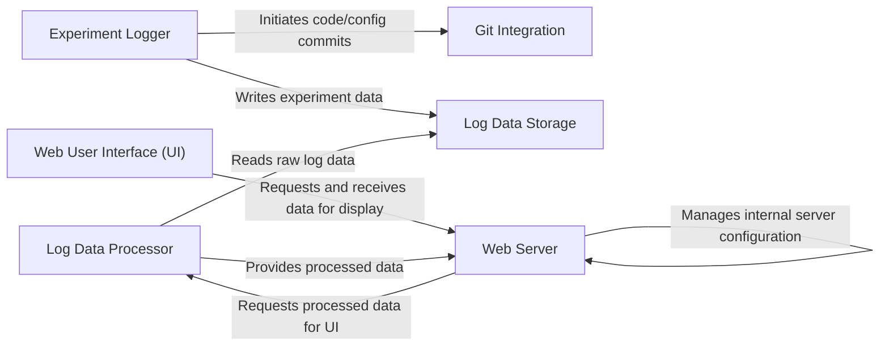

## Details

The `fitlog` project implements a client-server architecture for ML experiment management, centered on an experiment-centric data flow. Users interact with the Experiment Logger to record experiment details, which are then persistently stored in Log Data Storage and version-controlled by the Git Integration module. For visualization, a Web User Interface (UI) communicates with the Web Server, which acts as the central orchestrator. The Web Server retrieves raw data from Log Data Storage via the Log Data Processor, which transforms and aggregates the data before it is presented to the user through the Web User Interface (UI). This design ensures a clear separation of concerns, allowing for robust logging, versioning, and interactive visualization of machine learning experiments.

### Experiment Logger [[Expand]](./Experiment_Logger.md)
The primary user-facing API for logging experiment data (hyperparameters, metrics, etc.) and initiating version control.

**Related Classes/Methods**:

- <a href="https://github.com/fastnlp/fitlog/blob/master/fitlog/fastlog/logger.py" target="_blank" rel="noopener noreferrer">`fitlog.fastlog.logger.Logger`</a>

### Git Integration [[Expand]](./Git_Integration.md)
Manages interactions with Git for version control of experiment code and configurations.

**Related Classes/Methods**:

- <a href="https://github.com/fastnlp/fitlog/blob/master/fitlog/fastgit/committer.py#L71-L644" target="_blank" rel="noopener noreferrer">`fitlog.fastgit.committer.Committer`:71-644</a>

### Log Data Storage
The persistent layer for storing raw experiment log files on the file system.

**Related Classes/Methods**:

- <a href="https://github.com/fastnlp/fitlog/blob/master/fitlog/fastgit/normal/logs/" target="_blank" rel="noopener noreferrer">`Log Data Files`</a>

### Log Data Processor [[Expand]](./Log_Data_Processor.md)
Reads, parses, aggregates, and transforms raw log data into structured formats suitable for analysis and display.

**Related Classes/Methods**:

- <a href="https://github.com/fastnlp/fitlog/blob/master/fitlog/fastlog/log_read.py#L11-L90" target="_blank" rel="noopener noreferrer">`fitlog.fastlog.log_read.LogReader`:11-90</a>
- <a href="https://github.com/fastnlp/fitlog/blob/master/fitlog/fastserver/server/summary_utils.py#L270-L440" target="_blank" rel="noopener noreferrer">`generate_summary_table`:270-440</a>
- <a href="https://github.com/fastnlp/fitlog/blob/master/fitlog/fastlog/log_read.py#L40-L72" target="_blank" rel="noopener noreferrer">`read_logs`:40-72</a>

### Web Server [[Expand]](./Web_Server.md)
The backend application that handles HTTP requests, serves the web UI, manages server configurations, and orchestrates data flow between the UI and data processing components.

**Related Classes/Methods**:

- <a href="https://github.com/fastnlp/fitlog/blob/master/fitlog/fastserver/server/server_config.py#L8-L106" target="_blank" rel="noopener noreferrer">`read_server_config`:8-106</a>
- <a href="https://github.com/fastnlp/fitlog/blob/master/fitlog/fastserver/server/server_config.py#L108-L143" target="_blank" rel="noopener noreferrer">`save_config`:108-143</a>
- <a href="https://github.com/fastnlp/fitlog/blob/master/fitlog/fastserver/server/app_utils.py#L9-L23" target="_blank" rel="noopener noreferrer">`cmd_parser`:9-23</a>
- <a href="https://github.com/fastnlp/fitlog/blob/master/fitlog/fastserver/server/app_utils.py#L42-L66" target="_blank" rel="noopener noreferrer">`ServerWatcher`:42-66</a>
- <a href="https://github.com/fastnlp/fitlog/blob/master/fitlog/fastserver/summary_app.py#L28-L39" target="_blank" rel="noopener noreferrer">`summary_index`:28-39</a>
- <a href="https://github.com/fastnlp/fitlog/blob/master/fitlog/fastserver/summary_app.py#L106-L154" target="_blank" rel="noopener noreferrer">`new_summary`:106-154</a>
- <a href="https://github.com/fastnlp/fitlog/blob/master/fitlog/fastserver/summary_app.py#L156-L172" target="_blank" rel="noopener noreferrer">`save_summary_api`:156-172</a>
- <a href="https://github.com/fastnlp/fitlog/blob/master/fitlog/fastserver/summary_app.py#L174-L194" target="_blank" rel="noopener noreferrer">`delete_summary_api`:174-194</a>

### Web User Interface (UI) [[Expand]](./Web_User_Interface_UI_.md)
The frontend application that provides an interactive interface for users to visualize, analyze, and manage experiment logs.

**Related Classes/Methods**:

- <a href="https://github.com/fastnlp/fitlog/blob/master/fitlog/fastserver/templates/" target="_blank" rel="noopener noreferrer">`HTML Templates`</a>
- <a href="https://github.com/fastnlp/fitlog/blob/master/fitlog/fastserver/static/" target="_blank" rel="noopener noreferrer">`Static Assets`</a>

### [FAQ](https://github.com/CodeBoarding/GeneratedOnBoardings/tree/main?tab=readme-ov-file#faq)