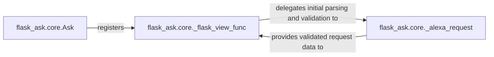

## Details

The `Alexa Request Handler` subsystem is the core entry point for all Alexa interactions within the Flask application, acting as an adapter layer between the Amazon Alexa platform and the Python Flask application. It is responsible for receiving, validating, and orchestrating the processing of incoming Alexa requests.

### flask_ask.core.Ask
This component serves as the Flask-Ask extension initializer. It integrates Flask-Ask into a Flask application, setting up the necessary routing and managing the mapping between Alexa intents and the application's handler functions. It embodies the "Extension/Plugin Pattern" by providing the primary interface for developers to enable Alexa capabilities in their Flask apps.

**Related Classes/Methods**:

- <a href="https://github.com/johnwheeler/flask-ask/blob/master/flask_ask/core.py#L61-L927" target="_blank" rel="noopener noreferrer">`flask_ask.core.Ask`:61-927</a>

### flask_ask.core._flask_view_func
This is the central Flask view function that acts as the universal endpoint for all incoming Alexa requests. It orchestrates the entire request lifecycle, from initial reception and security verification to dispatching the request to the appropriate intent handler. This component is crucial for the "Event-Driven Architecture" and "MVC Variant" patterns, serving as the main controller for Alexa events.

**Related Classes/Methods**:

- <a href="https://github.com/johnwheeler/flask-ask/blob/master/flask_ask/core.py#L766-L820" target="_blank" rel="noopener noreferrer">`flask_ask.core._flask_view_func`:766-820</a>

### flask_ask.core._alexa_request
A utility component responsible for parsing the raw JSON payload of an incoming Alexa request into a structured object. Crucially, it performs initial security validations, such as checking the request timestamp and verifying the application ID, ensuring the integrity and authenticity of the request before further processing. This component is vital for the security and reliability of the Alexa skill.

**Related Classes/Methods**:

- <a href="https://github.com/johnwheeler/flask-ask/blob/master/flask_ask/core.py#L692-L721" target="_blank" rel="noopener noreferrer">`flask_ask.core._alexa_request`:692-721</a>

### [FAQ](https://github.com/CodeBoarding/GeneratedOnBoardings/tree/main?tab=readme-ov-file#faq)