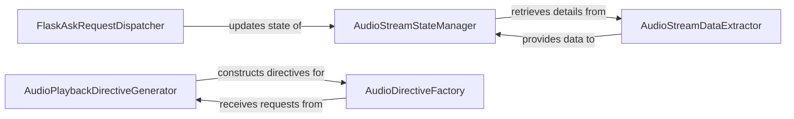

## Details

The Flask-Ask audio subsystem orchestrates the management and playback of audio streams within Alexa skills. It begins with the `FlaskAskRequestDispatcher` handling incoming Alexa requests, which then updates the `AudioStreamStateManager` to reflect the current audio playback context. The `AudioStreamStateManager` relies on the `AudioStreamDataExtractor` to accurately parse and provide necessary audio stream details from these requests. For generating audio responses, skill developers interact with the `AudioPlaybackDirectiveGenerator`, a high-level interface that delegates the creation of precise Alexa AudioPlayer directives to the `AudioDirectiveFactory`, ensuring compliance with Alexa API specifications. This structured interaction enables robust and context-aware audio experiences for Alexa skill users.

### FlaskAskRequestDispatcher
Responsible for receiving and processing incoming Alexa requests within the Flask-Ask framework. It dispatches these requests to appropriate handlers and initiates updates to the audio stream state based on the request type (e.g., AudioPlayer events). This component acts as the central entry point for Alexa interactions.

**Related Classes/Methods**:

- <a href="https://github.com/johnwheeler/flask-ask/blob/master/flask_ask/core.py" target="_blank" rel="noopener noreferrer">`flask_ask.core:Ask`</a>

### AudioStreamStateManager
Manages and maintains the current state of the audio stream within the Flask-Ask application's context. It is responsible for updating the stream's status based on incoming Alexa requests (e.g., AudioPlayer.PlaybackStarted, AudioPlayer.PlaybackFinished) and providing the current playback details to other parts of the application. This component is fundamental for enabling continuous and context-aware audio experiences.

**Related Classes/Methods**:

- <a href="https://github.com/johnwheeler/flask-ask/blob/master/flask_ask/core.py" target="_blank" rel="noopener noreferrer">`flask_ask.core:_update_stream`</a>
- <a href="https://github.com/johnwheeler/flask-ask/blob/master/flask_ask/core.py" target="_blank" rel="noopener noreferrer">`flask_ask.core:current_stream`</a>

### AudioStreamDataExtractor
Specializes in parsing and extracting relevant audio stream information from various parts of an incoming Alexa request. This includes details from the session context (e.g., previously played audio) and specific AudioPlayer directives (e.g., AudioPlayer.PlaybackStarted). It acts as an interpreter, making raw request data accessible for audio state management.

**Related Classes/Methods**:

- <a href="https://github.com/johnwheeler/flask-ask/blob/master/flask_ask/core.py" target="_blank" rel="noopener noreferrer">`flask_ask.core:_from_context`</a>
- <a href="https://github.com/johnwheeler/flask-ask/blob/master/flask_ask/core.py" target="_blank" rel="noopener noreferrer">`flask_ask.core:_from_directive`</a>

### AudioPlaybackDirectiveGenerator
Provides a high-level, developer-friendly interface for initiating, enqueuing, or resuming audio playback. It abstracts the complexity of Alexa's AudioPlayer directives, allowing skill developers to simply call methods like play(), enqueue(), or resume() to control audio output. This component is the primary entry point for developers to programmatically manage audio.

**Related Classes/Methods**:

- <a href="https://github.com/johnwheeler/flask-ask/blob/master/flask_ask/models.py" target="_blank" rel="noopener noreferrer">`flask_ask.models:play`</a>
- <a href="https://github.com/johnwheeler/flask-ask/blob/master/flask_ask/models.py" target="_blank" rel="noopener noreferrer">`flask_ask.models:enqueue`</a>
- <a href="https://github.com/johnwheeler/flask-ask/blob/master/flask_ask/models.py" target="_blank" rel="noopener noreferrer">`flask_ask.models:resume`</a>

### AudioDirectiveFactory
A utility component responsible for the low-level assembly and validation of Alexa AudioItem objects and complete AudioPlayer.Play directives. It ensures that the generated directives conform precisely to the Alexa API specifications, handling details like token generation, URL formatting, and play behavior.

**Related Classes/Methods**:

- <a href="https://github.com/johnwheeler/flask-ask/blob/master/flask_ask/models.py" target="_blank" rel="noopener noreferrer">`flask_ask.models:_audio_item`</a>
- <a href="https://github.com/johnwheeler/flask-ask/blob/master/flask_ask/models.py" target="_blank" rel="noopener noreferrer">`flask_ask.models:_play_directive`</a>

### [FAQ](https://github.com/CodeBoarding/GeneratedOnBoardings/tree/main?tab=readme-ov-file#faq)