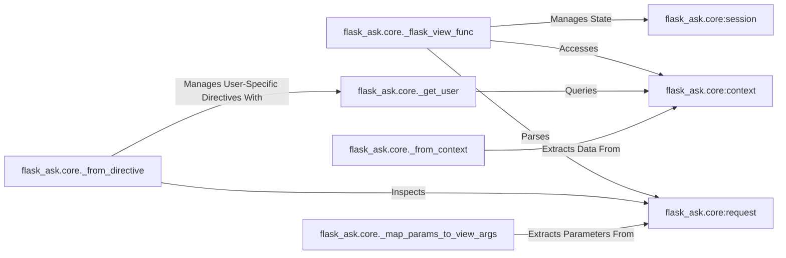

## Details

The flask_ask.core subsystem forms the backbone of Alexa skill integration with Flask. It centers around the _flask_view_func which orchestrates the processing of incoming Alexa requests. This function interacts with core components: request for raw payload access, session for conversational state management, and context for environmental and user-specific details. Auxiliary components like _get_user and _from_context provide granular access to context data, while _from_directive handles advanced device instructions, often requiring user context. The _map_params_to_view_args component ensures seamless data flow from the Alexa request to the Flask application's view functions. This structured interaction enables robust and context-aware Alexa skill development.

### flask_ask.core:session
Manages and provides an abstracted interface for accessing and manipulating Alexa session attributes. This is critical for maintaining conversational state across multiple turns in an Alexa skill, allowing the application to store and retrieve user-specific data throughout a session.

**Related Classes/Methods**:

- <a href="https://github.com/johnwheeler/flask-ask/blob/master/flask_ask/core.py" target="_blank" rel="noopener noreferrer">`flask_ask.core:session`</a>

### flask_ask.core:context
Offers an abstracted interface to the Alexa request context. This includes details about the device, user (e.g., user ID, permissions), application, and other system-level information provided by the Alexa service. It allows the skill to adapt its behavior based on the environment and user.

**Related Classes/Methods**:

- <a href="https://github.com/johnwheeler/flask-ask/blob/master/flask_ask/core.py" target="_blank" rel="noopener noreferrer">`flask_ask.core:context`</a>

### flask_ask.core:request
Encapsulates the raw incoming Alexa request payload. It provides structured access to the request type (e.g., LaunchRequest, IntentRequest), intent name, slot values, and other direct data from the Alexa service. This component is the primary entry point for parsing the user's utterance and intent.

**Related Classes/Methods**:

- <a href="https://github.com/johnwheeler/flask-ask/blob/master/flask_ask/core.py" target="_blank" rel="noopener noreferrer">`flask_ask.core:request`</a>

### flask_ask.core._flask_view_func
Acts as the central request processor within the Flask-Ask framework, orchestrating the request handling lifecycle. It is responsible for integrating the Alexa request data (request, session, context) with Flask's view function mechanism.

**Related Classes/Methods**:

- <a href="https://github.com/johnwheeler/flask-ask/blob/master/flask_ask/core.py#L766-L820" target="_blank" rel="noopener noreferrer">`flask_ask.core._flask_view_func`:766-820</a>

### flask_ask.core._get_user
A utility component specifically designed to extract user-specific information from the Alexa request context, such as the user ID or access tokens.

**Related Classes/Methods**:

- <a href="https://github.com/johnwheeler/flask-ask/blob/master/flask_ask/core.py#L686-L689" target="_blank" rel="noopener noreferrer">`flask_ask.core._get_user`:686-689</a>

### flask_ask.core._from_context
A utility component responsible for extracting general data and attributes from the Alexa request context object, providing structured access to various context-related details.

**Related Classes/Methods**:

- <a href="https://github.com/johnwheeler/flask-ask/blob/master/flask_ask/core.py#L755-L756" target="_blank" rel="noopener noreferrer">`flask_ask.core._from_context`:755-756</a>

### flask_ask.core._from_directive
A component used to inspect the Alexa request for directives, which are instructions for the Alexa device (e.g., to play audio, display cards). It helps in processing advanced Alexa features, particularly those involving user-specific states like audio stream management, by utilizing user context.

**Related Classes/Methods**:

- <a href="https://github.com/johnwheeler/flask-ask/blob/master/flask_ask/core.py#L758-L764" target="_blank" rel="noopener noreferrer">`flask_ask.core._from_directive`:758-764</a>

### flask_ask.core._map_params_to_view_args
This component is responsible for extracting parameters (like slot values from an intent) from the Alexa request and mapping them appropriately to arguments expected by the Flask view functions, facilitating seamless integration.

**Related Classes/Methods**:

- <a href="https://github.com/johnwheeler/flask-ask/blob/master/flask_ask/core.py#L884-L927" target="_blank" rel="noopener noreferrer">`flask_ask.core._map_params_to_view_args`:884-927</a>

### [FAQ](https://github.com/CodeBoarding/GeneratedOnBoardings/tree/main?tab=readme-ov-file#faq)