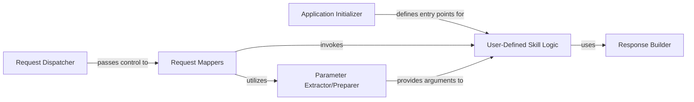

## Details

The User-Defined Skill Logic subsystem is the core of any Flask-Ask application, encapsulating the developer's custom business logic for handling Alexa interactions. It operates within a framework extension pattern, where flask-ask provides the scaffolding and the developer fills in the specific intent handling.

### User-Defined Skill Logic [[Expand]](./User_Defined_Skill_Logic.md)
This is the application-specific business logic implemented by the developer. It contains the Python functions that handle specific Alexa intents and events, orchestrate interactions with external services, perform data processing, and determine the appropriate voice response.

**Related Classes/Methods**:

- <a href="https://github.com/johnwheeler/flask-ask/blob/master/flask_ask/core.py" target="_blank" rel="noopener noreferrer">`flask_ask.core`</a>
- <a href="https://github.com/johnwheeler/flask-ask/blob/master/flask_ask/models.py" target="_blank" rel="noopener noreferrer">`flask_ask.models`</a>

### Application Initializer
The Ask class instance serves as the primary interface for developers to integrate Flask-Ask with their Flask application. It's used to define and register the entry points (via decorators) for the User-Defined Skill Logic.

**Related Classes/Methods**:

- <a href="https://github.com/johnwheeler/flask-ask/blob/master/flask_ask/core.py#L61-L927" target="_blank" rel="noopener noreferrer">`flask_ask.core.Ask`:61-927</a>

### Request Dispatcher
This component is responsible for receiving the incoming Alexa request (as a Flask HTTP request), performing initial processing (like signature verification), and then handing off the parsed request to the appropriate mappers for further routing.

**Related Classes/Methods**:

- <a href="https://github.com/johnwheeler/flask-ask/blob/master/flask_ask/core.py" target="_blank" rel="noopener noreferrer">`flask_ask.core`</a>

### Request Mappers
These components are central to routing. They analyze the incoming Alexa request (e.g., intent name, request type like LaunchRequest, IntentRequest, AudioPlayer.PlaybackStarted) and identify the corresponding User-Defined Skill Logic function to invoke.

**Related Classes/Methods**:

- <a href="https://github.com/johnwheeler/flask-ask/blob/master/flask_ask/core.py#L822-L840" target="_blank" rel="noopener noreferrer">`flask_ask.core._map_intent_to_view_func`:822-840</a>
- <a href="https://github.com/johnwheeler/flask-ask/blob/master/flask_ask/core.py#L842-L851" target="_blank" rel="noopener noreferrer">`flask_ask.core._map_player_request_to_func`:842-851</a>
- <a href="https://github.com/johnwheeler/flask-ask/blob/master/flask_ask/core.py#L853-L866" target="_blank" rel="noopener noreferrer">`flask_ask.core._map_purchase_request_to_func`:853-866</a>

### Parameter Extractor/Preparer
This component is responsible for extracting relevant data (e.g., slot values, session attributes, request body parameters) from the raw Alexa request and preparing them as arguments to be passed to the invoked User-Defined Skill Logic function.

**Related Classes/Methods**:

- <a href="https://github.com/johnwheeler/flask-ask/blob/master/flask_ask/core.py#L884-L927" target="_blank" rel="noopener noreferrer">`flask_ask.core._map_params_to_view_args`:884-927</a>

### Response Builder
This component provides the API (e.g., ask.tell, ask.ask, ask.reprompt) that the User-Defined Skill Logic uses to construct and return a structured, Alexa-compatible JSON response, including speech output, cards, and directives.

**Related Classes/Methods**:

- <a href="https://github.com/johnwheeler/flask-ask/blob/master/flask_ask/models.py#L168-L182" target="_blank" rel="noopener noreferrer">`flask_ask.models.render_response`:168-182</a>

### [FAQ](https://github.com/CodeBoarding/GeneratedOnBoardings/tree/main?tab=readme-ov-file#faq)