```mermaid
graph LR
    Alexa_Request_Handler["Alexa Request Handler"]
    Request_Verification_Module["Request Verification Module"]
    Intent_Request_Router["Intent & Request Router"]
    Session_Context_Manager["Session & Context Manager"]
    User_Defined_Skill_Logic["User-Defined Skill Logic"]
    Audio_Playback_Manager["Audio Playback Manager"]
    Alexa_Response_Generator["Alexa Response Generator"]
    Alexa_Request_Handler -- "Initiates verification of incoming request." --> Request_Verification_Module
    Request_Verification_Module -- "Returns verification status." --> Alexa_Request_Handler
    Alexa_Request_Handler -- "Dispatches validated request for routing." --> Intent_Request_Router
    Alexa_Request_Handler -- "Provides access to request data and context." --> Session_Context_Manager
    Intent_Request_Router -- "Invokes the appropriate skill handler." --> User_Defined_Skill_Logic
    User_Defined_Skill_Logic -- "Retrieves session attributes and request details." --> Session_Context_Manager
    User_Defined_Skill_Logic -- "Manages audio stream state and directives." --> Audio_Playback_Manager
    User_Defined_Skill_Logic -- "Provides content and directives for response construction." --> Alexa_Response_Generator
    Audio_Playback_Manager -- "Passes audio playback directives." --> Alexa_Response_Generator
    Alexa_Response_Generator -- "Returns the final Alexa JSON response." --> Alexa_Request_Handler
    click Alexa_Request_Handler href "https://github.com/CodeBoarding/GeneratedOnBoardings/blob/main/flask-ask/Alexa_Request_Handler.md" "Details"
    click Session_Context_Manager href "https://github.com/CodeBoarding/GeneratedOnBoardings/blob/main/flask-ask/Session_Context_Manager.md" "Details"
    click User_Defined_Skill_Logic href "https://github.com/CodeBoarding/GeneratedOnBoardings/blob/main/flask-ask/User_Defined_Skill_Logic.md" "Details"
    click Audio_Playback_Manager href "https://github.com/CodeBoarding/GeneratedOnBoardings/blob/main/flask-ask/Audio_Playback_Manager.md" "Details"
```

## Details

The `flask-ask` architecture is a well-structured extension designed to simplify Amazon Alexa skill development within the Flask framework. It operates on a clear request-response paradigm, where an incoming Alexa request is first handled by the **Alexa Request Handler**. This handler orchestrates the request's journey, beginning with a crucial security step: passing the request to the **Request Verification Module** for authentication and integrity checks. Once validated, the request is intelligently routed by the **Intent & Request Router** to the developer's custom **User-Defined Skill Logic**. This application-specific code leverages the **Session & Context Manager** to access request data and maintain session state, and can interact with the **Audio Playback Manager** for multimedia capabilities. Finally, the **User-Defined Skill Logic** directs the **Alexa Response Generator** to construct the appropriate JSON response, which is then sent back to the Alexa service via the **Alexa Request Handler**. This modular design promotes clear separation of concerns, extensibility for new intents, and adaptability across various deployment environments, making it ideal for building robust voice user interfaces.

### Alexa Request Handler [[Expand]](./Alexa_Request_Handler.md)
The central entry point for all incoming Alexa requests, integrating with Flask's routing and orchestrating the request lifecycle.

**Related Classes/Methods**:

- <a href="https://github.com/johnwheeler/flask-ask/blob/master/flask_ask/core.py" target="_blank" rel="noopener noreferrer">`flask_ask.core:_flask_view_func`</a>
- <a href="https://github.com/johnwheeler/flask-ask/blob/master/flask_ask/core.py" target="_blank" rel="noopener noreferrer">`flask_ask.core:_alexa_request`</a>
- <a href="https://github.com/johnwheeler/flask-ask/blob/master/flask_ask/core.py" target="_blank" rel="noopener noreferrer">`flask_ask.core:Ask`</a>

### Request Verification Module
Ensures the authenticity and integrity of incoming Alexa requests through signature, timestamp, and application ID validation.

**Related Classes/Methods**:

- <a href="https://github.com/johnwheeler/flask-ask/blob/master/flask_ask/verifier.py" target="_blank" rel="noopener noreferrer">`flask_ask.verifier:load_certificate`</a>
- <a href="https://github.com/johnwheeler/flask-ask/blob/master/flask_ask/verifier.py" target="_blank" rel="noopener noreferrer">`flask_ask.verifier:verify_signature`</a>
- <a href="https://github.com/johnwheeler/flask-ask/blob/master/flask_ask/verifier.py" target="_blank" rel="noopener noreferrer">`flask_ask.verifier:verify_timestamp`</a>
- <a href="https://github.com/johnwheeler/flask-ask/blob/master/flask_ask/verifier.py" target="_blank" rel="noopener noreferrer">`flask_ask.verifier:verify_application_id`</a>

### Intent & Request Router
Maps validated Alexa requests to the appropriate user-defined handler functions based on request type (e.g., Intent, Launch, AudioPlayer events).

**Related Classes/Methods**:

- <a href="https://github.com/johnwheeler/flask-ask/blob/master/flask_ask/core.py" target="_blank" rel="noopener noreferrer">`flask_ask.core:_map_intent_to_view_func`</a>
- <a href="https://github.com/johnwheeler/flask-ask/blob/master/flask_ask/core.py" target="_blank" rel="noopener noreferrer">`flask_ask.core:_map_player_request_to_func`</a>
- <a href="https://github.com/johnwheeler/flask-ask/blob/master/flask_ask/core.py" target="_blank" rel="noopener noreferrer">`flask_ask.core:_map_purchase_request_to_func`</a>

### Session & Context Manager [[Expand]](./Session_Context_Manager.md)
Provides an abstracted interface for accessing and managing Alexa session attributes, request context, and raw request payload.

**Related Classes/Methods**:

- <a href="https://github.com/johnwheeler/flask-ask/blob/master/flask_ask/core.py" target="_blank" rel="noopener noreferrer">`flask_ask.core:session`</a>
- <a href="https://github.com/johnwheeler/flask-ask/blob/master/flask_ask/core.py" target="_blank" rel="noopener noreferrer">`flask_ask.core:context`</a>
- <a href="https://github.com/johnwheeler/flask-ask/blob/master/flask_ask/core.py" target="_blank" rel="noopener noreferrer">`flask_ask.core:request`</a>

### User-Defined Skill Logic [[Expand]](./User_Defined_Skill_Logic.md)
Contains the application-specific business logic defined by the developer, handling intents, interacting with external services, and orchestrating response generation.

**Related Classes/Methods**:

- <a href="https://github.com/johnwheeler/flask-ask/blob/master/flask_ask/core.py" target="_blank" rel="noopener noreferrer">`flask_ask.core`</a>
- <a href="https://github.com/johnwheeler/flask-ask/blob/master/flask_ask/models.py" target="_blank" rel="noopener noreferrer">`flask_ask.models`</a>

### Audio Playback Manager [[Expand]](./Audio_Playback_Manager.md)
Manages the state and control of audio streams for skills incorporating audio playback, providing utilities for queue management.

**Related Classes/Methods**:

- <a href="https://github.com/johnwheeler/flask-ask/blob/master/flask_ask/core.py" target="_blank" rel="noopener noreferrer">`flask_ask.core:_update_stream`</a>
- <a href="https://github.com/johnwheeler/flask-ask/blob/master/flask_ask/core.py" target="_blank" rel="noopener noreferrer">`flask_ask.core:current_stream`</a>

### Alexa Response Generator
Constructs the final JSON response sent back to the Alexa service, including speech, cards, and various directives (e.g., audio, dialog, skill connections).

**Related Classes/Methods**:

- <a href="https://github.com/johnwheeler/flask-ask/blob/master/flask_ask/models.py" target="_blank" rel="noopener noreferrer">`flask_ask.models:render_response`</a>
- <a href="https://github.com/johnwheeler/flask-ask/blob/master/flask_ask/models.py" target="_blank" rel="noopener noreferrer">`flask_ask.models:reprompt`</a>
- <a href="https://github.com/johnwheeler/flask-ask/blob/master/flask_ask/models.py" target="_blank" rel="noopener noreferrer">`flask_ask.models:play`</a>
- <a href="https://github.com/johnwheeler/flask-ask/blob/master/flask_ask/models.py" target="_blank" rel="noopener noreferrer">`flask_ask.models:enqueue`</a>
- <a href="https://github.com/johnwheeler/flask-ask/blob/master/flask_ask/models.py" target="_blank" rel="noopener noreferrer">`flask_ask.models:resume`</a>

### [FAQ](https://github.com/CodeBoarding/GeneratedOnBoardings/tree/main?tab=readme-ov-file#faq)