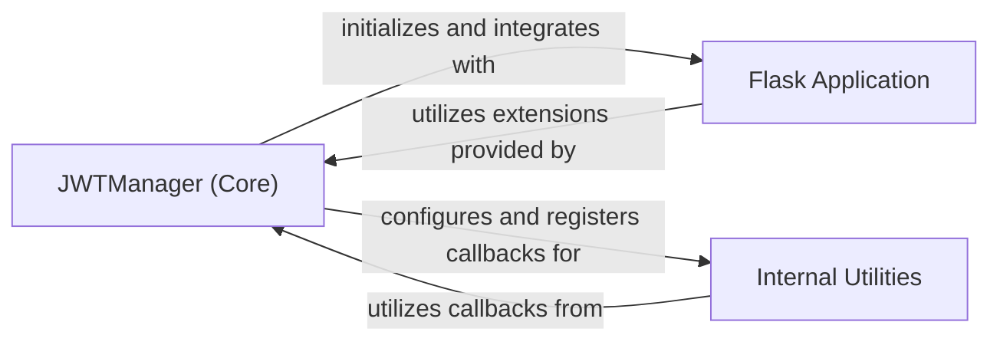

## Details

The `flask-jwt-extended` library provides a robust framework for integrating JSON Web Token (JWT) authentication into Flask applications. At its core, the `JWTManager (Core)` component acts as the central orchestrator, responsible for initializing the JWT extension within a `Flask Application` instance and managing its configuration and lifecycle callbacks. `Internal Utilities` within the library leverage the `JWTManager` to perform specific JWT-related operations, such as token parsing, validation, and applying security decorators, by utilizing the configurations and callbacks registered by the `JWTManager`. This design ensures a clear separation of concerns, with the `JWTManager` providing the foundational setup and `Internal Utilities` handling the operational details, all within the context of a user-provided Flask application.

### JWTManager (Core) [[Expand]](./JWTManager_Core_.md)
The central orchestrator and primary interface for integrating and managing JWT-related functionalities within a Flask application. It handles the initialization of the extension, sets up default configurations, and registers user-defined callbacks for various stages of the JWT lifecycle, such as user lookup, token blocklisting, and error handling. It acts as the single source of truth for JWT configuration and operational hooks.

**Related Classes/Methods**:

- <a href="https://github.com/vimalloc/flask-jwt-extended/blob/main/flask_jwt_extended/jwt_manager.py#L49-L564" target="_blank" rel="noopener noreferrer">`flask_jwt_extended.jwt_manager.JWTManager`:49-564</a>

### Flask Application
The underlying Flask web framework instance provided by the user, serving as the host environment for the `flask-jwt-extended` extension. It provides the request-response cycle, routing, and application context within which the `JWTManager` operates and integrates its JWT processing logic. The `JWTManager` initializes and extends this application's capabilities.

**Related Classes/Methods**: _None_

### Internal Utilities
A collection of internal helper functions, decorators, and modules within the `flask-jwt-extended` library that perform specific JWT-related tasks. These tasks include token parsing, validation, claim handling, and applying security decorators to Flask routes. These utilities are dependent on the `JWTManager` instance to retrieve configuration settings and invoke the registered callbacks (e.g., for user loading or token blocklist checks).

**Related Classes/Methods**: _None_

### [FAQ](https://github.com/CodeBoarding/GeneratedOnBoardings/tree/main?tab=readme-ov-file#faq)