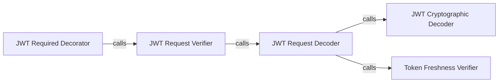

## Details

The `Request Processing Pipeline` subsystem in `flask-jwt-extended` is responsible for intercepting incoming HTTP requests, extracting and decoding JWTs, and performing initial validation of token integrity and authenticity. It leverages Flask decorators to protect routes, ensuring that only requests with valid JWTs proceed to the application logic.

### JWT Required Decorator
This component acts as the primary entry point for securing Flask routes. It's a decorator that intercepts incoming HTTP requests and enforces the presence and validity of a JWT before allowing access to the decorated view function. It ensures that a token is present and initiates the verification process.

**Related Classes/Methods**:

- <a href="https://github.com/vimalloc/flask-jwt-extended/blob/main/flask_jwt_extended/view_decorators.py#L121-L174" target="_blank" rel="noopener noreferrer">`flask_jwt_extended.view_decorators.jwt_required`:121-174</a>

### JWT Request Verifier
This component orchestrates the overall JWT verification process within the request context. It coordinates calls to other internal components to extract, decode, and perform initial validation of the JWT from the request. It's the central coordinator for token validation.

**Related Classes/Methods**:

- <a href="https://github.com/vimalloc/flask-jwt-extended/blob/main/flask_jwt_extended/view_decorators.py#L45-L118" target="_blank" rel="noopener noreferrer">`flask_jwt_extended.view_decorators.verify_jwt_in_request`:45-118</a>

### JWT Request Decoder
This component handles the extraction of the JWT from various request locations (e.g., headers, cookies, query parameters, JSON body) and prepares it for decoding. It then initiates the actual cryptographic decoding and freshness verification. Its responsibility is to locate and prepare the raw token.

**Related Classes/Methods**:

- <a href="https://github.com/vimalloc/flask-jwt-extended/blob/main/flask_jwt_extended/view_decorators.py#L298-L372" target="_blank" rel="noopener noreferrer">`flask_jwt_extended.view_decorators._decode_jwt_from_request`:298-372</a>

### JWT Cryptographic Decoder
This component performs the cryptographic decoding and initial structural validation of the JWT. This involves verifying the token's signature against a secret key and parsing its claims. It is crucial for ensuring the token's authenticity and integrity.

**Related Classes/Methods**:

- <a href="https://github.com/vimalloc/flask-jwt-extended/blob/main/flask_jwt_extended/tokens.py" target="_blank" rel="noopener noreferrer">`flask_jwt_extended.tokens.decode_jwt`</a>

### Token Freshness Verifier
This component checks the "freshness" claim of a decoded JWT. It ensures that the token was issued recently enough to be considered valid for certain operations that require a "fresh" token, adding an extra layer of security.

**Related Classes/Methods**:

- <a href="https://github.com/vimalloc/flask-jwt-extended/blob/main/flask_jwt_extended/view_decorators.py#L34-L42" target="_blank" rel="noopener noreferrer">`flask_jwt_extended.view_decorators._verify_token_is_fresh`:34-42</a>

### [FAQ](https://github.com/CodeBoarding/GeneratedOnBoardings/tree/main?tab=readme-ov-file#faq)