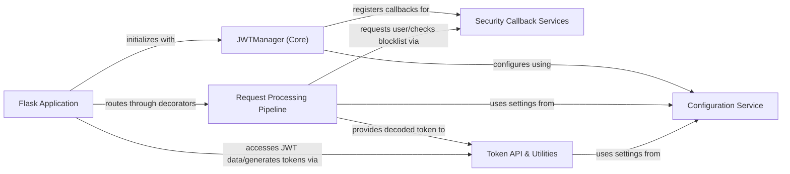

## Details

The `flask-jwt-extended` library provides a robust framework for integrating JSON Web Token (JWT) based authentication and authorization into Flask applications. At its core, the `JWTManager` component orchestrates the entire JWT lifecycle, from configuration and token creation to request processing and security callbacks. The `Configuration Service` centralizes all JWT-related settings, ensuring consistent behavior across the application. Incoming requests are handled by the `Request Processing Pipeline`, which extracts, decodes, and validates JWTs, leveraging the `Security Callback Services` for application-specific user lookup and token blocklisting. Finally, the `Token API & Utilities` component offers a convenient interface for developers to interact with JWTs, enabling token generation, access to claims, and cookie management. This modular design promotes clear separation of concerns, making it easy to integrate and extend JWT functionality within any Flask application.

### Flask Application
The host Flask application that integrates with `flask-jwt-extended`, defining routes and utilizing the library's authentication and authorization features.

**Related Classes/Methods**:

- <a href="https://github.com/vimalloc/flask-jwt-extended/blob/main/examples/simple.py#L1-L50" target="_blank" rel="noopener noreferrer">`examples/simple.py`:1-50</a>

### JWTManager (Core) [[Expand]](./JWTManager_Core_.md)
The central orchestrator for `flask-jwt-extended`. It initializes the extension, sets up default configurations, and registers user-defined callbacks for various stages of the JWT lifecycle.

**Related Classes/Methods**:

- <a href="https://github.com/vimalloc/flask-jwt-extended/blob/main/flask_jwt_extended/jwt_manager.py#L49-L564" target="_blank" rel="noopener noreferrer">`flask_jwt_extended.jwt_manager.JWTManager`:49-564</a>
- <a href="https://github.com/vimalloc/flask-jwt-extended/blob/main/flask_jwt_extended/jwt_manager.py" target="_blank" rel="noopener noreferrer">`flask_jwt_extended.jwt_manager.JWTManager:init_app`</a>
- <a href="https://github.com/vimalloc/flask-jwt-extended/blob/main/flask_jwt_extended/jwt_manager.py" target="_blank" rel="noopener noreferrer">`flask_jwt_extended.jwt_manager.JWTManager:user_lookup_loader`</a>
- <a href="https://github.com/vimalloc/flask-jwt-extended/blob/main/flask_jwt_extended/jwt_manager.py" target="_blank" rel="noopener noreferrer">`flask_jwt_extended.jwt_manager.JWTManager:token_blocklist_loader`</a>

### Configuration Service
Manages all configuration settings related to JWTs, including secret keys, algorithms, token locations, and cookie parameters, providing a centralized interface for access.

**Related Classes/Methods**:

- <a href="https://github.com/vimalloc/flask-jwt-extended/blob/main/flask_jwt_extended/config.py#L30-L32" target="_blank" rel="noopener noreferrer">`flask_jwt_extended.config.is_asymmetric`:30-32</a>
- <a href="https://github.com/vimalloc/flask-jwt-extended/blob/main/flask_jwt_extended/config.py#L219-L221" target="_blank" rel="noopener noreferrer">`flask_jwt_extended.config.algorithm`:219-221</a>
- <a href="https://github.com/vimalloc/flask-jwt-extended/blob/main/flask_jwt_extended/config.py#L34-L36" target="_blank" rel="noopener noreferrer">`flask_jwt_extended.config.encode_key`:34-36</a>
- <a href="https://github.com/vimalloc/flask-jwt-extended/blob/main/flask_jwt_extended/config.py#L38-L40" target="_blank" rel="noopener noreferrer">`flask_jwt_extended.config.decode_key`:38-40</a>
- <a href="https://github.com/vimalloc/flask-jwt-extended/blob/main/flask_jwt_extended/config.py#L42-L60" target="_blank" rel="noopener noreferrer">`flask_jwt_extended.config.token_location`:42-60</a>

### Request Processing Pipeline [[Expand]](./Request_Processing_Pipeline.md)
Handles the interception of incoming HTTP requests, the extraction and decoding of JWTs from various locations, and the initial validation of the token's integrity and authenticity. This component includes the Flask decorators that protect routes.

**Related Classes/Methods**:

- <a href="https://github.com/vimalloc/flask-jwt-extended/blob/main/flask_jwt_extended/view_decorators.py#L45-L118" target="_blank" rel="noopener noreferrer">`flask_jwt_extended.view_decorators.verify_jwt_in_request`:45-118</a>
- <a href="https://github.com/vimalloc/flask-jwt-extended/blob/main/flask_jwt_extended/view_decorators.py#L298-L372" target="_blank" rel="noopener noreferrer">`flask_jwt_extended.view_decorators._decode_jwt_from_request`:298-372</a>
- <a href="https://github.com/vimalloc/flask-jwt-extended/blob/main/flask_jwt_extended/view_decorators.py#L34-L42" target="_blank" rel="noopener noreferrer">`flask_jwt_extended.view_decorators._verify_token_is_fresh`:34-42</a>
- <a href="https://github.com/vimalloc/flask-jwt-extended/blob/main/flask_jwt_extended/tokens.py" target="_blank" rel="noopener noreferrer">`flask_jwt_extended.tokens.decode_jwt`</a>
- <a href="https://github.com/vimalloc/flask-jwt-extended/blob/main/flask_jwt_extended/view_decorators.py#L121-L174" target="_blank" rel="noopener noreferrer">`flask_jwt_extended.view_decorators.jwt_required`:121-174</a>

### Security Callback Services
Provides extensible callback mechanisms for application-specific security logic, such as looking up user information based on the JWT identity and checking if a token has been revoked or blocklisted.

**Related Classes/Methods**:

- <a href="https://github.com/vimalloc/flask-jwt-extended/blob/main/flask_jwt_extended/internal_utils.py#L42-L46" target="_blank" rel="noopener noreferrer">`flask_jwt_extended.internal_utils.user_lookup`:42-46</a>
- <a href="https://github.com/vimalloc/flask-jwt-extended/blob/main/flask_jwt_extended/internal_utils.py#L56-L59" target="_blank" rel="noopener noreferrer">`flask_jwt_extended.internal_utils.verify_token_not_blocklisted`:56-59</a>
- <a href="https://github.com/vimalloc/flask-jwt-extended/blob/main/flask_jwt_extended/internal_utils.py#L62-L66" target="_blank" rel="noopener noreferrer">`flask_jwt_extended.internal_utils.custom_verification_for_token`:62-66</a>

### Token API & Utilities
Offers a set of public helper functions for application developers to programmatically interact with JWTs, including generating new tokens, accessing decoded JWT claims, retrieving the current authenticated user, and managing JWTs within HTTP cookies.

**Related Classes/Methods**:

- <a href="https://github.com/vimalloc/flask-jwt-extended/blob/main/flask_jwt_extended/utils.py#L131-L181" target="_blank" rel="noopener noreferrer">`flask_jwt_extended.utils.create_access_token`:131-181</a>
- <a href="https://github.com/vimalloc/flask-jwt-extended/blob/main/flask_jwt_extended/utils.py#L54-L63" target="_blank" rel="noopener noreferrer">`flask_jwt_extended.utils.get_jwt_identity`:54-63</a>
- <a href="https://github.com/vimalloc/flask-jwt-extended/blob/main/flask_jwt_extended/utils.py#L80-L101" target="_blank" rel="noopener noreferrer">`flask_jwt_extended.utils.get_current_user`:80-101</a>
- <a href="https://github.com/vimalloc/flask-jwt-extended/blob/main/flask_jwt_extended/utils.py#L269-L316" target="_blank" rel="noopener noreferrer">`flask_jwt_extended.utils.set_access_cookies`:269-316</a>
- <a href="https://github.com/vimalloc/flask-jwt-extended/blob/main/flask_jwt_extended/utils.py#L372-L381" target="_blank" rel="noopener noreferrer">`flask_jwt_extended.utils.unset_jwt_cookies`:372-381</a>
- <a href="https://github.com/vimalloc/flask-jwt-extended/blob/main/flask_jwt_extended/tokens.py" target="_blank" rel="noopener noreferrer">`flask_jwt_extended.tokens.encode_jwt`</a>

### [FAQ](https://github.com/CodeBoarding/GeneratedOnBoardings/tree/main?tab=readme-ov-file#faq)