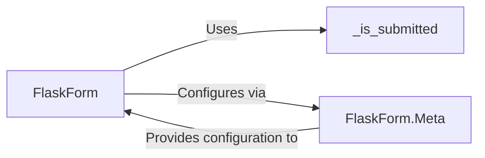

## Details

The `Flask-WTF Core Forms Module` serves as the foundational integration layer between WTForms and the Flask web framework. Its primary responsibility is to streamline form handling within Flask applications, encompassing data binding, submission detection, validation, and rendering.

### FlaskForm
The cornerstone of Flask-WTF, extending `wtforms.form.Form` to provide Flask-specific capabilities. It manages the lifecycle of web forms, including processing incoming request data, validating user input, and preparing forms for rendering in templates. It acts as the primary interface for developers to define and interact with forms in a Flask context.

**Related Classes/Methods**:

- <a href="https://github.com/pallets-eco/flask-wtf/blob/main/src/flask_wtf/form.py#L24-L119" target="_blank" rel="noopener noreferrer">`FlaskForm`:24-119</a>

### FlaskForm.Meta
An inner class within `FlaskForm` that serves as a configuration hub for Flask-WTF specific behaviors. It allows developers to customize aspects like CSRF protection (e.g., `csrf_class`, `csrf_secret`) and define how Flask's request data (`request.form`, `request.files`, `request.get_json()`) is adapted for WTForms processing.

**Related Classes/Methods**:

- <a href="https://github.com/pallets-eco/flask-wtf/blob/main/src/flask_wtf/form.py" target="_blank" rel="noopener noreferrer">`FlaskForm.Meta`</a>

### _is_submitted
A module-level helper function responsible for determining if a form has been submitted based on the HTTP request method (e.g., POST, PUT, PATCH, DELETE) and the presence of form data or a JSON payload. It encapsulates the core logic for submission detection, a critical step in form processing.

**Related Classes/Methods**:

- <a href="https://github.com/pallets-eco/flask-wtf/blob/main/src/flask_wtf/form.py#L122-L127" target="_blank" rel="noopener noreferrer">`_is_submitted`:122-127</a>

### [FAQ](https://github.com/CodeBoarding/GeneratedOnBoardings/tree/main?tab=readme-ov-file#faq)