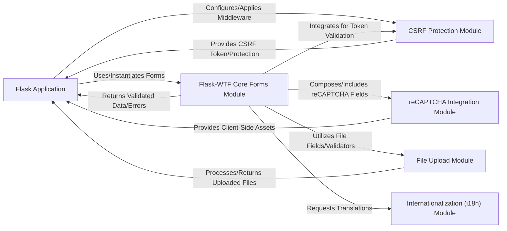

## Details

The Flask-WTF library provides a robust framework for integrating WTForms with Flask applications, emphasizing security and ease of use. The Flask Application serves as the central orchestrator, leveraging the Flask-WTF Core Forms Module for all form-related operations, including data binding, validation, and rendering. Security is a primary concern, addressed by the dedicated CSRF Protection Module which safeguards against common web vulnerabilities. For enhanced user verification, the reCAPTCHA Integration Module seamlessly incorporates Google's reCAPTCHA service. File handling is streamlined through the File Upload Module, simplifying the process of managing uploaded content. Finally, the Internationalization (i18n) Module ensures that forms and messages can be easily localized, providing a global reach for applications built with Flask-WTF. This modular design allows for clear separation of concerns, promoting maintainability and extensibility, and facilitating a clear data flow from user input through validation and processing within the Flask ecosystem.

### Flask Application
The primary consumer of Flask-WTF's functionalities, defining routes, rendering templates, and processing web requests. It integrates Flask-WTF for form handling, security, and external service interactions.

**Related Classes/Methods**:

- <a href="https://github.com/pallets-eco/flask-wtf/blob/main/examples/recaptcha/app.py" target="_blank" rel="noopener noreferrer">`examples/recaptcha/app.py`</a>
- <a href="https://github.com/pallets-eco/flask-wtf/blob/main/examples/uploadr/app.py" target="_blank" rel="noopener noreferrer">`examples/uploadr/app.py`</a>

### Flask-WTF Core Forms Module [[Expand]](./Flask_WTF_Core_Forms_Module.md)
The central integration point for WTForms within Flask. It provides the foundational FlaskForm class, handling form data binding, submission detection, validation, and rendering within a Flask application context.

**Related Classes/Methods**:

- <a href="https://github.com/pallets-eco/flask-wtf/blob/main/src/flask_wtf/form.py" target="_blank" rel="noopener noreferrer">`src/flask_wtf/form.py`</a>

### CSRF Protection Module
A security component dedicated to protecting Flask applications against Cross-Site Request Forgery (CSRF) attacks by generating and validating CSRF tokens.

**Related Classes/Methods**:

- <a href="https://github.com/pallets-eco/flask-wtf/blob/main/src/flask_wtf/csrf.py" target="_blank" rel="noopener noreferrer">`src/flask_wtf/csrf.py`</a>

### reCAPTCHA Integration Module [[Expand]](./reCAPTCHA_Integration_Module.md)
Facilitates the seamless integration of Google reCAPTCHA into Flask forms, providing specialized fields, widgets, and validators.

**Related Classes/Methods**:

- <a href="https://github.com/pallets-eco/flask-wtf/blob/main/src/flask_wtf/recaptcha/fields.py" target="_blank" rel="noopener noreferrer">`src/flask_wtf/recaptcha/fields.py`</a>
- <a href="https://github.com/pallets-eco/flask-wtf/blob/main/src/flask_wtf/recaptcha/validators.py" target="_blank" rel="noopener noreferrer">`src/flask_wtf/recaptcha/validators.py`</a>
- <a href="https://github.com/pallets-eco/flask-wtf/blob/main/src/flask_wtf/recaptcha/widgets.py" target="_blank" rel="noopener noreferrer">`src/flask_wtf/recaptcha/widgets.py`</a>

### File Upload Module
Simplifies handling file uploads within Flask applications by providing WTForms-compatible file fields and validators.

**Related Classes/Methods**:

- <a href="https://github.com/pallets-eco/flask-wtf/blob/main/src/flask_wtf/file.py" target="_blank" rel="noopener noreferrer">`src/flask_wtf/file.py`</a>

### Internationalization (i18n) Module
Provides localized messages and labels for the Flask-WTF Core Forms Module.

**Related Classes/Methods**:

- <a href="https://github.com/pallets-eco/flask-wtf/blob/main/src/flask_wtf/i18n.py" target="_blank" rel="noopener noreferrer">`src/flask_wtf/i18n.py`</a>

### [FAQ](https://github.com/CodeBoarding/GeneratedOnBoardings/tree/main?tab=readme-ov-file#faq)