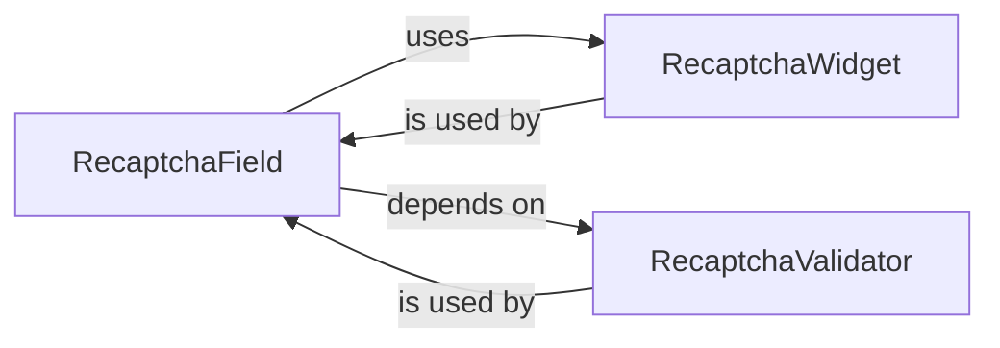

## Details

The `reCAPTCHA Integration Module` is a self-contained subsystem within Flask-WTF, dedicated to providing a robust and seamless way to integrate Google reCAPTCHA into Flask applications' forms. It adheres to the "Extension/Plugin Pattern" by extending WTForms' capabilities and the "Integration Layer" pattern by abstracting interactions with the external reCAPTCHA service.

### RecaptchaField
This component serves as the primary interface for developers to incorporate reCAPTCHA into their Flask forms. It extends WTForms' `Field` class, providing a specialized input type that encapsulates the reCAPTCHA challenge. Its design aligns with the "Extension/Plugin Pattern" by offering a custom form element that integrates directly with the existing form handling capabilities of WTForms.

**Related Classes/Methods**:

- <a href="https://github.com/pallets-eco/flask-wtf/blob/main/src/flask_wtf/recaptcha/fields.py#L9-L17" target="_blank" rel="noopener noreferrer">`flask_wtf.recaptcha.fields.RecaptchaField`:9-17</a>

### RecaptchaValidator
This component is responsible for the crucial server-side verification of the reCAPTCHA response. It encapsulates the logic for communicating with Google's reCAPTCHA service to validate the user's input. This embodies the "Integration Layer" pattern, handling the secure interaction with an external API to confirm the legitimacy of the reCAPTCHA submission.

**Related Classes/Methods**:

- <a href="https://github.com/pallets-eco/flask-wtf/blob/main/src/flask_wtf/recaptcha/validators.py" target="_blank" rel="noopener noreferrer">`flask_wtf.recaptcha.validators.RecaptchaValidator`</a>

### RecaptchaWidget
This component handles the client-side presentation of the reCAPTCHA challenge. It generates the necessary HTML and JavaScript snippets required to display the reCAPTCHA widget on the web page. This is a standard pattern in web frameworks where widgets manage the rendering of specific UI elements, ensuring proper display and functionality within the browser.

**Related Classes/Methods**:

- <a href="https://github.com/pallets-eco/flask-wtf/blob/main/src/flask_wtf/recaptcha/widgets.py#L16-L43" target="_blank" rel="noopener noreferrer">`flask_wtf.recaptcha.widgets.RecaptchaWidget`:16-43</a>

### [FAQ](https://github.com/CodeBoarding/GeneratedOnBoardings/tree/main?tab=readme-ov-file#faq)