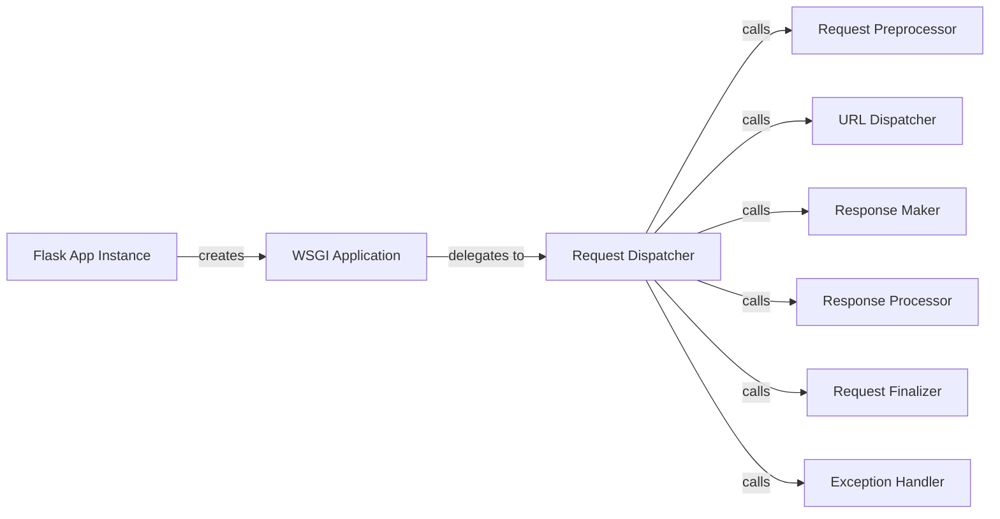

## Component Details

The Flask application core manages the lifecycle of a web request from the moment it's received by the WSGI server until a response is sent back to the client. It initializes the application, sets up the application and request contexts, dispatches the request to the appropriate view function based on the URL, handles any exceptions that occur during processing, and ensures that resources are properly cleaned up after the request is complete. The core orchestrates the interaction between various components like request preprocessors, view functions, response processors, and exception handlers to deliver a complete web application experience.

### Flask App Instance
The central Flask application object. It's responsible for initializing the application, loading configuration, registering extensions, and acting as the central point for request handling. It holds the WSGI application callable and manages the application context.
- **Related Classes/Methods**: `flask.src.flask.app.Flask`

### WSGI Application
The WSGI application callable that receives requests from the WSGI server. It sets up the request and application contexts and then delegates the actual request handling to the `full_dispatch_request` method.
- **Related Classes/Methods**: `flask.src.flask.app.Flask:wsgi_app`, `flask.src.flask.app.Flask:__call__`

### Request Dispatcher
The core of the request handling process. It preprocesses the request, dispatches it to the view function, and finalizes the request by processing the response. It also handles exceptions that occur during request processing.
- **Related Classes/Methods**: `flask.src.flask.app.Flask:full_dispatch_request`

### Request Preprocessor
Functions that are executed before the request is handled by the view function. They can modify the request or return a response directly, short-circuiting the normal request handling.
- **Related Classes/Methods**: `flask.src.flask.app.Flask:preprocess_request`

### URL Dispatcher
Matches the URL to an endpoint and calls the associated view function. It handles routing and view function execution.
- **Related Classes/Methods**: `flask.src.flask.app.Flask:dispatch_request`

### Response Maker
Converts the return value of a view function into a Response object. It handles different return types and ensures a consistent response format.
- **Related Classes/Methods**: `flask.src.flask.app.Flask:make_response`

### Response Processor
Functions that are executed after the view function has returned a response. They can modify the response before it is sent to the client.
- **Related Classes/Methods**: `flask.src.flask.app.Flask:process_response`

### Request Finalizer
Performs actions after the request has been handled, such as closing database connections or cleaning up resources.
- **Related Classes/Methods**: `flask.src.flask.app.Flask:finalize_request`

### Exception Handler
Handles exceptions that occur during request processing. It can be customized to provide specific error handling logic for user exceptions and HTTP exceptions.
- **Related Classes/Methods**: `flask.src.flask.app.Flask:handle_exception`, `flask.src.flask.app.Flask:handle_user_exception`, `flask.src.flask.app.Flask:handle_http_exception`
