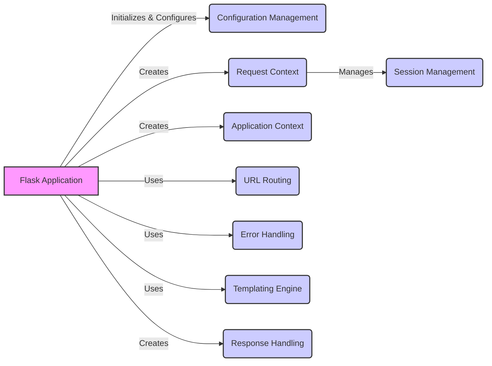

## Application Core Overview

The Application Core manages the Flask application instance, configuration, and overall lifecycle. It initializes and configures the application, handles context management, and provides access to application-level resources.

Here's a high-level component flow diagram illustrating the Application Core's structure and interactions:

### Component Descriptions:

*   **Flask Application:** The core Flask application class responsible for managing the application lifecycle, routing, and configuration. It initializes and configures the application, dispatches requests to the appropriate view functions, and handles errors. **Relevant source files:** `flask.app.Flask`

*   **Configuration Management:** Handles application configuration, loading from files, environment variables, and other sources. It provides a centralized way to manage application settings. **Relevant source files:** `flask.config.Config`

*   **Request Context:** Encapsulates request-specific information, including the request object, URL adapter, and session. It provides a context within which request processing occurs. **Relevant source files:** `flask.ctx.RequestContext`

*   **Application Context:** Manages application-level data during a request, providing access to resources like the database connection. It ensures that resources are available throughout the request lifecycle. **Relevant source files:** `flask.ctx.AppContext`

*   **URL Routing:** Maps URLs to view functions, handling request dispatching based on the URL requested. It determines which view function should handle a given request. **Relevant source files:** `flask.app.Flask.add_url_rule`, `flask.sansio.app.App.add_url_rule`, `flask.app.Flask.create_url_adapter`

*   **Error Handling:** Manages exceptions and errors that occur during request processing, providing mechanisms for handling HTTP exceptions and user-defined exceptions. It ensures that errors are handled gracefully and that appropriate responses are returned to the client. **Relevant source files:** `flask.app.Flask.handle_http_exception`, `flask.app.Flask.handle_user_exception`, `flask.app.Flask.log_exception`

*   **Templating Engine:** Renders templates to generate dynamic HTML content, allowing developers to separate presentation logic from application code. It uses a templating language (e.g., Jinja2) to generate HTML output. **Relevant source files:** `flask.templating.Environment`, `flask.app.Flask.create_jinja_environment`, `flask.sansio.app.App.add_template_filter`, `flask.sansio.app.App.add_template_test`, `flask.sansio.app.App.add_template_global`

*   **Session Management:** Provides an interface for implementing session management, allowing applications to store and retrieve user-specific data across requests. It enables applications to maintain user state across multiple requests. **Relevant source files:** `flask.sessions.SessionInterface.is_null_session`, `flask.sessions.SecureCookieSessionInterface.save_session`

*   **Response Handling:** Represents the outgoing HTTP response, including headers, body, and status code. It is responsible for converting return values from view functions into valid HTTP responses. **Relevant source files:** `flask.wrappers.Response`