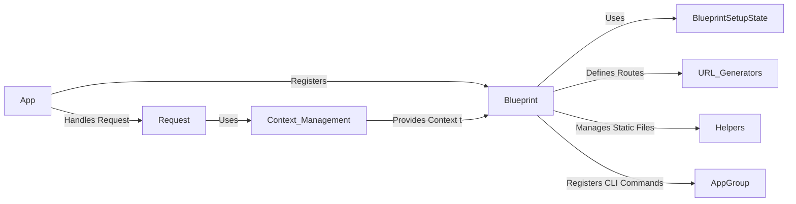

## Blueprints and Modularization in Flask

This component provides a way to organize Flask applications into reusable components. It allows defining sets of routes, templates, and static files that can be registered with the application, promoting modularity and code reuse.

## Components

### Blueprint

*Description*: Centralizes a group of views and other code. Blueprints allow you to organize your application into reusable components, encapsulating routes, templates, and static files.

*Interaction*: The `App` registers the `Blueprint`. The `Blueprint` uses `BlueprintSetupState` to manage its registration. It defines routes that are used by `URL Generators`, manages static files using `Helpers`, and registers CLI commands using `AppGroup`.

*Relevant source files*:
    *   `flask.blueprints.Blueprint`
    *   `flask.sansio.blueprints.Blueprint`

### BlueprintSetupState

*Description*: Holds the state for registering a blueprint on the application. It manages the connection between the blueprint and the application during registration.

*Interaction*: Created by the `Blueprint` during registration with the `App`. It's used to store the application and options during the setup process.

*Relevant source files*:
    *   `flask.sansio.blueprints.BlueprintSetupState`

### App

*Description*: The Flask application class. It manages the application lifecycle, configuration, and registration of blueprints.

*Interaction*: The `App` registers `Blueprints`. It handles incoming `Requests` and provides the application context for the `Blueprint`.

*Relevant source files*:
    *   `flask.sansio.app.App`

### Request

*Description*: Encapsulates the incoming HTTP request data, providing access to request parameters, headers, and body.

*Interaction*: The `App` handles the `Request`. The `Request` uses `Context Management` to access application and request contexts.

*Relevant source files*:
    *   `flask.wrappers.Request`

### Helpers

*Description*: Provides helper functions for tasks such as sending static files and splitting blueprint paths, aiding in common application operations.

*Interaction*: Used by the `Blueprint` to send static files.

*Relevant source files*:
    *   `flask.helpers.send_from_directory`
    *   `flask.helpers._split_blueprint_path`

### AppGroup

*Description*: Specialized group for managing application-related CLI commands, facilitating the creation of custom commands for application management.

*Interaction*: The `Blueprint` registers CLI commands with the `App` through `AppGroup`.

*Relevant source files*:
    *   `flask.cli.AppGroup`

### URL Generators

*Description*: Generates URLs for routes defined within blueprints, allowing for dynamic URL creation based on blueprint context.

*Interaction*: Used by the `Blueprint` to generate URLs for its routes.

*Relevant source files*:
    *   `flask.url_for`

### Context Management

*Description*: Manages the application and request contexts, ensuring that resources are available during request processing within blueprints.

*Interaction*: Used by the `Request` and provides context to the `Blueprint`.

*Relevant source files*:
    *   `flask.app_context`
    *   `flask.request_context`