```mermaid
graph LR
    flask_blueprints_Blueprint["flask.blueprints.Blueprint"]
    flask_sansio_blueprints_Blueprint["flask.sansio.blueprints.Blueprint"]
    flask_sansio_app_Flask_register_blueprint["flask.sansio.app.Flask.register_blueprint"]
    flask_sansio_blueprints_BlueprintSetupState["flask.sansio.blueprints.BlueprintSetupState"]
    flask_blueprints_Blueprint -- "passed to" --> flask_sansio_app_Flask_register_blueprint
    flask_blueprints_Blueprint -- "utilizes" --> flask_sansio_blueprints_Blueprint
    flask_sansio_blueprints_Blueprint -- "instantiates" --> flask_sansio_blueprints_BlueprintSetupState
    flask_sansio_app_Flask_register_blueprint -- "invokes methods on" --> flask_sansio_blueprints_Blueprint
    flask_sansio_blueprints_BlueprintSetupState -- "provides context to" --> flask_sansio_blueprints_Blueprint
```

## Details

The Flask Blueprint subsystem provides a robust mechanism for organizing web applications into modular, reusable components. At its highest level, the `flask.blueprints.Blueprint` class serves as the developer-facing API for defining these modules. This high-level blueprint internally relies on `flask.sansio.blueprints.Blueprint` to manage the core, I/O-independent registration logic. The integration of a blueprint into a Flask application is handled by the `flask.sansio.app.Flask.register_blueprint` method, which orchestrates the setup process. During this setup, `flask.sansio.blueprints.Blueprint` creates a `flask.sansio.blueprints.BlueprintSetupState` instance, which acts as a temporary context holder, providing essential application-specific information back to the `flask.sansio.blueprints.Blueprint` to complete its configuration and register its components with the main application. This layered approach ensures a clear separation of concerns, distinguishing the public API from the internal sans-I/O core and the registration state management.

### flask.blueprints.Blueprint
This is the primary interface for developers to define and configure modular sections of a Flask application. It acts as a container for routes, error handlers, static files, and template configurations specific to a logical group of functionalities. It provides a higher-level abstraction over the core blueprint logic.

**Related Classes/Methods**:

- <a href="https://github.com/pallets/flask/blob/main/src/flask/blueprints.py#L18-L128" target="_blank" rel="noopener noreferrer">`flask.blueprints.Blueprint`:18-128</a>

### flask.sansio.blueprints.Blueprint
This component encapsulates the fundamental, I/O-independent logic for managing and registering blueprint-specific components (like URL rules, template filters, context processors) with the application. It stores the actions and configurations that need to be applied when the blueprint is registered. This separation aligns with Flask's move towards a sans-I/O core.

**Related Classes/Methods**:

- <a href="https://github.com/pallets/flask/blob/main/src/flask/sansio/blueprints.py" target="_blank" rel="noopener noreferrer">`flask.sansio.blueprints.Blueprint`</a>

### flask.sansio.app.Flask.register_blueprint
This method, part of the main `Flask` application core, is the entry point for integrating a `Blueprint` instance into the application. It orchestrates the process of adding the blueprint's routes, error handlers, and other configurations to the application's global dispatching mechanisms.

**Related Classes/Methods**:

- <a href="https://github.com/pallets/flask/blob/main/src/flask/sansio/app.py" target="_blank" rel="noopener noreferrer">`flask.sansio.app.Flask.register_blueprint`</a>

### flask.sansio.blueprints.BlueprintSetupState
A helper class that maintains the necessary state and context during the blueprint's registration process. It provides the blueprint with access to the application instance and other relevant information required for its setup and configuration.

**Related Classes/Methods**:

- <a href="https://github.com/pallets/flask/blob/main/src/flask/sansio/blueprints.py#L34-L116" target="_blank" rel="noopener noreferrer">`flask.sansio.blueprints.BlueprintSetupState`:34-116</a>

### [FAQ](https://github.com/CodeBoarding/GeneratedOnBoardings/tree/main?tab=readme-ov-file#faq)