```mermaid
graph LR
    Flask_CLI_Runner["Flask CLI Runner"]
    Flask_CLI_Application_Loader["Flask CLI Application Loader"]
    Script_Information_Manager["Script Information Manager"]
    Flask_CLI_Command_Group["Flask CLI Command Group"]
    Application_Command_Group["Application Command Group"]
    Flask_Application_Core["Flask Application Core"]
    Flask_Blueprint["Flask Blueprint"]
    Environment_and_Debugging_Helpers["Environment and Debugging Helpers"]
    Flask_CLI_Runner -- "invokes with" --> Script_Information_Manager
    Flask_CLI_Application_Loader -- "raises" --> flask_src_flask_cli_NoAppException
    Flask_CLI_Application_Loader -- "uses" --> flask_src_flask_cli__called_with_wrong_args
    Flask_CLI_Application_Loader -- "orchestrates app finding via" --> Flask_CLI_Application_Loader
    Script_Information_Manager -- "loads app using" --> Flask_CLI_Application_Loader
    Script_Information_Manager -- "configures debug with" --> Environment_and_Debugging_Helpers
    Script_Information_Manager -- "raises" --> flask_src_flask_cli_NoAppException
    Application_Command_Group -- "wraps commands with" --> Application_Command_Group
    Environment_and_Debugging_Helpers -- "loads environment via" --> Environment_and_Debugging_Helpers
    Flask_CLI_Command_Group -- "loads plugin commands via" --> Flask_CLI_Command_Group
    Flask_CLI_Command_Group -- "creates context with" --> Script_Information_Manager
    Environment_and_Debugging_Helpers -- "uses" --> Environment_and_Debugging_Helpers
    Flask_Application_Core -- "inherits from" --> flask_src_flask_sansio_app_App
    Flask_Application_Core -- "initializes with" --> Application_Command_Group
    Flask_Application_Core -- "adds URL rules via" --> flask_src_flask_sansio_app_App
    Flask_Application_Core -- "manages environment loading via" --> Environment_and_Debugging_Helpers
    Flask_Application_Core -- "configures debug with" --> Environment_and_Debugging_Helpers
    Flask_Application_Core -- "displays server banner via" --> Environment_and_Debugging_Helpers
    Flask_Blueprint -- "inherits from" --> flask_src_flask_sansio_blueprints_Blueprint
    Flask_Blueprint -- "initializes with" --> Application_Command_Group
    Flask_CLI_Command_Group -- "extends" --> Application_Command_Group
    Application_Command_Group -- "uses" --> Script_Information_Manager
    Flask_CLI_Command_Group -- "handles" --> flask_src_flask_cli_NoAppException
    Flask_Application_Core -- "integrates with" --> Flask_CLI_Command_Group
    Flask_Blueprint -- "registers commands with" --> Application_Command_Group
    Flask_CLI_Runner -- "tests" --> Flask_CLI_Command_Group
```

## Component Details

The Command Line Interface (CLI) subsystem in Flask provides a robust framework for managing Flask applications from the command line. It enables developers to execute various tasks such as running the development server, managing application instances, and executing custom commands. The core functionality revolves around loading the Flask application, handling command groups, and integrating with Click for command parsing and execution. It also incorporates utilities for environment variable management and debugging.

### Flask CLI Runner
This component provides a testing utility for invoking Flask CLI commands in an isolated environment. It uses ScriptInfo to load the Flask application for testing purposes.

**Related Classes/Methods**:

- <a href="https://github.com/pallets/flask/blob/master/src/flask/testing.py#L275-L298" target="_blank" rel="noopener noreferrer">`flask.testing.FlaskCliRunner:invoke` (275:298)</a>

### Flask CLI Application Loader
This component is responsible for locating and loading Flask applications based on various criteria, including module names, app names, and default file paths. It handles import preparation and error handling for app discovery.

**Related Classes/Methods**:

- <a href="https://github.com/pallets/flask/blob/master/src/flask/cli.py#L41-L91" target="_blank" rel="noopener noreferrer">`flask.src.flask.cli:find_best_app` (41:91)</a>
- <a href="https://github.com/pallets/flask/blob/master/src/flask/cli.py#L120-L197" target="_blank" rel="noopener noreferrer">`flask.src.flask.cli:find_app_by_string` (120:197)</a>
- <a href="https://github.com/pallets/flask/blob/master/src/flask/cli.py#L230-L232" target="_blank" rel="noopener noreferrer">`flask.src.flask.cli:locate_app` (230:232)</a>
- <a href="https://github.com/pallets/flask/blob/master/src/flask/cli.py#L200-L226" target="_blank" rel="noopener noreferrer">`flask.src.flask.cli:prepare_import` (200:226)</a>
- <a href="https://github.com/pallets/flask/blob/master/src/flask/cli.py#L37-L38" target="_blank" rel="noopener noreferrer">`flask.src.flask.cli.NoAppException` (37:38)</a>
- <a href="https://github.com/pallets/flask/blob/master/src/flask/cli.py#L94-L117" target="_blank" rel="noopener noreferrer">`flask.src.flask.cli._called_with_wrong_args` (94:117)</a>

### Script Information Manager
This component acts as a helper object to manage information about the Flask application, particularly for the command-line interface. It facilitates the loading of the Flask application and handles debug flag settings and dotenv loading.

**Related Classes/Methods**:

- <a href="https://github.com/pallets/flask/blob/master/src/flask/cli.py#L293-L372" target="_blank" rel="noopener noreferrer">`flask.src.flask.cli.ScriptInfo` (293:372)</a>
- <a href="https://github.com/pallets/flask/blob/master/src/flask/cli.py#L333-L372" target="_blank" rel="noopener noreferrer">`flask.src.flask.cli.ScriptInfo:load_app` (333:372)</a>

### Flask CLI Command Group
This component extends Click's command group to provide Flask-specific command handling. It automatically wraps commands with an application context and manages the loading of plugin commands.

**Related Classes/Methods**:

- <a href="https://github.com/pallets/flask/blob/master/src/flask/cli.py#L531-L688" target="_blank" rel="noopener noreferrer">`flask.src.flask.cli.FlaskGroup` (531:688)</a>
- <a href="https://github.com/pallets/flask/blob/master/src/flask/cli.py#L609-L634" target="_blank" rel="noopener noreferrer">`flask.src.flask.cli.FlaskGroup:get_command` (609:634)</a>
- <a href="https://github.com/pallets/flask/blob/master/src/flask/cli.py#L636-L655" target="_blank" rel="noopener noreferrer">`flask.src.flask.cli.FlaskGroup:list_commands` (636:655)</a>
- <a href="https://github.com/pallets/flask/blob/master/src/flask/cli.py#L657-L676" target="_blank" rel="noopener noreferrer">`flask.src.flask.cli.FlaskGroup:make_context` (657:676)</a>
- <a href="https://github.com/pallets/flask/blob/master/src/flask/cli.py#L600-L607" target="_blank" rel="noopener noreferrer">`flask.src.flask.cli.FlaskGroup._load_plugin_commands` (600:607)</a>

### Application Command Group
This component is a generic Click group that ensures commands registered under it are executed within a Flask application context. It is used by both the main Flask application and Blueprints for their CLI commands.

**Related Classes/Methods**:

- <a href="https://github.com/pallets/flask/blob/master/src/flask/cli.py#L405-L437" target="_blank" rel="noopener noreferrer">`flask.src.flask.cli.AppGroup` (405:437)</a>
- <a href="https://github.com/pallets/flask/blob/master/src/flask/cli.py#L413-L427" target="_blank" rel="noopener noreferrer">`flask.src.flask.cli.AppGroup:command` (413:427)</a>
- <a href="https://github.com/pallets/flask/blob/master/src/flask/cli.py#L380-L402" target="_blank" rel="noopener noreferrer">`flask.src.flask.cli:with_appcontext` (380:402)</a>

### Flask Application Core
This is the central WSGI application object in Flask. It handles the application's lifecycle, routing, configuration, and integrates with the CLI for running the development server and managing commands. It also manages the application context and request context.

**Related Classes/Methods**:

- <a href="https://github.com/pallets/flask/blob/master/src/flask/app.py#L81-L1536" target="_blank" rel="noopener noreferrer">`flask.src.flask.app.Flask` (81:1536)</a>
- <a href="https://github.com/pallets/flask/blob/master/src/flask/app.py#L226-L279" target="_blank" rel="noopener noreferrer">`flask.src.flask.app.Flask:__init__` (226:279)</a>
- <a href="https://github.com/pallets/flask/blob/master/src/flask/app.py#L546-L667" target="_blank" rel="noopener noreferrer">`flask.src.flask.app.Flask:run` (546:667)</a>
- <a href="https://github.com/pallets/flask/blob/master/src/flask/app.py#L727-L742" target="_blank" rel="noopener noreferrer">`flask.src.flask.app.Flask:test_cli_runner` (727:742)</a>
- <a href="https://github.com/pallets/flask/blob/master/src/flask/sansio/app.py#L59-L964" target="_blank" rel="noopener noreferrer">`flask.src.flask.sansio.app.App` (59:964)</a>
- <a href="https://github.com/pallets/flask/blob/master/src/flask/sansio/app.py#L605-L661" target="_blank" rel="noopener noreferrer">`flask.src.flask.sansio.app.App:add_url_rule` (605:661)</a>

### Flask Blueprint
This component allows for modular organization of application features. It can define its own routes, templates, and static files, and can also register its own CLI commands, which are then integrated into the main application's CLI.

**Related Classes/Methods**:

- <a href="https://github.com/pallets/flask/blob/master/src/flask/blueprints.py#L18-L128" target="_blank" rel="noopener noreferrer">`flask.src.flask.blueprints.Blueprint` (18:128)</a>
- <a href="https://github.com/pallets/flask/blob/master/src/flask/blueprints.py#L19-L53" target="_blank" rel="noopener noreferrer">`flask.src.flask.blueprints.Blueprint:__init__` (19:53)</a>
- <a href="https://github.com/pallets/flask/blob/master/src/flask/sansio/blueprints.py#L119-L632" target="_blank" rel="noopener noreferrer">`flask.src.flask.sansio.blueprints.Blueprint` (119:632)</a>

### Environment and Debugging Helpers
This component provides utility functions related to environment variable loading, retrieving the debug flag status, and server-related utilities, which are crucial for configuring and running Flask applications.

**Related Classes/Methods**:

- <a href="https://github.com/pallets/flask/blob/master/src/flask/helpers.py#L27-L32" target="_blank" rel="noopener noreferrer">`flask.src.flask.helpers.get_debug_flag` (27:32)</a>
- <a href="https://github.com/pallets/flask/blob/master/src/flask/helpers.py#L35-L47" target="_blank" rel="noopener noreferrer">`flask.src.flask.helpers.get_load_dotenv` (35:47)</a>
- <a href="https://github.com/pallets/flask/blob/master/src/flask/cli.py#L698-L763" target="_blank" rel="noopener noreferrer">`flask.src.flask.cli:load_dotenv` (698:763)</a>
- <a href="https://github.com/pallets/flask/blob/master/src/flask/cli.py#L493-L512" target="_blank" rel="noopener noreferrer">`flask.src.flask.cli:_env_file_callback` (493:512)</a>
- <a href="https://github.com/pallets/flask/blob/master/src/flask/cli.py#L766-L777" target="_blank" rel="noopener noreferrer">`flask.src.flask.cli:show_server_banner` (766:777)</a>
- <a href="https://github.com/pallets/flask/blob/master/src/flask/cli.py#L780-L825" target="_blank" rel="noopener noreferrer">`flask.src.flask.cli.CertParamType` (780:825)</a>
- <a href="https://github.com/pallets/flask/blob/master/src/flask/cli.py#L867-L879" target="_blank" rel="noopener noreferrer">`flask.src.flask.cli.SeparatedPathType` (867:879)</a>
- <a href="https://github.com/pallets/flask/blob/master/src/flask/cli.py#L935-L993" target="_blank" rel="noopener noreferrer">`flask.src.flask.cli:run_command` (935:993)</a>

### [FAQ](https://github.com/CodeBoarding/GeneratedOnBoardings/tree/main?tab=readme-ov-file#faq)