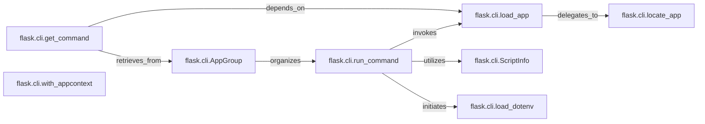

## Details

The `flask.cli` subsystem provides a robust framework for command-line interactions with Flask applications. At its core, the `AppGroup` organizes and manages available commands, with `run_command` serving as the primary orchestrator for executing these commands. To function correctly, commands often require access to the Flask application instance, which is handled by `load_app` and its dependency, `locate_app`. Command discovery is facilitated by `get_command`, which retrieves commands from the `AppGroup` and may rely on `load_app` for app-specific commands. Runtime context for commands is managed through `ScriptInfo`, which is utilized by components like `run_command`. Additionally, `load_dotenv` ensures proper environment variable loading, a process that can be initiated by high-level command execution components. The `with_appcontext` decorator is crucial for providing commands with the necessary application context, ensuring they operate within the correct Flask environment.

### flask.cli.AppGroup
Serves as the foundational component for organizing and grouping CLI commands. It provides a hierarchical structure, enhancing the usability and discoverability of commands. It acts as the root for Flask's command-line interface, from which specific commands are retrieved and managed.

**Related Classes/Methods**:

- <a href="https://github.com/pallets/flask/blob/main/src/flask/app.py#L226-L279" target="_blank" rel="noopener noreferrer">`flask.app.__init__`:226-279</a>

### flask.cli.run_command
Orchestrates the execution of a specific command-line operation. It acts as a primary entry point for running Flask CLI commands, handling the overall flow from command invocation to execution. It initiates the loading of the Flask application and utilizes runtime information.

**Related Classes/Methods**:

- <a href="https://github.com/pallets/flask/blob/main/src/flask/cli.py#L333-L372" target="_blank" rel="noopener noreferrer">`flask.cli.load_app`:333-372</a>
- <a href="https://github.com/pallets/flask/blob/main/src/flask/cli.py#L766-L777" target="_blank" rel="noopener noreferrer">`flask.cli.show_server_banner`:766-777</a>

### flask.cli.load_app
A critical utility responsible for locating and loading the Flask application instance. This is a prerequisite for almost all CLI commands that need to operate within the context of a running Flask application. It delegates the actual discovery process to `locate_app`.

**Related Classes/Methods**:

- <a href="https://github.com/pallets/flask/blob/main/src/flask/cli.py#L241-L264" target="_blank" rel="noopener noreferrer">`flask.cli.locate_app`:241-264</a>

### flask.cli.locate_app
Implements the core logic for discovering the Flask application instance within the project directory structure. It handles various methods of locating the app, such as by name or by file path.

**Related Classes/Methods**:

- <a href="https://github.com/pallets/flask/blob/main/src/flask/cli.py#L41-L91" target="_blank" rel="noopener noreferrer">`flask.cli.find_best_app`:41-91</a>
- <a href="https://github.com/pallets/flask/blob/main/src/flask/cli.py#L120-L197" target="_blank" rel="noopener noreferrer">`flask.cli.find_app_by_string`:120-197</a>

### flask.cli.get_command
Facilitates the retrieval of specific CLI commands. This includes commands defined within the application itself and those dynamically loaded from Flask extensions or plugins, enabling extensibility. It retrieves commands from the `AppGroup` and may depend on `load_app` for app-specific commands.

**Related Classes/Methods**:

- <a href="https://github.com/pallets/flask/blob/main/src/flask/cli.py#L333-L372" target="_blank" rel="noopener noreferrer">`flask.cli.load_app`:333-372</a>
- <a href="https://github.com/pallets/flask/blob/main/src/flask/cli.py#L600-L607" target="_blank" rel="noopener noreferrer">`flask.cli._load_plugin_commands`:600-607</a>

### flask.cli.with_appcontext
A decorator that establishes the Flask application context for a decorated function. This ensures that the code within the decorated function has access to the application's configuration, database connections, and other resources, crucial for commands interacting with the app. It is applied to functions to provide them with the necessary application context.

**Related Classes/Methods**:

- <a href="https://github.com/pallets/flask/blob/main/src/flask/cli.py#L422-L425" target="_blank" rel="noopener noreferrer">`flask.cli.decorator`:422-425</a>

### flask.cli.ScriptInfo
A data container that stores information about the current CLI invocation, such as the application instance, environment variables, and other runtime details. This information is then made available within the command's context. It is utilized by components like `run_command` to access runtime context.

**Related Classes/Methods**:

- <a href="https://github.com/pallets/flask/blob/main/src/flask/cli.py#L657-L676" target="_blank" rel="noopener noreferrer">`flask.cli.make_context`:657-676</a>

### flask.cli.load_dotenv
Manages the loading of environment variables from `.env` files. This is crucial for configuring the application in different environments (e.g., development, testing) without hardcoding sensitive information directly in the code. Its loading process can be initiated by high-level command execution components.

**Related Classes/Methods**:

- <a href="https://github.com/pallets/flask/blob/main/src/flask/cli.py#L493-L512" target="_blank" rel="noopener noreferrer">`flask.cli._env_file_callback`:493-512</a>
- <a href="https://github.com/pallets/flask/blob/main/src/flask/app.py#L546-L667" target="_blank" rel="noopener noreferrer">`flask.app.run`:546-667</a>

### [FAQ](https://github.com/CodeBoarding/GeneratedOnBoardings/tree/main?tab=readme-ov-file#faq)