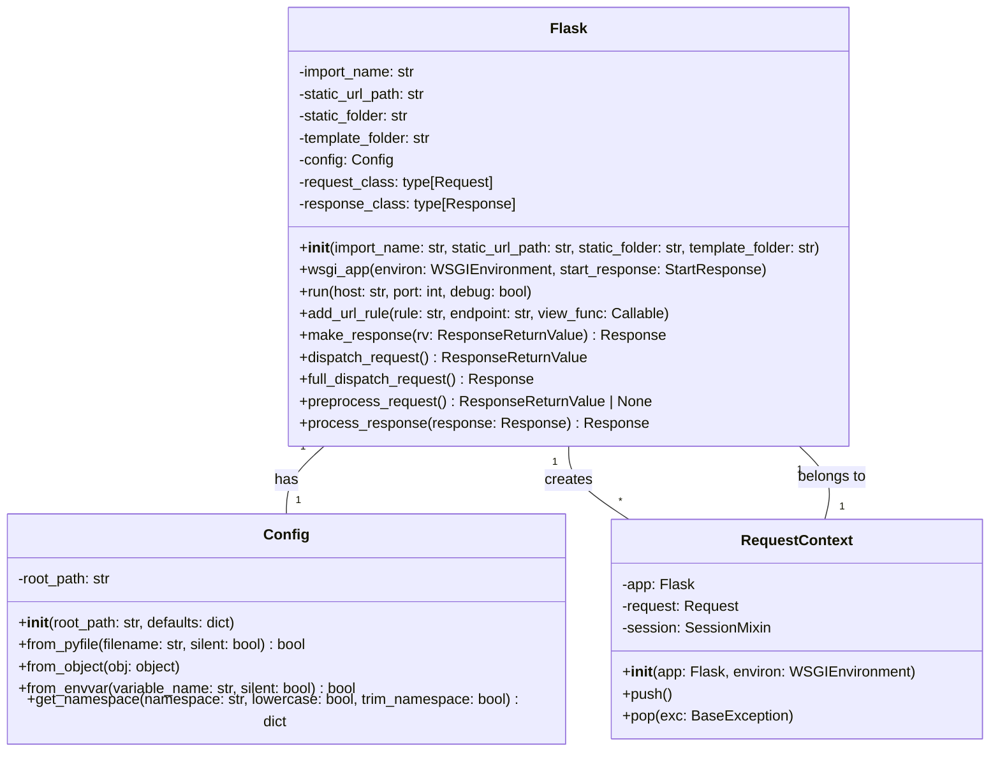

Okay, I have examined the source code for `flask.app.Flask`, `flask.ctx.RequestContext`, and `flask.config.Config`. Based on the information gathered, here's an overview of the Flask component:

**Component Description:**

The Flask component is a micro web framework written in Python. It provides tools and features that allow developers to build web applications. The core of Flask revolves around the `Flask` class, which is the WSGI application. It handles request routing, middleware, and manages the application lifecycle. `RequestContext` manages the context of each HTTP request, providing access to request data, session management, and the application context. `Config` provides a way to manage the application's configuration, loading values from files, environment variables, and objects.

**Main Classes and Their Purposes:**

*   **`Flask`**: The central application object. It's responsible for:
    *   Routing requests to the appropriate view functions.
    *   Managing application configuration.
    *   Handling request and response lifecycle.
    *   Managing extensions.
    *   Serving static files.
*   **`RequestContext`**: Encapsulates the context of a single HTTP request. It's responsible for:
    *   Storing request-specific data (e.g., request object, session).
    *   Matching the request URL to a specific route.
    *   Managing the application context.
    *   Handling teardown functions.
*   **`Config`**: Manages the application's configuration. It's responsible for:
    *   Loading configuration values from various sources (e.g., files, environment variables, objects).
    *   Providing access to configuration values.
    *   Providing a namespace feature to retrieve configuration subsets.

**Visualization:**

I will use a class diagram to represent the structure of the Flask component, highlighting the relationships between the main classes.

**Explanation of the Class Diagram:**

*   The `Flask` class is the central class, representing the Flask application.
*   The `Config` class is associated with the `Flask` class, indicating that each Flask application has a configuration object.
*   The `RequestContext` class is associated with the `Flask` class, indicating that the Flask application creates request contexts for each incoming request.
*   The diagram shows the main attributes and methods of each class, providing a high-level overview of their functionality.