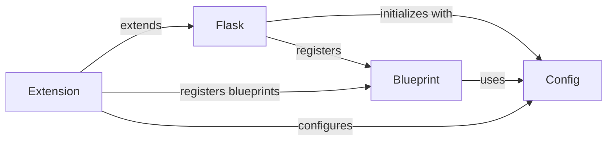

## Component Details

The Configuration and Extensions subsystem in Flask is responsible for managing application settings and providing a modular way to extend Flask's core functionality. The `Config` component handles loading and managing configuration variables from different sources, while the `Blueprint` component allows developers to encapsulate reusable parts of the application. Flask initializes with a `Config` object and can register multiple `Blueprint` instances. Extensions leverage these mechanisms to add new features to Flask.

### Flask
The Flask class represents the WSGI application and is the central point for handling requests, routing, and managing the application lifecycle. It initializes with configurations, registers blueprints, and dispatches requests to the appropriate view functions.
- **Related Classes/Methods**: `flask.src.flask.app.Flask`

### Blueprint
The Blueprint class enables the creation of modular and reusable application components. It encapsulates routes, templates, static files, and other application logic. Blueprints can be registered with a Flask application to organize and structure the application's functionality.
- **Related Classes/Methods**: `flask.src.flask.blueprints.Blueprint`

### Config
The Config class manages the application's configuration settings. It provides a dictionary-like interface for storing and accessing configuration values. It can load configuration from various sources, including environment variables, Python files, and other configuration objects.
- **Related Classes/Methods**: `flask.src.flask.config.Config`

### Extension
Extensions are external packages that add new functionality to a Flask application. They typically provide a way to register themselves with the application and then add new features, such as database integration, authentication, or API support. Extensions often interact with the `Config` and `Blueprint` components to configure themselves and add new routes or functionality.
- **Related Classes/Methods**: _None_
