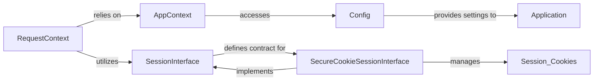

## Details

The Flask application's core context and session management subsystem revolves around RequestContext and AppContext. RequestContext handles the lifecycle of individual HTTP requests, making request-specific data accessible and initiating session loading via the SessionInterface. AppContext provides application-wide resources and configurations, ensuring a consistent environment across requests. The SessionInterface, with its default SecureCookieSessionInterface implementation, is responsible for securely managing session data, primarily through signed cookies. All these components implicitly or explicitly rely on the Config object, which centralizes and provides application-wide settings, influencing various aspects of request and session processing. This structured approach ensures proper isolation of request-specific data while maintaining access to global application configurations and persistent session information.

### RequestContext
Manages the lifecycle of a single HTTP request's context. It encapsulates request-specific data like the incoming request object, URL routing information, and the current application instance. It pushes itself onto a thread-local stack, making request-specific data globally accessible via proxies. It also handles the opening of the session via SessionInterface and triggers teardown functions at the end of the request.

**Related Classes/Methods**:

- <a href="https://github.com/pallets/flask/blob/main/src/flask/ctx.py#L287-L449" target="_blank" rel="noopener noreferrer">`src.flask.ctx.requestcontext`:287-449</a>

### AppContext
Manages application-wide context, providing access to application-level resources and configurations that are constant across requests for a given application instance. It's pushed and popped from a thread-local stack, making application-level data globally available. It also manages the g object for application-specific globals.

**Related Classes/Methods**:

- <a href="https://github.com/pallets/flask/blob/main/src/flask/ctx.py#L238-L284" target="_blank" rel="noopener noreferrer">`src.flask.ctx.appcontext`:238-284</a>

### SessionInterface
An abstract base class defining the contract for session management. It specifies methods for opening, saving, and handling session data, allowing for various session backends. It provides default implementations for cookie-related properties.

**Related Classes/Methods**:

- <a href="https://github.com/pallets/flask/blob/main/src/flask/sessions.py#L114-L284" target="_blank" rel="noopener noreferrer">`src.flask.sessions.sessioninterface`:114-284</a>

### SecureCookieSessionInterface
The default concrete implementation of SessionInterface. It securely stores session data in signed cookies using itsdangerous. It serializes session data, signs it to prevent tampering, and stores it in a cookie. On subsequent requests, it verifies the signature and deserializes the data.

**Related Classes/Methods**:

- <a href="https://github.com/pallets/flask/blob/main/src/flask/sessions.py#L298-L399" target="_blank" rel="noopener noreferrer">`src.flask.sessions.securecookiesessioninterface`:298-399</a>

### Config
A dictionary-like object storing and providing access to all application configuration settings. It supports loading configurations from various sources like Python files, environment variables, and mappings, offering a flexible way to manage application settings.

**Related Classes/Methods**:

- <a href="https://github.com/pallets/flask/blob/main/src/flask/config.py#L50-L367" target="_blank" rel="noopener noreferrer">`src.flask.config.config`:50-367</a>

### [FAQ](https://github.com/CodeBoarding/GeneratedOnBoardings/tree/main?tab=readme-ov-file#faq)