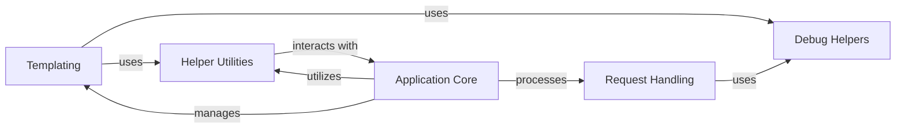

## Component Details

This component overview details the core utilities and helper functions within the Flask framework. It encompasses modules responsible for debugging, template rendering, request processing, and general-purpose helper functions. The flow generally involves the Application Core orchestrating request handling and response generation, leveraging Templating for content presentation, and utilizing Helper Utilities for common tasks, with Debug Helpers providing diagnostic support across these areas.

### Debug Helpers
This component provides utility functions and classes primarily for debugging purposes within the Flask application. It includes mechanisms to attach detailed error messages for file upload issues and to explain template loading attempts, aiding developers in understanding and resolving common problems.

**Related Classes/Methods**:

- <a href="https://github.com/pallets/flask/blob/master/src/flask/debughelpers.py#L81-L104" target="_blank" rel="noopener noreferrer">`flask.src.flask.debughelpers:attach_enctype_error_multidict` (81:104)</a>
- <a href="https://github.com/pallets/flask/blob/master/src/flask/debughelpers.py#L124-L178" target="_blank" rel="noopener noreferrer">`flask.src.flask.debughelpers:explain_template_loading_attempts` (124:178)</a>
- <a href="https://github.com/pallets/flask/blob/master/src/flask/debughelpers.py#L23-L47" target="_blank" rel="noopener noreferrer">`flask.src.flask.debughelpers.DebugFilesKeyError` (23:47)</a>

### Templating
This component handles the rendering and streaming of templates in Flask. It integrates with Jinja2 to provide an environment for template processing, including mechanisms for locating templates from various sources (application and blueprints) and streaming rendered content.

**Related Classes/Methods**:

- <a href="https://github.com/pallets/flask/blob/master/src/flask/templating.py#L165-L185" target="_blank" rel="noopener noreferrer">`flask.src.flask.templating:_stream` (165:185)</a>
- <a href="https://github.com/pallets/flask/blob/master/src/flask/templating.py#L39-L49" target="_blank" rel="noopener noreferrer">`flask.src.flask.templating.Environment` (39:49)</a>
- <a href="https://github.com/pallets/flask/blob/master/src/flask/templating.py#L52-L123" target="_blank" rel="noopener noreferrer">`flask.src.flask.templating.DispatchingJinjaLoader` (52:123)</a>
- <a href="https://github.com/pallets/flask/blob/master/src/flask/templating.py#L126-L135" target="_blank" rel="noopener noreferrer">`flask.src.flask.templating:_render` (126:135)</a>
- <a href="https://github.com/pallets/flask/blob/master/src/flask/templating.py#L138-L150" target="_blank" rel="noopener noreferrer">`flask.src.flask.templating.render_template` (138:150)</a>
- <a href="https://github.com/pallets/flask/blob/master/src/flask/templating.py#L153-L162" target="_blank" rel="noopener noreferrer">`flask.src.flask.templating.render_template_string` (153:162)</a>
- <a href="https://github.com/pallets/flask/blob/master/src/flask/templating.py#L188-L204" target="_blank" rel="noopener noreferrer">`flask.src.flask.templating.stream_template` (188:204)</a>
- <a href="https://github.com/pallets/flask/blob/master/src/flask/templating.py#L207-L219" target="_blank" rel="noopener noreferrer">`flask.src.flask.templating.stream_template_string` (207:219)</a>

### Request Handling
This component defines the Request object used by Flask, extending Werkzeug's Request. It manages incoming request data, including form data and file uploads, and provides properties for accessing URL rules, view arguments, and blueprint information. It also includes logic for handling JSON loading failures and attaching debug information for file upload errors.

**Related Classes/Methods**:

- <a href="https://github.com/pallets/flask/blob/master/src/flask/wrappers.py#L197-L210" target="_blank" rel="noopener noreferrer">`flask.src.flask.wrappers.Request:_load_form_data` (197:210)</a>
- <a href="https://github.com/pallets/flask/blob/master/src/flask/wrappers.py#L18-L219" target="_blank" rel="noopener noreferrer">`flask.src.flask.wrappers.Request` (18:219)</a>

### Application Core
This component represents the central Flask application object. It manages the application's configuration, URL routing, request and response processing, and static file serving. It also provides methods for creating Jinja environments, handling exceptions, and managing application and request contexts.

**Related Classes/Methods**:

- <a href="https://github.com/pallets/flask/blob/master/src/flask/app.py#L308-L328" target="_blank" rel="noopener noreferrer">`flask.src.flask.app.Flask:send_static_file` (308:328)</a>
- <a href="https://github.com/pallets/flask/blob/master/src/flask/app.py#L281-L306" target="_blank" rel="noopener noreferrer">`flask.src.flask.app.Flask.get_send_file_max_age` (281:306)</a>
- <a href="https://github.com/pallets/flask/blob/master/src/flask/app.py#L81-L1536" target="_blank" rel="noopener noreferrer">`flask.src.flask.app.Flask` (81:1536)</a>
- <a href="https://github.com/pallets/flask/blob/master/src/flask/app.py#L385-L423" target="_blank" rel="noopener noreferrer">`flask.src.flask.app.Flask.create_jinja_environment` (385:423)</a>
- <a href="https://github.com/pallets/flask/blob/master/src/flask/app.py#L425-L476" target="_blank" rel="noopener noreferrer">`flask.src.flask.app.Flask.create_url_adapter` (425:476)</a>
- <a href="https://github.com/pallets/flask/blob/master/src/flask/app.py#L478-L504" target="_blank" rel="noopener noreferrer">`flask.src.flask.app.Flask.raise_routing_exception` (478:504)</a>
- <a href="https://github.com/pallets/flask/blob/master/src/flask/app.py#L506-L532" target="_blank" rel="noopener noreferrer">`flask.src.flask.app.Flask.update_template_context` (506:532)</a>
- <a href="https://github.com/pallets/flask/blob/master/src/flask/app.py#L1129-L1269" target="_blank" rel="noopener noreferrer">`flask.src.flask.app.Flask.make_response` (1129:1269)</a>
- <a href="https://github.com/pallets/flask/blob/master/src/flask/app.py#L1271-L1296" target="_blank" rel="noopener noreferrer">`flask.src.flask.app.Flask.preprocess_request` (1271:1296)</a>
- <a href="https://github.com/pallets/flask/blob/master/src/flask/app.py#L1298-L1324" target="_blank" rel="noopener noreferrer">`flask.src.flask.app.Flask.process_response` (1298:1324)</a>
- <a href="https://github.com/pallets/flask/blob/master/src/flask/app.py#L1326-L1358" target="_blank" rel="noopener noreferrer">`flask.src.flask.app.Flask.do_teardown_request` (1326:1358)</a>
- <a href="https://github.com/pallets/flask/blob/master/src/flask/app.py#L1360-L1384" target="_blank" rel="noopener noreferrer">`flask.src.flask.app.Flask.do_teardown_appcontext` (1360:1384)</a>
- <a href="https://github.com/pallets/flask/blob/master/src/flask/app.py#L1479-L1527" target="_blank" rel="noopener noreferrer">`flask.src.flask.app.Flask.wsgi_app` (1479:1527)</a>

### Helper Utilities
This component provides a collection of general utility functions used across the Flask framework. These helpers include functions for streaming responses with context, creating responses, generating URLs, handling redirects and aborts, managing flashed messages, and preparing arguments for sending files.

**Related Classes/Methods**:

- <a href="https://github.com/pallets/flask/blob/master/src/flask/helpers.py#L51-L53" target="_blank" rel="noopener noreferrer">`flask.src.flask.helpers:stream_with_context` (51:53)</a>
- <a href="https://github.com/pallets/flask/blob/master/src/flask/helpers.py#L400-L523" target="_blank" rel="noopener noreferrer">`flask.src.flask.helpers:send_file` (400:523)</a>
- <a href="https://github.com/pallets/flask/blob/master/src/flask/helpers.py#L526-L567" target="_blank" rel="noopener noreferrer">`flask.src.flask.helpers:send_from_directory` (526:567)</a>
- <a href="https://github.com/pallets/flask/blob/master/src/flask/helpers.py#L387-L397" target="_blank" rel="noopener noreferrer">`flask.src.flask.helpers:_prepare_send_file_kwargs` (387:397)</a>
- <a href="https://github.com/pallets/flask/blob/master/src/flask/helpers.py#L139-L185" target="_blank" rel="noopener noreferrer">`flask.src.flask.helpers.make_response` (139:185)</a>
- <a href="https://github.com/pallets/flask/blob/master/src/flask/helpers.py#L188-L239" target="_blank" rel="noopener noreferrer">`flask.src.flask.helpers.url_for` (188:239)</a>
- <a href="https://github.com/pallets/flask/blob/master/src/flask/helpers.py#L242-L263" target="_blank" rel="noopener noreferrer">`flask.src.flask.helpers.redirect` (242:263)</a>
- <a href="https://github.com/pallets/flask/blob/master/src/flask/helpers.py#L266-L286" target="_blank" rel="noopener noreferrer">`flask.src.flask.helpers.abort` (266:286)</a>
- <a href="https://github.com/pallets/flask/blob/master/src/flask/helpers.py#L311-L342" target="_blank" rel="noopener noreferrer">`flask.src.flask.helpers.flash` (311:342)</a>
- <a href="https://github.com/pallets/flask/blob/master/src/flask/helpers.py#L345-L384" target="_blank" rel="noopener noreferrer">`flask.src.flask.helpers.get_flashed_messages` (345:384)</a>

### [FAQ](https://github.com/CodeBoarding/GeneratedOnBoardings/tree/main?tab=readme-ov-file#faq)