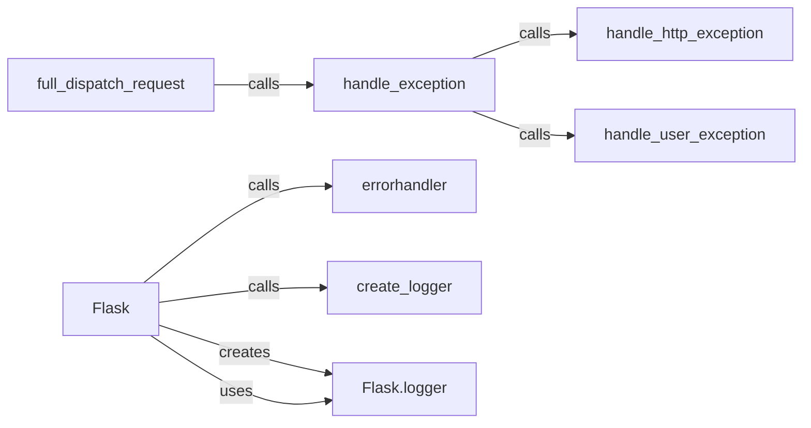

## Component Details

The Error Handling and Logging subsystem in Flask is responsible for managing exceptions and errors that occur during request processing, as well as providing logging capabilities for debugging and monitoring. It allows developers to define custom error handlers for different exception types and log messages to various destinations. The Flask application class (`Flask`) is central to this subsystem, as it provides methods for handling exceptions (`handle_exception`, `handle_http_exception`, `handle_user_exception`) and a decorator (`errorhandler`) for registering custom error handlers. The `create_logger` function initializes the application's logger, which is then used to record events and errors.

### Flask
The core Flask class that represents the WSGI application. It initializes the application and manages error handling through its methods like `handle_exception`, `handle_http_exception`, and `handle_user_exception`. It also provides the `errorhandler` decorator for registering custom error handlers.
- **Related Classes/Methods**: `flask.src.flask.app.Flask`

### handle_exception
Handles exceptions that occur during request processing. It attempts to find an appropriate exception handler for the exception type. It delegates to `handle_http_exception` for HTTP exceptions and `handle_user_exception` for exceptions raised by user code.
- **Related Classes/Methods**: `flask.src.flask.app.Flask:handle_exception`

### handle_http_exception
Handles HTTP exceptions specifically, converting them into appropriate HTTP responses. It is called by `handle_exception` when an HTTP exception is encountered.
- **Related Classes/Methods**: `flask.src.flask.app.Flask:handle_http_exception`

### handle_user_exception
Handles exceptions raised directly by the user's code (e.g., within a view function). It is called by `handle_exception` when a user-defined exception is encountered.
- **Related Classes/Methods**: `flask.src.flask.app.Flask:handle_user_exception`

### errorhandler
A decorator used to register error handlers for specific exception types. It allows developers to define custom functions to handle different types of exceptions that may occur during request processing.
- **Related Classes/Methods**: `flask.src.flask.app.Flask:errorhandler`

### create_logger
Creates a logger instance for the Flask application. This logger is used to record events, errors, and other information for debugging and monitoring purposes. It is part of the Flask logging module.
- **Related Classes/Methods**: `flask.src.flask.logging:create_logger`

### Flask.logger
The logger instance attached to the Flask application. It is created by `create_logger` and used throughout the application to log messages.
- **Related Classes/Methods**: `flask.src.flask.app.Flask`

### full_dispatch_request
Dispatches the request to the appropriate view function after performing request context setup. It is responsible for calling the view function and handling any exceptions that occur during the process, using the `handle_exception` method.
- **Related Classes/Methods**: `flask.src.flask.app.Flask:full_dispatch_request`
