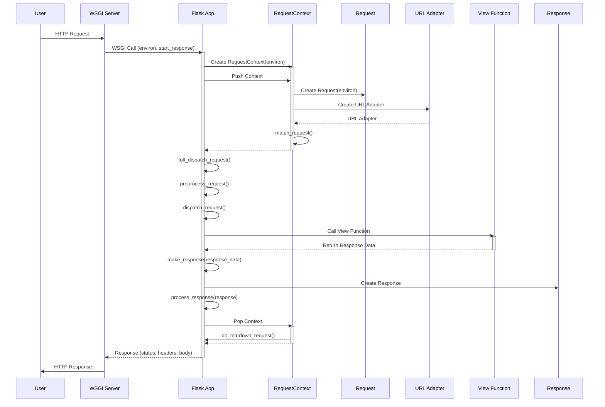
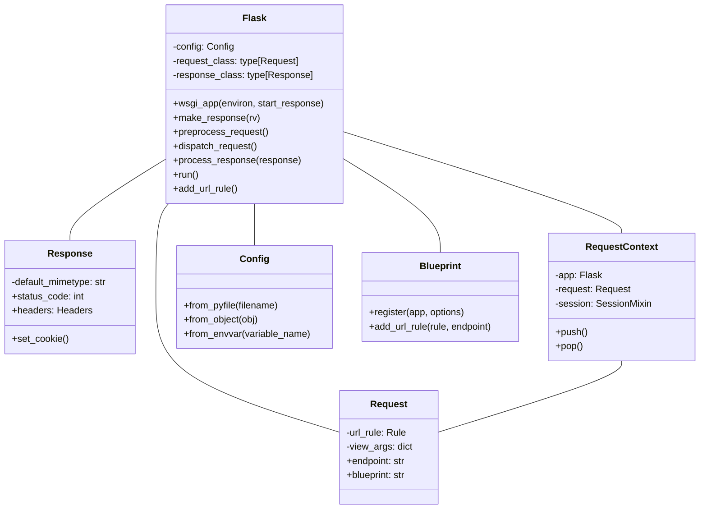

Okay, I have reviewed the source code for the core Flask components. Here's a breakdown of the Flask component:

**Description:**

The Flask component is a micro web framework for Python. It provides the tools and libraries needed to build web applications, including request handling, routing, templating, and more. Flask is designed to be lightweight and modular, allowing developers to choose the components they need.

**Main Classes and Their Purposes:**

*   **`Flask`**: The core application object. It manages the application's configuration, routing, request handling, and lifecycle. It inherits from `App`.
*   **`Request`**: Represents an incoming HTTP request. It provides access to request data, headers, and other information.
*   **`Response`**: Represents an outgoing HTTP response. It allows setting the response body, status code, headers, and cookies.
*   **`RequestContext`**: Manages the context of a request, including the application, request, session, and URL adapter. It's pushed at the beginning of a request and popped at the end.
*   **`Config`**: Handles the application's configuration. It allows loading configuration values from files, environment variables, and objects.
*   **`Blueprint`**: A way to organize a Flask application into reusable components. A blueprint is a set of operations which can be registered on an application.
*   **`render_template`**: A function that renders a template using Jinja2.

**Main Flow (Sequence Diagram):**

**Component Structure (Class Diagram):**

