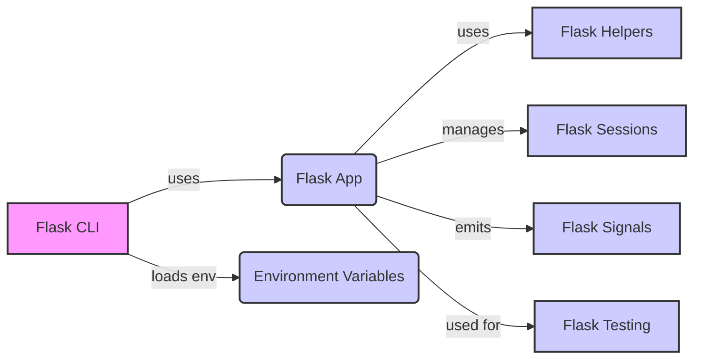

## Extensions and Utilities Overview

This section provides an overview of the extensions and utilities that Flask offers to enhance its functionality. These components cover a range of tasks, from handling command-line interfaces to managing user sessions and providing testing tools.

### Component Descriptions:

- **Flask CLI**: Provides command-line interface tools for managing Flask applications. It loads the Flask application and environment variables, allowing users to run commands and manage the application from the command line.
  *Relevant source files*: `flask.cli`

- **Flask App**: The core Flask application instance. It uses helpers, manages sessions, emits signals, and is used for testing.
  *Relevant source files*: `flask.app`

- **Environment Variables**: Configuration settings loaded by the Flask CLI to customize application behavior.
  *Relevant source files*: `flask.cli`

- **Flask Helpers**: Offers utility functions that simplify common tasks within Flask applications, such as sending static files and generating URLs. It is used by the Flask application to provide helper functionalities.
  *Relevant source files*: `flask.helpers`

- **Flask Sessions**: Manages user sessions in Flask applications, providing a way to store and retrieve user-specific data across multiple requests. It is managed by the Flask application to handle user sessions.
  *Relevant source files*: `flask.sessions`

- **Flask Signals**: Implements a signaling system that allows developers to subscribe to and emit custom signals during various stages of a Flask application's lifecycle. It is emitted by the Flask application to notify subscribers of events.
  *Relevant source files*: `flask.signals`

- **Flask Testing**: Offers tools and utilities for testing Flask applications, including a test client for simulating HTTP requests. It is used for testing the Flask application.
  *Relevant source files*: `flask.testing`
