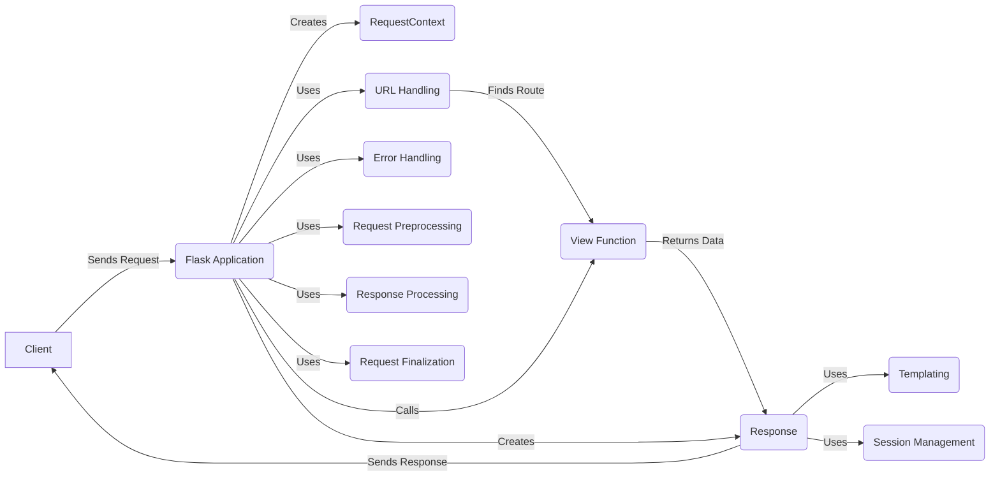

## Flask Application Overview

The Flask application is the core component responsible for handling web requests and managing the application's lifecycle. It acts as a central registry for routes, view functions, and configurations.

## Components Description

**Component:** `Flask Application`
   - *Description*: The core Flask application instance that manages the WSGI application, request handling, routing, and configuration. It acts as a central registry for view functions, URL rules, and template configurations.
   - *Interaction*: Receives requests from the client, creates a request context, uses URL handling to find the appropriate view function, calls the view function, creates a response, and sends the response back to the client. It also uses error handling, request preprocessing, response processing, and request finalization to manage the request lifecycle.
   - *Relevant source files*: `repos.flask.src.flask.app.Flask`

**Component:** `RequestContext`
   - *Description*: Manages the context for each request, holding request-specific data like the request and session objects. It's pushed and popped during request handling.
   - *Interaction*: Created by the Flask application for each request. It provides access to request-specific data and manages the lifecycle of the request.
   - *Relevant source files*: `flask.ctx.RequestContext`

**Component:** `URL Handling`
   - *Description*: Components responsible for URL routing and building, including creating URL adapters and handling routing exceptions.
   - *Interaction*: Used by the Flask application to match the incoming request URL to a registered route and extract any URL parameters. It then provides the matched route and parameters to the view function.
   - *Relevant source files*: `flask.app.Flask.create_url_adapter`, `flask.app.Flask.raise_routing_exception`, `flask.app.Flask.url_for`

**Component:** `View Function`
   - *Description*: A function that is associated with a specific URL route. It processes the request and returns data to be rendered as a response.
   - *Interaction*: Called by the Flask application after the URL has been matched. It receives the request context and URL parameters as input and returns data to be used to create the response.
   - *Relevant source files*: N/A (User-defined)

**Component:** `Response`
   - *Description*: Represents the outgoing response, including headers, body, and status code. It's created by `make_response` and processed by `process_response`.
   - *Interaction*: Created by the Flask application from the data returned by the view function. It encapsulates the response data, headers, and status code, and is sent back to the client.
   - *Relevant source files*: `flask.wrappers.Response`

**Component:** `Templating`
   - *Description*: Components responsible for rendering templates, including creating the Jinja environment and updating the template context.
   - *Interaction*: Used by the Response component to render dynamic content into the response body. It takes a template and a context as input and generates the final HTML or other output.
   - *Relevant source files*: `flask.templating.Environment`, `flask.app.Flask.update_template_context`, `flask.app.Flask.create_jinja_environment`

**Component:** `Session Management`
   - *Description*: Handles user sessions using a session interface. The default implementation uses secure cookies.
   - *Interaction*: Used by the Flask application to manage user sessions. It stores and retrieves session data associated with the user's request.
   - *Relevant source files*: `flask.sessions.SessionInterface`, `flask.sessions.SessionInterface.is_null_session`, `flask.sessions.SecureCookieSessionInterface.save_session`

**Component:** `Error Handling`
   - *Description*: Components responsible for handling exceptions and errors during request processing, including HTTP exceptions and user exceptions.
   - *Interaction*: Used by the Flask application to catch and handle exceptions that occur during request processing. It can render error pages or perform other error-handling tasks.
   - *Relevant source files*: `flask.app.Flask.handle_http_exception`, `flask.app.Flask.handle_user_exception`, `flask.app.Flask.log_exception`, `flask.app.Flask.handle_exception`

**Component:** `Request Preprocessing`
   - *Description*: Functions that are executed before the request is dispatched, such as URL value preprocessors and before-request functions.
   - *Interaction*: Executed by the Flask application before the view function is called. It can modify the request or perform other preprocessing tasks.
   - *Relevant source files*: `flask.app.Flask.preprocess_request`

**Component:** `Response Processing`
   - *Description*: Functions that are executed after the request is handled and before the response is sent, such as after-request functions.
   - *Interaction*: Executed by the Flask application after the view function has returned and before the response is sent to the client. It can modify the response or perform other postprocessing tasks.
   - *Relevant source files*: `flask.app.Flask.process_response`

**Component:** `Request Finalization`
   - *Description*: Finalizes the request by converting the return value to a response and invoking postprocessing functions.
   - *Interaction*: Finalizes the request processing by converting the return value from the view function into a Response object and then calls the response processing functions.
   - *Relevant source files*: `flask.app.Flask.finalize_request`
