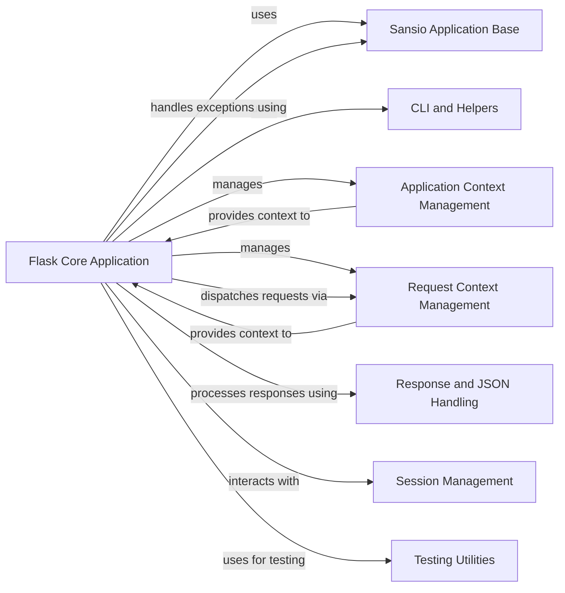

## Component Details

This graph outlines the core components of the Flask framework, focusing on the central application lifecycle, context management, and foundational sans-I/O logic. It details how the main Flask application object orchestrates request handling, exception management, and integrates with various sub-components for tasks like context provisioning, response generation, session management, and CLI utilities. The relationships highlight the dependencies and interactions crucial for Flask's operation, from request dispatching to testing support.

### Flask Core Application
The central application object responsible for initializing the Flask application, handling the WSGI interface, dispatching incoming requests to appropriate handlers, managing exceptions, and orchestrating the overall request-response cycle.

**Related Classes/Methods**:

- <a href="https://github.com/pallets/flask/blob/master/src/flask/app.py#L226-L279" target="_blank" rel="noopener noreferrer">`flask.src.flask.app.Flask:__init__` (226:279)</a>
- <a href="https://github.com/pallets/flask/blob/master/src/flask/app.py#L546-L667" target="_blank" rel="noopener noreferrer">`flask.src.flask.app.Flask:run` (546:667)</a>
- <a href="https://github.com/pallets/flask/blob/master/src/flask/app.py#L744-L777" target="_blank" rel="noopener noreferrer">`flask.src.flask.app.Flask:handle_http_exception` (744:777)</a>
- <a href="https://github.com/pallets/flask/blob/master/src/flask/app.py#L779-L809" target="_blank" rel="noopener noreferrer">`flask.src.flask.app.Flask:handle_user_exception` (779:809)</a>
- <a href="https://github.com/pallets/flask/blob/master/src/flask/app.py#L811-L862" target="_blank" rel="noopener noreferrer">`flask.src.flask.app.Flask:handle_exception` (811:862)</a>
- <a href="https://github.com/pallets/flask/blob/master/src/flask/app.py#L879-L902" target="_blank" rel="noopener noreferrer">`flask.src.flask.app.Flask:dispatch_request` (879:902)</a>
- <a href="https://github.com/pallets/flask/blob/master/src/flask/app.py#L904-L920" target="_blank" rel="noopener noreferrer">`flask.src.flask.app.Flask:full_dispatch_request` (904:920)</a>
- <a href="https://github.com/pallets/flask/blob/master/src/flask/app.py#L922-L951" target="_blank" rel="noopener noreferrer">`flask.src.flask.app.Flask:finalize_request` (922:951)</a>
- <a href="https://github.com/pallets/flask/blob/master/src/flask/app.py#L1129-L1269" target="_blank" rel="noopener noreferrer">`flask.src.flask.app.Flask:make_response` (1129:1269)</a>
- <a href="https://github.com/pallets/flask/blob/master/src/flask/app.py#L1271-L1296" target="_blank" rel="noopener noreferrer">`flask.src.flask.app.Flask:preprocess_request` (1271:1296)</a>
- <a href="https://github.com/pallets/flask/blob/master/src/flask/app.py#L1298-L1324" target="_blank" rel="noopener noreferrer">`flask.src.flask.app.Flask:process_response` (1298:1324)</a>
- <a href="https://github.com/pallets/flask/blob/master/src/flask/app.py#L1326-L1358" target="_blank" rel="noopener noreferrer">`flask.src.flask.app.Flask:do_teardown_request` (1326:1358)</a>
- <a href="https://github.com/pallets/flask/blob/master/src/flask/app.py#L1360-L1384" target="_blank" rel="noopener noreferrer">`flask.src.flask.app.Flask:do_teardown_appcontext` (1360:1384)</a>
- <a href="https://github.com/pallets/flask/blob/master/src/flask/app.py#L1386-L1405" target="_blank" rel="noopener noreferrer">`flask.src.flask.app.Flask:app_context` (1386:1405)</a>
- <a href="https://github.com/pallets/flask/blob/master/src/flask/app.py#L1407-L1421" target="_blank" rel="noopener noreferrer">`flask.src.flask.app.Flask:request_context` (1407:1421)</a>
- <a href="https://github.com/pallets/flask/blob/master/src/flask/app.py#L1423-L1477" target="_blank" rel="noopener noreferrer">`flask.src.flask.app.Flask:test_request_context` (1423:1477)</a>
- <a href="https://github.com/pallets/flask/blob/master/src/flask/app.py#L1479-L1527" target="_blank" rel="noopener noreferrer">`flask.src.flask.app.Flask:wsgi_app` (1479:1527)</a>
- <a href="https://github.com/pallets/flask/blob/master/src/flask/app.py#L1529-L1536" target="_blank" rel="noopener noreferrer">`flask.src.flask.app.Flask:__call__` (1529:1536)</a>

### Application Context Management
Manages the lifecycle of the application context, pushing and popping it from a stack. This context holds application-wide data and configurations, ensuring that resources and settings are available throughout the application's lifespan.

**Related Classes/Methods**:

- <a href="https://github.com/pallets/flask/blob/master/src/flask/ctx.py#L274-L276" target="_blank" rel="noopener noreferrer">`flask.src.flask.ctx.AppContext:__enter__` (274:276)</a>
- <a href="https://github.com/pallets/flask/blob/master/src/flask/ctx.py#L251-L254" target="_blank" rel="noopener noreferrer">`flask.src.flask.ctx.AppContext:push` (251:254)</a>
- <a href="https://github.com/pallets/flask/blob/master/src/flask/ctx.py#L278-L284" target="_blank" rel="noopener noreferrer">`flask.src.flask.ctx.AppContext:__exit__` (278:284)</a>
- <a href="https://github.com/pallets/flask/blob/master/src/flask/ctx.py#L256-L272" target="_blank" rel="noopener noreferrer">`flask.src.flask.ctx.AppContext:pop` (256:272)</a>
- <a href="https://github.com/pallets/flask/blob/master/src/flask/ctx.py#L29-L114" target="_blank" rel="noopener noreferrer">`flask.src.flask.ctx._AppCtxGlobals` (29:114)</a>

### Request Context Management
Handles the lifecycle of the request context, pushing and popping it for each incoming request. It manages request-specific data, routing information, and error handling mechanisms pertinent to the current HTTP request.

**Related Classes/Methods**:

- <a href="https://github.com/pallets/flask/blob/master/src/flask/ctx.py#L337-L355" target="_blank" rel="noopener noreferrer">`flask.src.flask.ctx.RequestContext:copy` (337:355)</a>
- <a href="https://github.com/pallets/flask/blob/master/src/flask/ctx.py#L367-L394" target="_blank" rel="noopener noreferrer">`flask.src.flask.ctx.RequestContext:push` (367:394)</a>
- <a href="https://github.com/pallets/flask/blob/master/src/flask/ctx.py#L357-L365" target="_blank" rel="noopener noreferrer">`flask.src.flask.ctx.RequestContext:match_request` (357:365)</a>
- <a href="https://github.com/pallets/flask/blob/master/src/flask/ctx.py#L433-L435" target="_blank" rel="noopener noreferrer">`flask.src.flask.ctx.RequestContext:__enter__` (433:435)</a>
- <a href="https://github.com/pallets/flask/blob/master/src/flask/ctx.py#L437-L443" target="_blank" rel="noopener noreferrer">`flask.src.flask.ctx.RequestContext:__exit__` (437:443)</a>
- <a href="https://github.com/pallets/flask/blob/master/src/flask/ctx.py#L287-L449" target="_blank" rel="noopener noreferrer">`flask.src.flask.ctx.RequestContext` (287:449)</a>

### Sansio Application Base
Provides the fundamental, sans-I/O (input/output) application logic that the main Flask application builds upon. It handles core functionalities like URL rule management, error handler discovery, and basic request processing independent of the WSGI layer.

**Related Classes/Methods**:

- <a href="https://github.com/pallets/flask/blob/master/src/flask/sansio/app.py#L282-L411" target="_blank" rel="noopener noreferrer">`flask.src.flask.sansio.app.App.__init__` (282:411)</a>
- <a href="https://github.com/pallets/flask/blob/master/src/flask/sansio/app.py#L605-L661" target="_blank" rel="noopener noreferrer">`flask.src.flask.sansio.app.App.add_url_rule` (605:661)</a>
- <a href="https://github.com/pallets/flask/blob/master/src/flask/sansio/app.py#L823-L846" target="_blank" rel="noopener noreferrer">`flask.src.flask.sansio.app.App._find_error_handler` (823:846)</a>
- <a href="https://github.com/pallets/flask/blob/master/src/flask/sansio/app.py#L848-L881" target="_blank" rel="noopener noreferrer">`flask.src.flask.sansio.app.App.trap_http_exception` (848:881)</a>
- <a href="https://github.com/pallets/flask/blob/master/src/flask/sansio/app.py#L883-L891" target="_blank" rel="noopener noreferrer">`flask.src.flask.sansio.app.App.should_ignore_error` (883:891)</a>

### CLI and Helpers
Contains utilities for command-line interface operations, environment variable loading, and general helper functions that support the Flask application's setup, configuration, and runtime environment.

**Related Classes/Methods**:

- <a href="https://github.com/pallets/flask/blob/master/src/flask/cli.py#L405-L437" target="_blank" rel="noopener noreferrer">`flask.src.flask.cli.AppGroup` (405:437)</a>
- <a href="https://github.com/pallets/flask/blob/master/src/flask/helpers.py#L35-L47" target="_blank" rel="noopener noreferrer">`flask.src.flask.helpers.get_load_dotenv` (35:47)</a>
- <a href="https://github.com/pallets/flask/blob/master/src/flask/cli.py#L698-L763" target="_blank" rel="noopener noreferrer">`flask.src.flask.cli.load_dotenv` (698:763)</a>
- <a href="https://github.com/pallets/flask/blob/master/src/flask/helpers.py#L27-L32" target="_blank" rel="noopener noreferrer">`flask.src.flask.helpers.get_debug_flag` (27:32)</a>
- <a href="https://github.com/pallets/flask/blob/master/src/flask/cli.py#L766-L777" target="_blank" rel="noopener noreferrer">`flask.src.flask.cli.show_server_banner` (766:777)</a>
- <a href="https://github.com/pallets/flask/blob/master/src/flask/cli.py#L531-L688" target="_blank" rel="noopener noreferrer">`flask.src.flask.cli.FlaskGroup` (531:688)</a>

### Response and JSON Handling
Manages the creation and processing of HTTP responses, including wrapping various data types into standard response objects and handling JSON serialization for responses, ensuring proper content type and formatting.

**Related Classes/Methods**:

- <a href="https://github.com/pallets/flask/blob/master/src/flask/wrappers.py#L222-L257" target="_blank" rel="noopener noreferrer">`flask.src.flask.wrappers.Response` (222:257)</a>
- <a href="https://github.com/pallets/flask/blob/master/src/flask/json/provider.py#L189-L215" target="_blank" rel="noopener noreferrer">`flask.src.flask.json.provider.DefaultJSONProvider.response` (189:215)</a>
- <a href="https://github.com/pallets/flask/blob/master/src/flask/json/provider.py#L124-L215" target="_blank" rel="noopener noreferrer">`flask.src.flask.json.provider.DefaultJSONProvider` (124:215)</a>

### Session Management
Provides an interface for managing user sessions, including checking for null sessions and saving session data, typically using secure cookies to maintain state across multiple requests from the same client.

**Related Classes/Methods**:

- <a href="https://github.com/pallets/flask/blob/master/src/flask/sessions.py#L176-L183" target="_blank" rel="noopener noreferrer">`flask.src.flask.sessions.SessionInterface.is_null_session` (176:183)</a>
- <a href="https://github.com/pallets/flask/blob/master/src/flask/sessions.py#L351-L399" target="_blank" rel="noopener noreferrer">`flask.src.flask.sessions.SecureCookieSessionInterface.save_session` (351:399)</a>
- <a href="https://github.com/pallets/flask/blob/master/src/flask/sessions.py#L97-L111" target="_blank" rel="noopener noreferrer">`flask.src.flask.sessions.NullSession` (97:111)</a>
- <a href="https://github.com/pallets/flask/blob/master/src/flask/sessions.py#L52-L94" target="_blank" rel="noopener noreferrer">`flask.src.flask.sessions.SecureCookieSession` (52:94)</a>
- <a href="https://github.com/pallets/flask/blob/master/src/flask/sessions.py#L298-L399" target="_blank" rel="noopener noreferrer">`flask.src.flask.sessions.SecureCookieSessionInterface` (298:399)</a>

### Testing Utilities
Offers tools and builders specifically designed to facilitate testing of Flask applications, such as creating test environments and simulating requests to enable robust unit and integration testing.

**Related Classes/Methods**:

- <a href="https://github.com/pallets/flask/blob/master/src/flask/testing.py#L27-L94" target="_blank" rel="noopener noreferrer">`flask.src.flask.testing.EnvironBuilder` (27:94)</a>

### [FAQ](https://github.com/CodeBoarding/GeneratedOnBoardings/tree/main?tab=readme-ov-file#faq)