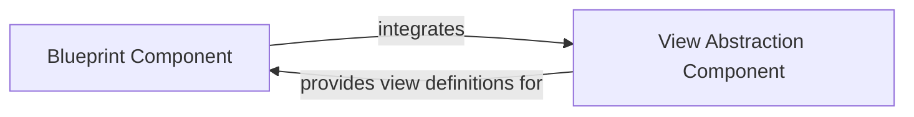

## Component Details

This component provides mechanisms for organizing Flask applications into reusable and modular components (Blueprints) and defines base classes and utilities for creating view functions and class-based views. It enables developers to build scalable and maintainable Flask applications by segmenting functionality into distinct, manageable units.

### Blueprint Component
Encapsulates the functionality for creating and managing modular application sections, including routing, static files, and CLI commands specific to that module. It allows for the registration of routes, error handlers, and other application-specific logic within a self-contained unit.

**Related Classes/Methods**:

- <a href="https://github.com/pallets/flask/blob/master/src/flask/blueprints.py#L18-L128" target="_blank" rel="noopener noreferrer">`flask.blueprints.Blueprint` (18:128)</a>
- <a href="https://github.com/pallets/flask/blob/master/src/flask/blueprints.py#L19-L53" target="_blank" rel="noopener noreferrer">`flask.blueprints.Blueprint:__init__` (19:53)</a>
- <a href="https://github.com/pallets/flask/blob/master/src/flask/blueprints.py#L82-L102" target="_blank" rel="noopener noreferrer">`flask.blueprints.Blueprint.send_static_file` (82:102)</a>
- <a href="https://github.com/pallets/flask/blob/master/src/flask/blueprints.py#L104-L128" target="_blank" rel="noopener noreferrer">`flask.blueprints.Blueprint.open_resource` (104:128)</a>

### View Abstraction Component
Offers abstract base classes for defining view logic, allowing developers to implement generic views or method-specific views for different HTTP methods. It provides a structured way to handle incoming requests and generate responses.

**Related Classes/Methods**:

- <a href="https://github.com/pallets/flask/blob/master/src/flask/views.py#L16-L135" target="_blank" rel="noopener noreferrer">`flask.views.View` (16:135)</a>
- <a href="https://github.com/pallets/flask/blob/master/src/flask/views.py#L78-L83" target="_blank" rel="noopener noreferrer">`flask.views.View.dispatch_request` (78:83)</a>
- <a href="https://github.com/pallets/flask/blob/master/src/flask/views.py#L86-L135" target="_blank" rel="noopener noreferrer">`flask.views.View.as_view` (86:135)</a>
- <a href="https://github.com/pallets/flask/blob/master/src/flask/views.py#L138-L191" target="_blank" rel="noopener noreferrer">`flask.views.MethodView` (138:191)</a>
- <a href="https://github.com/pallets/flask/blob/master/src/flask/views.py#L182-L191" target="_blank" rel="noopener noreferrer">`flask.views.MethodView.dispatch_request` (182:191)</a>

### [FAQ](https://github.com/CodeBoarding/GeneratedOnBoardings/tree/main?tab=readme-ov-file#faq)