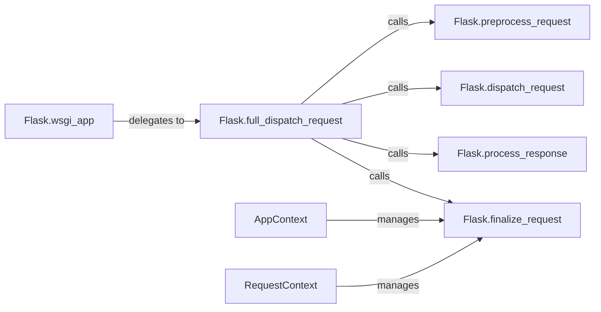

## Component Details

The Flask request handling process centers around managing the application and request contexts. When a request comes in, Flask sets up these contexts, making request-specific data available throughout the request's lifecycle. The WSGI application callable receives the request and delegates to the full dispatch request, which preprocesses the request, dispatches it to the appropriate view function, processes the response, and finalizes the request. Finalization includes tearing down both the request and application contexts, ensuring proper cleanup and isolation between requests.

### Flask.wsgi_app
The WSGI application callable. It receives the incoming request and is responsible for setting up the application and request contexts. It then delegates the actual request handling to `full_dispatch_request`.
- **Related Classes/Methods**: `flask.src.flask.app.Flask:wsgi_app`

### Flask.full_dispatch_request
Dispatches the request after pre-processing and handles any exceptions that occur during the request handling process. It orchestrates the calling of `preprocess_request`, `dispatch_request`, and `process_response` in sequence.
- **Related Classes/Methods**: `flask.src.flask.app.Flask:full_dispatch_request`

### Flask.preprocess_request
Performs any necessary pre-request processing, such as running before-request functions that are registered with the application.
- **Related Classes/Methods**: `flask.src.flask.app.Flask:preprocess_request`

### Flask.dispatch_request
Dispatches the request to the appropriate view function based on the URL. It determines which view function should handle the request and then calls that function.
- **Related Classes/Methods**: `flask.src.flask.app.Flask:dispatch_request`

### Flask.process_response
Processes the response after the view function has returned. This includes running after-request functions that can modify or further process the response.
- **Related Classes/Methods**: `flask.src.flask.app.Flask:process_response`

### Flask.finalize_request
Finalizes the request by performing teardown operations. This includes running teardown handlers for both the request and application contexts to clean up any resources used during the request.
- **Related Classes/Methods**: `flask.src.flask.app.Flask:finalize_request`

### AppContext
Manages the application context for each request. It provides a way to share data during a request and is automatically created and torn down. It interacts with `RequestContext` to provide a complete context for the application.
- **Related Classes/Methods**: `flask.src.flask.ctx.AppContext:__enter__`, `flask.src.flask.ctx.AppContext:__exit__`

### RequestContext
Manages the request context, holding information about the current request, such as the request method, URL, and headers. It is automatically created and torn down for each request and interacts with `AppContext` to provide a complete context for the request.
- **Related Classes/Methods**: `flask.src.flask.ctx.RequestContext:copy`, `flask.src.flask.ctx.RequestContext:push`, `flask.src.flask.ctx.RequestContext:__enter__`, `flask.src.flask.ctx.RequestContext:__exit__`
